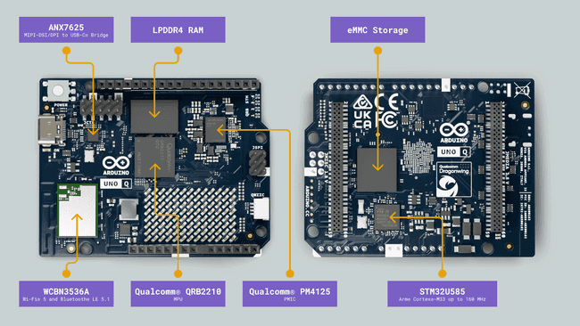
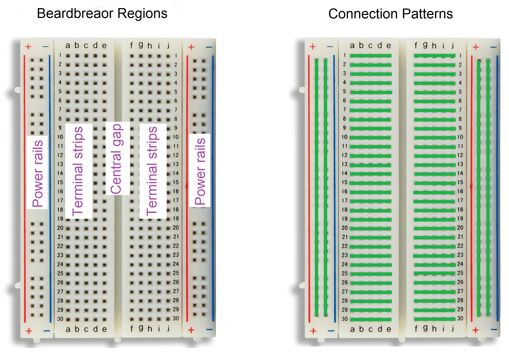

## Objectives
- Exploring Arduino
- Arduino Programming
## Exploring Arduino
### Introduction
Microcontrollers are powerful devices that allow us to build smart and automated systems. However, working directly with microcontrollers is often difficult, especially for beginners. In many cases, we must design a special circuit around the microcontroller, provide the correct power, connect external components, and use special tools to program it. This process can be complex, time-consuming, and expensive.

To make this process easier, Arduino was introduced.
### What Is Arduino?
Arduino is an open-source electronics platform designed to simplify working with microcontrollers. Instead of building the full circuit from scratch, Arduino provides ready-made boards that already include the important components needed to run and program a microcontroller.   
Most Arduino boards are built around microcontrollers such as the ATmega328P. The board includes power regulation, communication circuits, and connection pins. Because of this, we only need to connect the board to a computer and start programming.   


What makes Arduino even more powerful is that it comes with many components and kits that make creating prototypes and small projects very easy for everyone. These kits allow beginners to start experimenting and building real systems without needing advanced knowledge. The components are designed to be easy to connect and wire with Arduino, which reduces complexity and helps learners focus on understanding the concepts and developing their ideas


Another important strength of Arduino is its large and active community. Students, hobbyists, engineers, and makers from all around the world share projects, tutorials, and solutions. This makes learning easier because beginners can find help, examples, and inspiration online. One of the best places to explore these ideas is the official Arduino project website: [Arduino Project Hub](https://projecthub.arduino.cc/).

Arduino is an open-source platform. Because of this, many manufacturers have copied the design and created their own compatible boards based on it. Most of these boards look similar and work in the same way. The original boards usually have the Arduino name and logo printed on them, such as the Arduino Uno.
### Type Of Arduino
We can find different types of Arduino boards. Each type is designed for a specific use, depending on the project size, power, and required features.
#### Arduino Uno
The **Arduino Uno** is the most popular and recognizable board in the Arduino family, making it the definitive starting point for beginners. Powered by the 8-bit ATmega328P microcontroller, it features 14 digital input/output pins, 6 analog inputs, and a standard, robust USB-B connection. Its larger footprint is intentionally designed to easily accept "shields" (stackable add-on boards for things like motors or displays), which makes prototyping straightforward without needing to solder. If you are just starting your electronics journey, this is the classic, heavily documented, and foolproof choice

#### Arduino Nano
The **Arduino Nano** packs almost exactly the same capabilities as the Uno into a much smaller, breadboard-friendly form factor. Usually based on the same ATmega328P chip, it drops the standard barrel power jack and bulky USB port in favor of a Mini-B or Micro-USB connection (and USB-C on newer iterations). Because its pins point downwards, you can plug it directly into a prototyping breadboard. This makes it the go-to choice for permanent, soldered circuits or space-constrained projects where the Uno would simply be too bulky.


#### Arduino Mega
The **Arduino Mega 2560** is the heavy lifter of the classic Arduino lineup, designed specifically for complex projects that require a massive amount of hardware connections or code memory. It uses the larger ATmega2560 microcontroller, which provides a staggering 54 digital I/O pins, 16 analog inputs, and four times the flash memory of the Uno. This board is traditionally used in demanding, hardware-heavy applications like custom 3D printers, multi-servo robotics, and complex home automation systems where a standard Uno runs out of pins.


#### Arduino Leonardo
The **Arduino Leonardo** looks physically similar to the Uno but has a fundamental difference under the hood: it uses the ATmega32U4 microcontroller. This specific chip features built-in USB communication, meaning it doesn't need a secondary, separate chip to talk to your computer like the Uno does. Because of this direct line of communication, the Leonardo can natively emulate computer peripherals. You can program it to be recognized by your PC as a standard USB mouse or keyboard, making it ideal for building custom game controllers, macro pads, or flight simulator panels.


#### Arduino Micro
Think of the **Arduino Micro** as the Leonardo's smaller sibling, much like how the Nano relates to the Uno. Developed in conjunction with Adafruit, it features the exact same ATmega32U4 chip as the Leonardo, giving it the identical ability to act natively as a USB mouse, keyboard, or MIDI device. However, all of this is shrunk down into a compact, breadboard-friendly design. It is the perfect choice for embedding into small, custom PC input devices or wearables where you need USB emulation but a full-sized Leonardo just won't fit.


#### Arduino Due
The **Arduino Due** was a massive milestone as the first Arduino board to feature a powerful 32-bit ARM core microcontroller (the Cortex-M3). While it shares a similarly large footprint and the massive 54 digital I/O and 12 analog pin count of the Mega, it absolutely crushes older 8-bit boards in raw performance, boasting an 84 MHz clock speed and significantly more memory. It also includes advanced hardware like two DACs (for true analog output, great for audio) and two CAN buses. However, it comes with a critical catch: **it operates strictly at 3.3V**. Pushing the standard 5V used by the Uno or Mega into the Due's pins will permanently damage the board. This makes it a powerhouse for experienced makers building complex, high-speed applications like CNC controllers, advanced robotics, or real-time data acquisition, provided you carefully manage your voltage levels.


#### Arduino MKR Series
Rather than a single board, the **Arduino MKR Series** is an entire family of compact microcontrollers designed specifically to dominate the Internet of Things (IoT). Sharing a standardized, breadboard-friendly footprint, almost all MKR boards are powered by a 32-bit ARM Cortex-M0+ processor and include built-in charging circuits for lithium-polymer (LiPo) batteries, making them ready for off-grid use out of the box. What sets the series apart is that you simply choose the specific board based on how you want to communicate: the MKR WiFi 1010 handles standard Wi-Fi and Bluetooth, the MKR WAN 1310 uses LoRa for long-range remote networks, and the MKR GSM 1400 taps directly into cellular networks. If you are building battery-powered smart home devices, remote agricultural sensors, or any project that needs to talk securely to the cloud, this 3.3V family is your modern, professional-grade toolkit.


#### Arduino UNO R4
The **Arduino UNO R4** is the newest generation of the classic Arduino Uno and represents a big improvement over the older versions, upgrading from the old 8-bit chip to a highly capable 32-bit ARM Cortex-M4 microcontroller (the Renesas RA4M1). This upgrade brings drastically faster processing speeds, up to 16 times more memory,  In addition, the Uno R4 includes modern features such as a built-in CAN bus for reliable communication in automotive and industrial systems, and a true digital-to-analog converter (DAC) that can generate smooth analog signals and even simple audio without extra hardware. all while maintaining the classic Uno pin layout so your old shields still fit. It comes in two flavors:    
The Minima version focuses on simplicity and performance, making it a good choice for learning and general electronics.    
The WiFi version adds wireless connectivity using a secondary chip based on the ESP32 and a built-in 12x8 LED matrix right on the board.


#### Arduino UNO Q
The **Arduino UNO Q** is not just another upgrade to the Uno lineup it is a complete reinvention of what an Arduino board can be. While it keeps the familiar Uno form factor and shield compatibility, the UNO Q combines a full Linux single-board computer with a real-time microcontroller on the same PCB. At its core is the powerful Qualcomm Dragonwing QRB2210 quad-core processor running Debian Linux for high-level computing, paired with an STM32U585 microcontroller from STMicroelectronics for precise, real-time control of GPIO, sensors, and actuators. This hybrid design means we can run Python, AI models, web servers, and image processing on Linux while simultaneously running traditional Arduino sketches for time-critical hardware tasks.  
Wireless connectivity is built in, offering dual-band Wi-Fi 5 and Bluetooth 5.1, and the board includes 2 GB RAM with 16 GB of onboard eMMC storage. It features USB-C for power, data, and even video output, an 8×13 LED matrix display, RGB status LEDs, a user button, and a Qwiic connector for plug-and-play I²C modules. Despite all this computing power, it maintains the classic Uno header layout with 14 digital pins and 6 analog inputs (3.3V logic, 5V-tolerant digital pins), so many existing shields still work.

What truly sets the UNO Q apart is its new development ecosystem built around Arduino App Lab. Instead of uploading a single sketch, we build “Apps” that can combine Arduino C++ code for the microcontroller and Python programs for the Linux processor, tied together using modular components called Bricks such as web servers, camera processing, AI object detection, or cloud connectivity. 



### Arduino Structure
Despite there being many types of Arduino boards, they all share the same basic structure. Understanding and mastering one will make it much easier to shift to the others. In our course, we will focus on the Arduino Uno.

To understand how the Uno works, we need to break down its core components:


#### Microcontroller
The microcontroller is the brain of the Arduino Uno. It is a small computer on a single chip that runs the program we upload to the board. It reads inputs from sensors, processes the information, and sends outputs to devices such as LEDs, motors, or displays.
#### Memory Structure 
The ATmega328P chip contains three distinct types of memory to function. 
- Flash Memory (32 KB) is where our actual code is stored; it is non-volatile, meaning our program stays there even when the board is unplugged. 
- SRAM (2 KB) is the volatile "working memory" used to quickly store and change variables while our program is actively running. 
- EEPROM (1 KB) is a tiny, non-volatile storage space that we can tell our code to use for saving small pieces of permanent data, like user settings or calibration numbers, so they aren't lost when the power goes out
#### USB Port
The USB port is used to connect the Arduino Uno to a computer. It allows us to upload programs (called sketches) to the board and also provides power to the Arduino. Additionally, it enables serial communication between the Arduino and the computer.
#### Power Jack
The power jack allows us to power the Arduino Uno using an external power supply, such as a battery or an adapter. This is useful when the board is not connected to a computer.
#### Voltage Regulator
The voltage regulator controls the voltage supplied to the Arduino and its components. It ensures that the board receives a stable voltage, protecting it from damage caused by power fluctuations.
#### Digital Pins
The Arduino Uno has 14 digital input/output (I/O) pins. "Digital" means they deal strictly in 1s and 0s (ON or OFF / 5V or 0V). You use these to read things like push buttons or to turn on things like LEDs and relays, Six of these pins (marked with a `~` symbol) are connected to internal hardware timers. This allows them to perform Pulse Width Modulation (PWM) rapidly turning the pin on and off to simulate varying voltage levels, which is how we dim a light or control the speed of a motor.
#### Analog Input Pins & ADC 
On the bottom edge are 6 Analog input pins (A0 through A5). Unlike digital pins, these can read a continuous spectrum of voltages (from 0V to 5V). Because the microcontroller only understands digital numbers, these pins use a built-in component called an **ADC (Analog-to-Digital Converter)**. The ADC translates the fluctuating voltages from things like temperature sensors into a digital number between 0 and 1023 that the code can understand.
#### Power Pins
The Arduino Uno includes several power pins, such as 5V, 3.3V, and GND (ground). These pins are used to provide power to external components like sensors and modules.
#### Reset Button
The reset button restarts the Arduino program from the beginning. This is useful for testing and debugging our projects.
#### Crystal Oscillator
FinallytThe crystal oscillator helps the microcontroller keep accurate timing. It ensures that the Arduino executes instructions at the correct speed.
### Arduino IDE
To communicate with our Arduino board and upload programs to it, we need the **Arduino IDE** (Integrated Development Environment).     
The Arduino IDE is the official software used to write, compile, and upload code to Arduino boards. It provides a simple and user-friendly environment that is suitable for beginners as well as advanced users. We can download it from the official Arduino website: [https://support.arduino.cc/hc/en-us/articles/360019833020-Download-and-install-Arduino-IDE](https://support.arduino.cc/hc/en-us/articles/360019833020-Download-and-install-Arduino-IDE).    
The Arduino IDE also includes many ready-to-use example sketches that help beginners learn how to use different electronic components and understand programming concepts. In addition, the IDE allows us to install libraries, which are collections of prewritten code that make it easier to control electronic components without writing complex programs from scratch. These libraries support many devices such as LCD screens, temperature sensors, Bluetooth and Wi-Fi modules, and servo motors, making project development faster and more efficient.   
## Arduino Programming
### Sketch
In Arduino programming, a sketch is the name given to a complete program written for an Arduino board. It is the main file that contains all the instructions and logic needed to control the hardware. A sketch is usually written using a simplified version of the C++ programming language and saved with the `.ino` extension.

A sketch can include variables, functions, and libraries, and it is uploaded to the microcontroller to run continuously. Each sketch must contain two essential functions: **setup()** and **loop()**, which define how the program starts and behaves during execution.
#### Setup
The setup() function runs once when the Arduino board is powered on or reset. It is used to initialize hardware and configure settings before the main program starts.
Typical tasks performed in setup():
- Setting pin modes (input or output).
- Initializing serial communication.
- Starting sensors or modules.
#### Loop
The loop() function runs repeatedly after setup() finishes. It contains the main logic of the program and keeps executing as long as the board has power.
Typical tasks in loop():
- Reading sensors.
- Controlling motors or LEDs.
- Making decisions and repeating actions.
### Variables and Data Types
Variables in Arduino can be thought of as containers or boxes used to store information that your program can use and manipulate. Each variable has a data type that tells the compiler what kind of data it will hold, such as numbers, text, or logical states.

To create variable we start with declaring the data type of the variable then the variable name then if it have value we assign value to it using `=` operator
```
type name = value
```
Arduino supports several fundamental data types:
#### `char`
Represents a **single character**, such as `'a'`, `'!'`, or `'$'`.
- Uses **1 byte** of memory.
- Stored using **ASCII encoding**.
- Arithmetic operations on `char` actually operate on their ASCII values.

Example:
```
char letter = 'A';  // ASCII value 65
```
#### `int`
Represents **integer numbers** (whole numbers without decimals), such as `5`, `-10`, or `0`.
- Typically 2 bytes on Arduino Uno.
- Arithmetic operations on integers return integer values (e.g., `4 / 3` gives `1`).

Example:
```
int count = 10;
```
#### `long`
Used for larger integer numbers than `int`.
- Typically 4 bytes on Arduino boards.
- Useful when you need to count large numbers or work with long durations.

Example:
```
long milliseconds = 100000L;
```
#### `float`
Represents decimal numbers with single-precision.
- Typically 4 bytes.
- Used for values like `3.14` or `-2.5`.

Example:
```
float pi = 3.14;
```
#### `double`
Represents decimal numbers with higher precision.
- On many Arduino boards (Uno, Nano), `double` is the same as `float` (4 bytes).
- On boards like Arduino Due, `double` uses 8 bytes for more precise calculations.

Example:
```
double precisePi = 3.1415926535;
```
#### `bool`
Represents a **logical value**, either **true** or **false**. Internally stored as `1` (true) or `0` (false).  
Example:
```
bool isLEDOn = true;
```
#### `void`
Represents no value. used for functions that do not return anything.   
Example:
```
void blinkLED() {  
  // This function does not return a value  
}
```
#### Arrays
Arrays are **collections of variables** of the same type stored together.  
- Elements are accessed using **indices**, starting from `0`.
- Arrays can hold integers, characters, or other data types.
    

Examples:
```
int numbers[] = {4, 5, 7};           // int array  
char message[] = "hello";            // char array (string)  
char name[] = {'A', 'l', 'i'};       // char array
```
### Constants
A **constant** is a variable whose value cannot change while the program runs.  We use uppercase letters for constants to make them easy to identify in code.
There are two ways to define constants:
- Using `const` keyword ``const float GRAVITY = 9.81;``
- Using `#define` directive ``#define PI 3.14159``

`#define` is a preprocessor directive that replaces the name with a value before compilation and has no type checking, while `const` creates a typed variable whose value cannot change, allowing the compiler to enforce type safety.   

### Arithmetic Operators
Arithmetic operators are used to perform mathematical operations in Arduino programs. They allow calculations such as addition, subtraction, multiplication, and division.
- **Addition (+):** Adds two operands. When used with char types, it adds their ASCII values and returns the resulting character.
- **Subtraction (-):** Subtracts the second operand from the first. Similar to addition, it operates on ASCII values when used with char types.
- **Multiplication (*):** Multiplies two operands. This operator cannot be directly used with char types.
- **Division (/):**
    
    - For float or double types, it performs regular division and returns the exact result.
    
    - For int or long types, it performs integer division, which discards any fractional part of the result. It does not round the result.
- **Modulo (%):** Returns the remainder of the division between two operands. It is only applicable for int and long types.
### Compound Operators
Compound operators combine an arithmetic operation with assignment in a single step. They make the code shorter, clearer, and easier to read.
**`+=` (Compound addition):**  Adds a value to a variable and assigns the result back to the same variable.  `a += 5;` same as ``x = x + 5;``  
**`-=` (Compound subtraction):**  Subtracts a value from a variable.  ``x -= 2;``   same as ``x = x - 2;``    
**`*=` (Compound multiplication):**  Multiplies a variable by a value. ``x *= 4;``   same as ``x = x * 4;``  
**`/=` (Compound division):**  Divides a variable by a value.  ``x /= 2;``  same as ``x = x / 2;``  
**`%=` (Compound remainder):**  Stores the remainder of division.  ``x %= 3;``   same as ``x = x % 3;``  
#### Increment and Decrement Operators
These operators are special compound operators used to increase or decrease a variable by 1. They are very common in Arduino loops and counters.

**`++` (Increment):**  Increases a variable by one.  ``i++;``   same as ``i = i + 1;``    
**`--` (Decrement):**  Decreases a variable by one.  ``i--;``  same as ``i = i - 1;``

These operators can be used in two forms:

- **`++i` (pre-increment)**: increment first, then use the value.
- **`i++` (post-increment)**: use the value first, then increment.
### Comparison Operators
Comparison operators are used to compare two values and produce a boolean result (true or false).

| Operator | Meaning          |
| -------- | ---------------- |
| ==       | Equal to         |
| !=       | Not equal        |
| >        | Greater than     |
| <        | Less than        |
| >=       | Greater or equal |
| <=       | Less or equal    |

### Boolean Operators
Boolean operator help us to  combine multiple conditions into more complex expressions. The result of a logical operation is also a boolean value (true or false).

- **|| (OR):** Returns **true** if at least one of the conditions connected by `||` is true.
- **&& (AND):**  Returns **true** only if all the conditions connected by `&&` are true.
- **! (NOT):**  Reverses the logical state of the condition.

| A     | B     | A && B | A \|\| B | !A    |
| ----- | ----- | ------ | -------- | ----- |
| true  | true  | true   | true     | false |
| true  | false | false  | true     | false |
| false | true  | false  | true     | true  |
| false | false | false  | false    | true  |
### Conditional Statements
#### Single Condition with `if`
In Arduino, we often want some code to run only when a condition is true. If the condition is false, the Arduino simply skips that block and continues running the rest of the program.

```
if (condition){
instructions
}
```
#### Alternative Path with `if-else`
We can also provide an alternative path. If the condition is true, one block runs; otherwise, the `else` block runs.
```
if (condition){
instructions to run if condition valide
}else{
instructions to run if condition not valide
}
```
#### Multiple Conditions with `else if`
When there are more than two possible outcomes, we can chain conditions using `else if`. Arduino checks them in order and executes the first one that is true.
```
if (condition 1){
instructions to run if condition 1 is valide
}else if(condition 2){
instructions to run if condition 2 is valide
}else{
instructions to run if non of the conditions is valide
}
```
#### Ternary Operator
Arduino also supports the ternary operator `? :`. It is useful for short and simple decisions, especially when assigning values.
```
status = condition ? "value if true" : "value if false";
```
#### The `switch` Statement
When checking a value against many options, Arduino provides the `switch` statement. It makes the code cleaner compared to many `else if` conditions.
#### Switch Case statement :
```
switch (variable){
	case value1:
		instruction that run if variable == value1
	break;
	case value2:
		instruction that run if variable == value2
	break;
	case value3:
		instruction that run if variable == value3
	break;
	case value4:
		instruction that run if variable == value4
	break;
	default:
		instruction that run if variable have other value then we provided
	break;
}
```
### Loops
Loops help us to repeat an action multiple times. there is three type of loops
#### The `for` Loop
A `for` loop is used when we know how many times we want to repeat a block of code. It is very common in Arduino, especially for controlling LEDs, sensors, or repeating tasks a fixed number of times.
```
for (initialization;condition; increment/decrement){
	instructions we want to repeat
}
```
#### The `while` Loop
A `while` loop repeats as long as a condition is true. It is useful when we don’t know how many times the loop will run.
```
while (condition){
instructions we want to repeat
}

```
#### The `do-while` Loop
A `do-while` loop is similar to `while`, but it always runs **at least once**, even if the condition is false.
```
do{
	instructions we want to repeat
}while (condition);
```
#### Break and Continue :
We can enhance the control of our loops by using the keywords `break` and `continue`:
- **`break`**: The `break` statement is used to terminate and exit a loop immediately when a specific condition is met.
- **`continue`**: The `continue` statement is used to skip the current iteration of the loop and proceed with the next one, effectively ignoring the instructions for that iteration when a specific condition is true.
### Comments :
Comments are lines of code that the compiler will ignore. They are used to add explanatory notes and improve the readability of our code. There are two ways to create comments:
- **Single-line comments:** Begin with ``//`` and continue until the end of the current line. All text following ``//`` on the same line is ignored by the compiler.
- **Multi-line comments:** Begin with ``/*`` and end with ``*/``. Any text between these two symbols, including multiple lines, will be ignored by the compiler.

## Creating Our First Projects
Let’s put what we’ve learned into practice and start building some simple projects to get hands-on experience with Arduino and the Arduino programming language.
### Blinking Led
We will start with one of the simplest beginner projects making an LED blink.  For this project, we will need, 1 LED, resistor (220Ω or 330Ω) and some wires.    
An LED (Light Emitting Diode) is a small electronic component that emits light when electrical current flows through it. An important characteristic of an LED is that it allows current to flow in only one direction. 
It has two legs:
- **The longer leg (anode)** connects to the positive side (power).
- **The shorter leg (cathode)** connects to ground (GND).
#### Wiring
We start by building the circuit. Connect the long leg (anode) of the LED to digital pin 13 on the Arduino (through a resistor). Then connect the short leg (cathode) of the LED to the GND pin on the Arduino.


#### Creating the Program
Now let’s program the Arduino board to make the LED blink. First, we connect the Arduino to our computer using a USB cable. After that, we open the Arduino IDE. Then, check if our computer has detected the Arduino board. If it has, select the board so we can upload the program.


We used pin 13 as an output pin, we sending signals from the Arduino to turn the LED on and off.  
In the `setup()` function, we configure pin 13 as an OUTPUT using `pinMode()`. 
```cpp
void setup() {
  pinMode(13,OUTPUT);

}
```
After that, inside the `loop()` function, we control the LED by sending signals to pin 13. To turn the LED on, we use `digitalWrite(13, HIGH);`. This sends a HIGH signal (5V on most Arduino boards) to the pin, allowing current to flow through the LED and turn it on. 
```cpp
void loop() {
  digitalWrite(13, HIGH);
}
```
Now we verify the program by clicking the Verify button to check for any errors in the code. If the code is correct, we then upload it to the Arduino by clicking the Upload button. This sends the program to the board.


We will notice that our LED turns on and stays on. This means we have done only half of the work. Now, we need to make it stay on for a short period and then turn off for a short period. By repeating this process, we will make it blink.   
To do this, we use the `delay()` function, which pauses (or freezes) the program for a specific number of milliseconds.  
First, we turn the LED on. Then we use `delay()` to keep it on for a short time. After that, we turn the LED off and use `delay()` again to keep it off for a short time. By repeating these steps inside the `loop()` function, the LED will continuously blink.
```cpp 

void loop() {
  digitalWrite(13, HIGH);
  delay(500);
  digitalWrite(13, LOW);
  delay(500);
}
```

### LED Control Using a Push Button
Let’s make our project more interactive by adding a **push button**. In this project, when we press the button, the LED will turn on and stay on. When we press the button again, the LED will turn off. 
This means the button will act like a switch, allowing us to control the LED manually instead of making it blink automatically.    
Before wiring and building the circuit, let’s explore another important component that will help us when prototyping and working on Arduino projects: the **breadboard**.
#### Breadboard
A breadboard is a tool that allows us to build and test electronic circuits **without soldering**. It makes prototyping fast and easy because we can quickly add, remove, or change components and connections.  
Inside the breadboard, the holes are connected in specific patterns:
- **Power rails (side columns):**  The long rows on the sides of the breadboard are used to distribute power. All the holes in each row are connected together. Usually, one side is used for **VCC (positive)** and the other for **GND (ground)**. This allows us to easily provide power to multiple components.
- **Terminal strips (middle area):**  In the center of the breadboard, the holes are connected in small horizontal groups, typically in rows of five. Each group of five holes is connected internally. This means if you place a wire or component leg in one hole, it is electrically connected to the other four holes in the same row.
- **Central gap:**  The middle gap separates the two sides of the breadboard. This gap is designed to place integrated circuits (ICs) so that their pins do not connect to each other by mistake.


#### Push Button
A push button is a simple input component that allows us to control a circuit by pressing it. When the button is **not pressed**, the internal contacts are open, so no current flows. When we press the button, the contacts close and allow current to pass through.

Inside the push button, the pins that are facing each other are internally connected. This means the two pins on one side are connected together, and the two pins on the opposite side are also connected. When the button is pressed, both sides become connected.


#### Wiring
For this project, we will need 1 LED, 1 push button and 2 resistors (220Ω), First, connect the **GND** and **5V (VCC)** pins from the Arduino board to the **power rails** of the breadboard. This allows us to easily access power and ground anywhere on the board.  
Next, place the LED on the breadboard:
- Connect the **short leg (cathode)** of the LED to the **GND rail** on the breadboard.
- Connect the **long leg (anode)** of the LED to one end of a resistor.
- Connect the other end of that resistor to **digital pin 13** on the Arduino.

Now, place the push button on the breadboard .
- Connect one side of the push button to **5V**.
- Connect the other side to a second resistor.
- Connect the other end of this resistor to one of the Arduino’s digital input pins (pin 2).
- Also connect that same point to **GND** through the resistor (this acts as a pull-down resistor).


We use a pull-down resistor to make sure the Arduino reads a stable and correct signal from the push button. When the button is not pressed, the input pin of the Arduino is not connected to anything, so it becomes floating. A floating pin can randomly read HIGH or LOW because of electrical noise, which can cause the LED to behave unpredictably.   
The pull-down resistor connects the input pin to **GND** when the button is not pressed, forcing it to read LOW in a stable way. When the button is pressed, the pin connects to **5V** and reads HIGH. This makes the button work reliably and also protects the circuit from unwanted current.


#### Creating The Program
First, we connect the Arduino to our computer using a USB cable. and set the Arduino IDE so we can upload the program.  
We using pin 13 as an output pin for the LED, and pin 2 as an input pin for the push button. In the `setup()` function, we configure these pins using `pinMode()`. 
```cpp
void setup() {  
pinMode(13, OUTPUT);  
pinMode(2, INPUT);  
}
```
To keep track of whether the LED should be on or off, we create a boolean variable outside the ``setup`` and ``loop`` function. We set it to `false` at the beginning. Each time the button is pressed, we change (toggle) its value. This way, the LED will stay on or off until the next click.
```cpp
bool ledState = false;
```
Inside the `loop()` function, we check if the push button is pressed using an if statement. When the button is clicked, we change the state of the variable and update the LED.
```cpp
void loop() {  
if (digitalRead(2) == HIGH) {  
ledState = !ledState;  
digitalWrite(13, ledState);  
}  
}
```
We may notice that one click turns the LED on and off many times. This happens because the loop runs very fast and the button may be detected multiple times from a single press. To fix this, we add a small delay (for example, 500 ms). This gives enough time for the user to release the button and helps reduce the effect called button bouncing.
```cpp
void loop() {  
if (digitalRead(2) == HIGH) {  
ledState = !ledState;  
digitalWrite(13, ledState);  
delay(500);  
}  
}
```
### Click Counter
In this final project, we will build a click counter. The LED will turn on after every 5 button clicks. For the circuit, we will use the same wiring from the previous project, so there is no need to change the connections.
#### Creating the Program
We will also use the same pin configuration as the last project. This means the `setup()` function will stay the same, since the LED is still connected to pin 13 and the push button to pin 2 on the Arduino.
```cpp
void setup() {  
  pinMode(13, OUTPUT);  
  pinMode(2, INPUT);  
}
```
Next, we create a variable to count the number of clicks. Each time the button is pressed, we increase this counter. When the number of clicks reaches 5, we turn the LED on. After that, we reset the counter and start counting again.

We also need a boolean variable to keep track of the LED state. At the beginning, it is set to `false` (OFF). Each time the counter reaches 5, this variable becomes `true` (ON), and the counter is reset. If the counter is not equal to 5, the LED remains OFF. This allows the Arduino to control the LED based on the number of button presses.
```cpp
bool ledState = false;
unsigned int counter = 0;
```
Inside the `loop()` function, we check if the button is pressed. If it is, we increase the counter and add a small delay to avoid multiple readings from a single press. Then we check if the counter has reached 5. If so, we set the LED state to `true` and reset the counter. Otherwise, we keep the LED OFF.
```cpp
void loop() {  
	if (digitalRead(2) == HIGH) {  
		counter = counter + 1;  
		if (counter == 5) {  
			ledState = true;  
			counter = 0; 
		} else {  
			ledState = false;   
		}  
		digitalWrite(13, ledState);
		delay(500);   
	}  
}
```
We can optimize our program by using the ternary operator and the increment operator. This allows us to check the condition and assign a value in the same line, making the code shorter and cleaner without changing its functionality.
```cpp
void loop() {  

	if (digitalRead(2) == HIGH) {
		ledState = ++counter == 5 ? true : false;
		counter = ledState ? 0 : counter;
		digitalWrite(13, ledState);  
	    delay(500);  
  }  
}
```