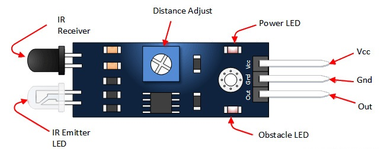
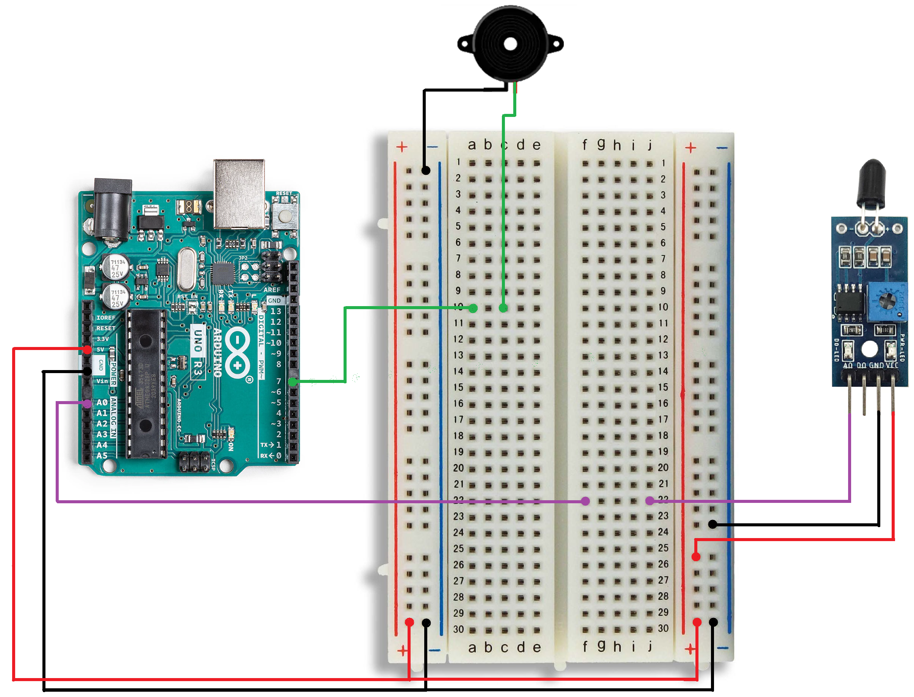

## Objectives
- Understand General Purpose Input/Output (GPIO) pins
- Working with Motors
## General Purpose Input/Output (GPIO) Pins
General Purpose Input/Output (GPIO) pins allow an Arduino to connect and communicate with the external world. These pins can be configured either as inputs or outputs, depending on the needs of the project.   
In total, an Arduino UNO board has 20 GPIO pins, which are divided into two main categories:
- **Digital pins** Used to read or write digital signals HIGH or LOW.
- **Analog pins** Used to read analog signals, a range of voltage values.
### Digital GPIO Pins
The Arduino board has 14 digital GPIO pins, which are located on the right side of the board. These pins can handle only two states: HIGH and LOW. This means they can either send or receive digital signals, such as turning an LED on or off, or reading the state of a button.    
Each digital pin can be configured as either an input or an output, depending on the requirements of the circuit. When set as an input, the pin reads signals from external components. When set as an output, it sends signals to control devices.


#### Digital GPIO Functions
The Arduino provides several functions that allow us to control and use digital pins easily.   
**`pinMode()`:** This function is used to configure the mode of a digital pin. It allows us to set the pin as either an input or an output.  
It accepts two arguments:
- The pin number
- The **mode** we want to set (`INPUT`, `OUTPUT`, or `INPUT_PULLUP`)

`INPUT_PULLUP` mode to enable the Arduino’s internal pull-up resistor. It helps avoid unstable readings when using input devices like push buttons, it force the `HIGH` state when no signal is sent to the pin.   
**`digitalWrite()`:** This function is used to send a digital signal to a pin. It allows us to set the pin to HIGH or LOW.     
It accepts two arguments:
- The pin number
- The signal state (`HIGH` or `LOW`)

**3. `digitalRead()`**  
This function is used to read the state of a digital pin. It returns either HIGH or LOW depending on the input signal.    
It accepts one argument:
- The pin number
#### Leds and Push Buttons
In our previous lecture, we explored LDs and push buttons, which are among the most commonly used digital components.   
LEDs are used as output devices. They have two states: ON and OFF. We can turn an LED ON by sending a HIGH signal from a digital pin, and turn it OFF by sending a LOW signal. LEDs are often used as indicators to show the status of a system.   
Push buttons are used as input devices. They also have two states: pressed and released. When a button is pressed, it sends a signal (HIGH or LOW, depending on the circuit design) to the Arduino. The Arduino reads this signal and performs an action based on the button state.
#### Buzzers
A buzzer is a special component that produces sound when we send a HIGH signal to it. It is commonly used as an alert or notification device in electronic projects, such as alarms, timers, and warning systems.
There are two main types of buzzers:
- Active buzzer: This type has a built-in oscillator that generates sound at a predefined frequency. We only need to send a HIGH or LOW signal to turn it ON or OFF. It is simple to use but offers limited control over the sound.
- Passive buzzer: This type does not have a built-in oscillator. Instead, it allows us to generate sound at different frequencies by sending signals from the Arduino. This gives us more control over the tone, which makes it possible to play melodies or different alert sounds.

Let’s build a simple project where an LED blink and buzzer produces sound, when a push button is pressed.     
We start by making the circuit, we can use the circuit of the previous lecture, we just add the active buzzer we connect it to pin 2.  


Now, let’s create our program.  
First, we start with the **`setup()`** function. Here, we configure the pins:
- Pin 8 and Pin 13 as output pins (for the LED and buzzer)
- Pin 2 as an input pin (for the push button)
```cpp
void setup() {
  pinMode(13, OUTPUT);
  pinMode(8, OUTPUT);
  pinMode(2, INPUT);
}
```
Next, we write the code for the **`loop()`** function. Our goal is to make the LED blink and the buzzer make sound when the push button is pressed.  
To do this, we use an  `while` loop to check the state of the button. While the button is pressed (On HIGH state):
1. Send a HIGH signal to the buzzer to produce sound.
2. Send a HIGH signal to the LED pin to turn it on.
3. Wait 500 ms using the `delay()` function.
4. Turn the LED OFF  by sending a LOW signal.
5. Wait 500 ms before repeating.

Outside the while loop, we ensure both the LED and buzzer are turned off by sending LOW signals to their pins. This guarantees that nothing remains active when the button is not pressed.

```cpp
void loop() {
  while(digitalRead(2)) {
    digitalWrite(8,HIGH);
    digitalWrite(13,HIGH);
    delay(500);
    
    digitalWrite(13,LOW);
    delay(500);
  }
  digitalWrite(8,LOW);
  digitalWrite(13,LOW);
}
```
#### Ultrasonic sensor
Ultrasonic sensors are one of the most useful sensors used with Arduino. They help us measure distance by using sound waves. When we want to calculate the depth of a well, or how long a cave is, we often rely on sound. For example, in the past, people would throw a rock into a well and listen for the sound when it hit the ground. By measuring the time it took for the sound to return, they could estimate how deep the well was.  
The same idea applies when exploring a cave. An adventurer might shout and listen for the echo. The time it takes for the echo to come back gives an idea of how far away the cave walls are.   

In a similar way, an ultrasonic sensor such as the HC-SR04 Ultrasonic Sensor sends out high-frequency sound waves and measures how long it takes for the echo to return. Using this time, the Arduino calculates the distance to an object.


Let’s create a project where we use **three LEDs** to indicate distance:
- The red LED turns on when the object is 60 cm or more away.
- The yellow LED turns on when the object is at least 30 cm away.
- The green LED turns on when the object is closer than 30 cm.

We will use the following pins for the LEDs:
- Pin 13 → Red LED
- Pin 12 → Yellow LED
- Pin 11 → Green LED

The HC-SR04 Ultrasonic Sensor has four pins:
1. **VCC** → Connect to the 5V pin on the Arduino
2. **GND** → Connect to the GND pin on the Arduino
3. Trig (Trigger) → Used to send the ultrasonic pulse, we connect it to Pin 8
4. Echo → Used to receive the reflected signal, we connect it to Pin 7


After finishing the circuit, it is time to write the program.

We start with the **`setup()`** function. In this function, we configure the pins as follows:
- Pins 13, 12, 11 and 8 are set as output pins 
- Pin 7 is set as an input pin.
```cpp
void setup(){
  pinMode(13,OUTPUT);
  pinMode(12,OUTPUT);
  pinMode(11,OUTPUT);
  pinMode(8,OUTPUT);
  pinMode(8,INPUT);
}
```
After the ``setup`` function we create two float variables
```
float duration, distance;
```
The duration variable stores how long the sound wave travels, and the distance variable stores how far the object is from the sensor.

Finally, inside the **`loop()`** function, we begin the measurement process. First, we set the Trig pin to **LOW** for a short time to make sure it starts in a stable state. Then we send a short HIGH pulse to the Trig pin for 10 microseconds. This pulse makes the sensor send an ultrasonic sound wave.

The sound wave travels through the air, hits an object, and then reflects back to the sensor. While the sound wave is traveling, the sensor sets the **Echo pin to HIGH**. The Echo pin remains HIGH until the reflected wave returns to the sensor. Once the wave is received, the Echo pin goes back to LOW.

To measure how long the sound wave took to travel to the object and back, we use the **`pulseIn()`** function. This function takes two arguments:
- The pin number (in our case, the Echo pin)
- The state we want to measure (`HIGH` or `LOW`)
Since we want to measure how long the Echo pin stays HIGH, we use `HIGH` as the second argument. The function then returns the time in microseconds.

We know that speed is equal to distance divided by time. In this project, we assume that the speed of sound is constant, which is approximately 0.0343 cm per microsecond.
Using this information, we can calculate the distance by multiplying the measured time by the speed of sound. However, the measured time represents the total travel time of the sound wave, which includes both the trip from the sensor to the object and the return trip back to the sensor.  
Therefore, after calculating the distance, we divide the result by **2** to obtain the actual distance between the sensor and the object. This gives us how far the object is from the sensor.

With this distance value, we can then control the LEDs based on how close or far the object is.
```cpp
void loop(){
  digitalWrite(8, LOW);
  delayMicroseconds(2);
  digitalWrite(8, HIGH);
  delayMicroseconds(10);
  digitalWrite(8, LOW);

  duration = pulseIn(7, HIGH);
  distance = (duration*.0343)/2;
  
  if (distance >= 60) {  
    digitalWrite(13, HIGH); 
    digitalWrite(12, LOW); 
    digitalWrite(11, LOW);
  }else if (distance >= 30) {  
 
    digitalWrite(13, LOW); 
    digitalWrite(12, HIGH); 
    digitalWrite(11, LOW); 
  }else {  
    digitalWrite(13, LOW); 
    digitalWrite(12, LOW);  
    digitalWrite(11, HIGH); 
  }
  delay(100);
}
```
We can simplify our program into
```cpp
void loop(){
  digitalWrite(8, LOW);
  delayMicroseconds(2);
  digitalWrite(8, HIGH);
  delayMicroseconds(10);
  digitalWrite(8, LOW);

  duration = pulseIn(7, HIGH);
  distance = (duration*.0343)/2;
  
  digitalWrite(13, distance >= 60); 
  digitalWrite(12, distance < 60 && distance >= 30); 
  digitalWrite(11, distance < 30);
  
  delay(100);
}
```
#### Obstacle Sensor
Another important sensor is the **obstacle sensor**. It allows us to detect the presence of obstacles using **infrared (IR) signals**. The sensor has an LED that emits infrared light and a receiver that detects the reflected IR signals. When an object is in front of the sensor, the infrared light reflects back to the receiver, allowing the sensor to detect the obstacle.   
The sensor also includes an internal variable resistor (potentiometer) that allows us to adjust the detection distance. The obstacle sensor has three pins: **VCC**, **GND**, and **OUT** (output). The output pin becomes **LOW** when an obstacle is detected and **HIGH** when no obstacle is present.

We use the **built-in potentiometer** to adjust the detection distance of the obstacle sensor.  
When the potentiometer is turned **clockwise**, the detection distance becomes **larger**, making the sensor more sensitive. When it is turned counterclockwise, the detection distance becomes **shorter**, making the sensor less sensitive



Some obstacle sensor modules include an additional pin for analog output (AO). This pin provides a voltage that changes depending on the distance of the obstacle. As the obstacle gets closer, the output voltage decreases, and as the obstacle moves farther away, the output voltage increases.
#### Relays
The Arduino digital pins provide an output voltage of 5V or 3.3V, depending on the board and its power supply. These pins can supply a maximum current of about 20 mA, which is enough to control small electronic components such as LEDs, buzzers, and small sensors.  
However, when we want to build larger projects, we may need to control devices that require higher voltage or higher current, such as lamps, fans, pumps, or motors. The Arduino pins cannot supply enough power for these devices directly, and connecting them without protection may damage the board.   
To solve this problem, we use relays. A relay is an electrically controlled switch that allows a low-power signal from the Arduino to control high-power devices safely. Inside the relay, there is a coil that plays a key role. When the Arduino sends a control signal, a small current flows through the coil, which produces a magnetic field. This magnetic field pulls a metal armature, causing the internal switch to close and allowing current to flow in the high-power circuit. When the Arduino stops sending the signal, the current in the coil stops, the magnetic field disappears, and a spring pushes the armature back to its original position, opening the switch again.


Let’s build a simple project using a relay and an ultrasonic sensor. In this project, we will use the ultrasonic sensor to turn a light ON when the user passes their hand in front of the sensor, and turn it OFF when the user passes their hand again.   

First, we connect the ultrasonic sensor:
- **VCC → 5V** on the Arduino
- **GND → GND** on the Arduino
- **Trig pin → Pin 10** on the Arduino
- **Echo pin → Pin 9** on the Arduino

Next, we connect the relay module. A typical relay module has two sides:  
Control Side, Low Voltage:
- **VCC → 5V** on the Arduino
- **GND → GND** on the Arduino
- **IN (Control Pin) → Pin 8** on the Arduino

**High-Power Side** On the high-power side, the relay has three terminals: COM (Common), NO (Normally Open), and NC (Normally Closed). To control a lamp:
- Connect the **live (phase) wire** from the power source to COM.
- Connect the NO terminal to one wire of the lamp.
- Connect the other wire of the lamp back to the neutral

When the relay is activated, the internal switch closes between COM and NO (Normally Open), allowing current to flow and turning the lamp ON. At the same time, the connection between COM and NC (Normally Closed) is opened. When the relay is deactivated, the opposite happens.


Now let’s create the program for our project. As always, we start with the **`setup()`** function, where we configure the pins. 
We set Pin 10** (Trig) and Pin 8 (relay control) as output pins, and Pin 9 (Echo) as an input pin:
```cpp
void setup() {  
  pinMode(10, OUTPUT); 
  pinMode(9, INPUT);  
  pinMode(8, OUTPUT);  
}
```
After that, we create two Boolean variables and initialize them to false:
- `lightState` – keeps track of whether the light is ON or OFF
- `handDetected` – tracks whether a hand has been detected in front of the sensor

We also create `duration` and `distance` variables to store the ultrasonic sensor measurement:
```cpp
bool lightState = false, handDetected = false;
float duration, distance;
```
Next, inside the **`loop()`** function, we use the ultrasonic sensor to check if the user passes their hand in front of it.
- If the measured distance is less than or equal to 20 cm and a hand hasn’t been detected yet, we toggle the light and set `handDetected` to true.
- If the measured distance is greater than 20 cm, this means the hand has been removed, so we set `handDetected` to false.

This ensures that the light only toggles once per hand pass.
```cpp
void loop(){
  digitalWrite(10, LOW);
  delayMicroseconds(2);
  digitalWrite(10, HIGH);
  delayMicroseconds(10);
  digitalWrite(10, LOW);

  duration = pulseIn(9, HIGH);
  distance = (duration*.0343)/2;
  
  if (distance <= 20 && !handDetected) {  
    lightState = !lightState;
    handDetected = true;
  }else if(distance > 20){
    handDetected = false;
  }
  digitalWrite(8, lightState); 
}
```

### Pulse Width Modulation
When we look closely at the digital pins on an Arduino board, we can notice that some pins have a special symbol (~) next to them. This symbol indicates that these pins support **Pulse Width Modulation (PWM)**.
**Pulse Width Modulation (PWM)** is a technique used to simulate an analog output using a digital signal. Since Arduino digital pins can only output **HIGH (5V)** or **LOW (0V)**.   
The principle of **Pulse Width Modulation (PWM)** is based on switching the output signal ON and OFF repeatedly during a constant time period T.

This fixed period TTT is called the PWM period, and within this period, the signal stays ON for a certain amount of time and OFF for the rest of the time, the percentage of time that the signal remains ON during one period is called the duty cycle.   
The output voltage is determined by the **average value** of the signal over one complete period.
For example (assuming a 5V system):
- If the output stays ON for the entire period (100% duty cycle),  the average voltage will be **5V**.
    
- If the output never turns ON (0% duty cycle), the average voltage will be **0V**.
    
- If the output stays ON for half of the period (50% duty cycle), the average voltage will be **2.5V**.

$$ V_{average}​=\frac{T_{on}}{T_{Off}}   \times V_{max}​ = DutyCycle \times V_{max}​ $$
To work with PWM in Arduino, we first configure the desired pin as an output inside the `setup()` function:
```
void setup(){
	pinMode(3,OUTPUT)
}
```
After setting the pin as an output, we use the `analogWrite()` function to generate the PWM control signal. This function takes two arguments: the pin number and a value that determines the duty cycle. The value must be between 0 and 255 because Arduino uses 8-bit resolution.  
If we write `255`, the duty cycle is 100%, meaning the signal stays ON all the time. If we write `0`, the duty cycle is 0%, meaning the signal is always OFF. For a 50% duty cycle, we use approximately `127`, which keeps the signal ON for half of the period.

Using this, we can calculate the duty cycle with the following equation:

$$Duty\ Cycle (\%) = \frac{value}{255} \times 100 $$

By adjusting this value, we directly control the duty cycle, which controls the average voltage applied to the connected device.
$$V_{average}​=\frac{value}{255}​×V_{max}​$$


### Analogue GPIO Pins
The Arduino board has 6 analogue input pins (A0–A5), located on the left side of the board. Unlike digital pins, which can only read HIGH or LOW, analogue pins can read a continuous range of voltage values between 0V and 5V. This makes them ideal for working with sensors and components that produce varying signals, such as temperature sensors, light sensors, and potentiometers.


Each analogue pin is connected to a built-in Analogue-to-Digital Converter (ADC), which converts the incoming voltage into a digital value that the Arduino can process. The ADC has a 10-bit resolution, meaning it maps the input voltage to a value between **0** and **1023**.

This means:
- 0V → 0
- 2.5V → approximately 512
- 5V → 1023

Just like with digital pins, the Arduino provides specific functions to handle analog signals.  
**`analogRead()`:** This function reads the value from the specified analog pin. It converts the input voltage into a digital integer value. It accepts one argument:
- The pin number (e.g., A0, A1) It returns a value between 0 (for 0 volts) and 1023 (for 5 volts).

We cannot send an analog output signal using the analog pins. On the Arduino Uno, the analog pins (A0–A5) are mainly designed to read analog inputs, However, even though they are labeled as analog pins, they can still be used as regular digital pins. This means we can use functions like `digitalWrite()` and `digitalRead()` with them, just like any other digital pin.
#### Potentiometers
A potentiometer is one of the most commonly used analogue input components. It is a variable resistor with three terminals, It allows us to manually change the voltage going into an analog pin. It has three terminals:
- Two outer terminals connect to VCC (5V) and GND.
- The middle terminal (wiper) connects to an Analog Pin (like A0).

When we turn the potentiometer , the voltage at the middle pin changes smoothly from 0V to 5V. The Arduino reads this and gives us a value between 0 and 1023.   

Let’s build a project to control the brightness of an LED using a potentiometer. For this project, we will need a potentiometer, an LED, and a 220 Ω resistor.   
First, connect the potentiometer’s two outer terminals to GND and 5V on the Arduino. Then, connect the middle terminal (wiper) of the potentiometer to the analog pin A0.  
Next, connect the short leg of the LED (cathode) to GND, and the long leg (anode) to digital pin 9 through the 220 Ω resistor. We use pin 9 because it supports PWM, which allows us to simulate an analog signal to control the LED brightness smoothly.


Now, let’s write the program. In the **`setup()`** function, we configure pin 9 as an output. We do not strictly need to configure A0 as input because analog pins are set to input by default.
```cpp
void setup(){
  pinMode(9,OUTPUT);
  pinMode(A0, INPUT);
}
```
Now, outside the `setup()` function, we declare a variable that will store the potentiometer value:
```cpp 
int potValue;
```
Finally, inside the `loop()` function, we start by reading the value from pin A0 using `analogRead()`. After that, we scale the retrieved value to match the PWM range by dividing it by 4. We do this because the analog input gives values from 0 to 1023, while PWM output works with values between 0 and 255.   
By dividing 1023 by 4, we approximately map the range to 0–255.   
Then, we send this scaled value to pin 9 using `analogWrite()` to control the LED brightness.  
```cpp
void loop() {  
  potValue = analogRead(A0);  
  potValue = potValue / 4;  
  analogWrite(9, potValue);  
}
```
Arduino provides a built-in function that allows us to scale values easily. This function is called `map()`. Instead of manually dividing or calculating the conversion, we can use this function to convert a number from one range to another.
The `map()` function takes **five arguments**, and its general form is:
```cpp
map(value, fromLow, fromHigh, toLow, toHigh);
```
- **value** The number we want to scale (for example, the value read from `analogRead()`).
- **fromLow** The lower limit of the original range.
- **fromHigh** The upper limit of the original range.
- **toLow** The lower limit of the new target range.
- **toHigh** The upper limit of the new target range.

With this our program become as following
```cpp
void loop() {  
  potValue = analogRead(A0);  
  potValue = map(potValue, 0, 123, 0, 255); 
  analogWrite(9, potValue);  
}
```
#### Light Dependent Resistor
An LDR (Light Dependent Resistor), or photoresistor, is another widely used analog input component. It is a special type of resistor whose resistance changes based on the amount of light it is exposed to.
- In **darkness**, its resistance is very high.    
- In **bright light**, its resistance becomes very low.
    

Unlike a potentiometer, an LDR only has two terminals. To read its changing resistance with an Arduino, we must pair it with a standard fixed resistor (usually 10k Ω) to create a setup called a voltage divider.   

A voltage divider is a simple circuit made of two or more resistors connected in series. When we apply a voltage across them, the total voltage is divided between them according to their resistance values.   
The output voltage is taken from the point between the two resistors, and its value depends on the ratio of the resistances.


The voltage divider equation is:
$$V_1 =V_{in}\times \frac{R_1}{R_1+R_2}$$
$$V_2 =V_{in}\times \frac{R_2}{R_1+R_2}$$
Let’s build a project to create an automatic night light that turns on an LED when it gets dark. For this project, we will need an LDR, a 10k Ω resistor, an LED, and a 220 Ω resistor.
First, connect one leg of the LDR to 5V on the Arduino. Then, connect the other leg of the LDR to both the analog pin A0 and to one end of the 10k Ω resistor. Finally, connect the other end of the 10k Ω resistor to GND.

Next, connect the short leg of the LED (cathode) to GND, and the long leg (anode) to digital pin 7 through the 220 Ω resistor. We will use pin 7 as a simple digital output to turn the LED on or off.

With this circuit, the voltage at pin **A0** is the output voltage of the voltage divider, which depends on the LDR’s resistance. Since the LDR is a variable resistor, its resistance changes according to the light intensity.
- When **light intensity increases**, the **resistance of the LDR decreases**, which causes the output voltage at A0 to decrease .
- When **light intensity decreases (darkness)**, the **resistance increases**, which causes the output voltage at A0 to increase.

Now, let's write the program. In the **`setup()`** function, we configure pin 7 and pin A0 as input.
```cpp
void setup() { 
	pinMode(7, OUTPUT); 
	pinMode(A0, INPUT); 
}
```
Now, outside the `setup()` function, we declare a variable that will store the LDR value:
```cpp
int ldrValue;
```
Finally, inside the `loop()` function, we start by reading the value from pin A0 using `analogRead()`. After that, we need to make a decision based on this value.  low value when it is bright and a high value when it is dark. We use an `if...else` statement to check if the `ldrValue` greater then a specific number, let's say `400`. This number represents our "nighttime" threshold. If the value is greater than 400, we turn the LED on using `digitalWrite()`. Otherwise, we turn it off.
```cpp
void loop() { 
	ldrValue = analogRead(A0); 
	if (ldrValue > 400) { 
		digitalWrite(7, HIGH); 
	} else { 
		digitalWrite(7, LOW); 
	} 
}
```

#### Flame Sensor
Another important sensor is the flame sensor. It allows us to detect fire or flames by sensing infrared (IR) light emitted by flames. Since Flames emit radiation across visible and infrared wavelengths. The flame sensor is designed to detect infrared light, typically in the **760–1100 nm** range. Unlike an LDR circuit that usually requires an external voltage divider, the flame sensor module already includes the necessary resistors and signal conditioning circuitry, so no external divider is required.    
The flame sensor usually has **four pins**: VCC, GND, DO (Digital Output), and AO (Analog Output).
- The **VCC** pin is used to power the sensor.
- The **GND** pin is connected to ground.
- The **DO pin** provides a digital signal (HIGH or LOW) when a flame is detected.
- The **AO pin** provides an analog signal that changes depending on the intensity of the flame.

The sensing element in the module is an infrared photodiode. When infrared radiation from a flame reaches the photodiode, it generates a small electrical signal. The strength of this signal depends on the intensity of the flame.  This signal is sent to two different parts of the module:

The **DO pin** provides a simple HIGH or LOW signal to indicate whether a flame is detected. Inside the module, there is a comparator circuit that compares the sensor signal with a reference voltage. This reference voltage can be adjusted using the built-in potentiometer.
Turning the potentiometer clockwise makes the sensor more sensitive, allowing it to detect smaller or weaker flames. Turning it counterclockwise makes the sensor less sensitive, so it will only detect **stronger or larger flames**.
- The DO pin becomes LOW when a flame is detected.
- The DO pin becomes HIGH when there is no flame.

The AO pin outputs a voltage that changes continuously depending on the intensity of the detected infrared radiation.
- If the flame is weak or far away, the output voltage is lower.
- If the flame is strong or closer, the output voltage is higher.

Let’s put this into practice by building a simple project for flame detection. When a flame is detected, a buzzer will produce a sound.   
For this project, we will need one active buzzer and a flame sensor module.   
First, connect the **GND** and **VCC** pins of the flame sensor module to the GND and VCC pins on the Arduino.  
Next, connect the AO (analog output) pin of the flame sensor to the A0 pin on the Arduino board.  
After that, connect the buzzer to the Arduino. Connect the GND pin of the buzzer to the Arduino GND, and connect the other pin of the buzzer to digital pin 7 on the Arduino.   



Now let’s create the program for our project.  First, inside the **`setup()`** function, we configure the pins. We set pin 7 as an OUTPUT because it is connected to the buzzer, and we set pin A0 as an INPUT since it receives the signal from the flame sensor.
```cpp
void setup() {  
  pinMode(7, OUTPUT);  
  pinMode(A0, INPUT);  
}
```
Next, we create a variable to store the value retrieved from the flame sensor.
```cpp
int flameValue;
```
Finally, inside the `loop()` function, we continuously read the value from the A0 pin. If the value is smaller than 300, this means a flame is detected. In that case, we set pin 7 HIGH, which turns the buzzer on and makes a sound. Otherwise, we turn the buzzer off by setting pin 7 LOW.
```cpp
void loop() {  
  flameValue = analogRead(A0);  
  
  if (flameValue < 300) {  
    digitalWrite(7, HIGH);  
  } else {  
    digitalWrite(7, LOW);  
  }  
}
```
#### Soil Moisture Sensor
Another extremely useful device is the soil moisture sensor, a tiny device that measures the water level in soil. They can work alone or in automated systems for real-time monitoring, making them crucial for several applications in agriculture, gardening, environmental monitoring, and more.

There are different types of sensors, but we can divide them into two main groups: resistance-based and capacitance-based.
- **Resistance-based** devices have two exposed electrodes. As soil moisture increases, its conductivity increases, causing the electrical resistance between the electrodes to drop.
- **Capacitance-based** sensors measure the dielectric permittivity of the soil. The presence of water changes this permittivity, which alters the sensor's capacitance.


The capacitive soil moisture sensor usually has three pins: VCC, GND, and OUT.
- **VCC** is used to power the sensor.
- **GND** is connected to ground.
- **OUT** is the output pin that provides an **analog voltage signal**.

The capacitive sensor measures the dielectric properties of the soil. Because of this, it is less affected by corrosion and usually lasts longer.   
The output pin releases a voltage that changes depending on the soil moisture level:
- When the soil is **very wet**, the sensor outputs a **lower voltage**.
- When the soil becomes **drier**, the sensor outputs a **higher voltage**.

On the other hand, the resistance-based soil moisture sensor works by measuring the electrical resistance of the soil. The sensing probe usually has two exposed electrodes that are inserted into the soil. When the soil contains more water, it becomes more conductive, which means the resistance between the electrodes decreases. When the soil is dry, the resistance increases.   
This type of sensor is the most common and inexpensive option. However, the probe itself usually has only two pins, so it cannot be connected directly to the Arduino. Instead, it requires an external module that processes the signal.   
The sensor module acts as an interface between the probe and the Arduino. It typically has **four pins**: VCC, GND, AO (Analog Output), and DO (Digital Output).
- **VCC** powers the module.
- **GND** connects to ground.
- **AO** outputs an **analog voltage** that changes depending on the soil moisture level.
- **DO** provides a **digital signal** that becomes HIGH or LOW when the moisture level crosses a threshold.

The module also includes a comparator circuit and a potentiometer. The potentiometer allows us to adjust the moisture threshold for the digital output.    

Let’s build an automated plant-watering system: when the soil becomes too dry, the Arduino will trigger a 12V water pump to water your plant for you!

For this project, we will need:
- Resistance-based soil moisture sensor with module
- Small 12V water pump
- 12V battery (or external 12V power supply)
- Relay module (5V)
    
First, let's connect the soil moisture sensor, we connect the resistance-based soil moisture sensor  to the module, after that we connect the GND and VCC pins of the sensor module to the GND and 5V pins on the Arduino, and the AO pin of the sensor to the A0 pin on the Arduino board.

Next, let's wire the relay to the Arduino, we connect the VCC and GND pins of the relay to the 5V and GND pins on the Arduino, and the IN pin of the relay to digital pin 8 on the Arduino.

Finally, we wire the high-voltage side with the pump and 12V battery, we connect the negative (-) terminal of the 12V battery directly to the negative wire of the water pump. and the positive (+) terminal of the 12V battery to the COM (Common) terminal on the relay. After that we Connect the positive wire of the water pump to the NO (Normally Open) terminal on the relay.


Now let’s create the program for our project. First, inside the **`setup()`** function, we configure our pins. We set pin 8 as an OUTPUT, and we set pin A0 as an INPUT.
```cpp
void setup() {  
  pinMode(8, OUTPUT);  
  pinMode(A0, INPUT);  
}
```
Next, we create a variable to store the value retrieved from the sensor.
```cpp
int moistureValue;
```
Finally, inside the **`loop()`** function, we continuously read the value from the A0 pin. If the value is greater than 600 which mean the soil is dry, we set pin 8 HIGH. This activates the relay and turns the 12V pump on. Otherwise, if the value is lower meaning the soil is wet enough, we turn the relay off by setting pin 8 LOW. We also add a small delay at the end to prevent the relay from clicking rapidly if the moisture reading fluctuates right at the 600 mark.
```cpp
void loop() {  
  moistureValue = analogRead(A0);  
  
  if (moistureValue > 600) {  
    digitalWrite(8, HIGH);  
  } else {  
    digitalWrite(8, LOW);   
  }  

  delay(1000); 
}
```
## Motors
Motors are very important devices in **mechatronic and robotic systems**. They represent most of the actuators used in these systems. In a typical mechatronic system, sensors first collect information from the external environment. This information is then processed by a controller. After the decision is made, the controller sends commands to the actuators, and the motors perform the required movement or action.      
Motors work by converting electrical energy into mechanical energy. This process is based on the interaction between magnetic fields and electric current, which produces motion in the motor’s rotor.
Motors do not come in only one form. There are **many different types of motors**, each designed for specific applications depending on the required speed, precision, torque, and control.
### DC Motor
The standard Direct Current (DC) motor is the most common type of motor we will encounter. It provides continuous rotational motion.   
A DC motor works on the principle of electromagnetism (Lorentz force principle). Inside the motor, there is a coil of wire (the armature) placed between the poles of a permanent magnet. When an electric current flows through the coil, it generates a magnetic field that pushes against the permanent magnet, causing the coil to spin. A mechanical component called a "commutator" constantly reverses the current direction to keep the motor spinning continuously in one direction. The speed of the motor depends on the supplied voltage, and the direction of rotation depends on the polarity of the voltage applied to the motor terminals.


An Arduino digital pin can only supply about 20 mA of current, which can't directly power most DC motors . We must use a Motor Driver (like the L298N or L293D) or Transistor circuit to power and control the motor.   
The drivers is integrated circuit that contain an "H-Bridge" circuit, which allows us to safely provide high current from an external battery and easily reverse the motor's direction.  


To use a DC motor with an L298N motor driver, we connect the motor to the driver's output terminals. After that we connect the driver's power pins to a battery and ground. Then, connect the driver's control pins to the Arduino.
- **IN1 and IN2** control the rotation direction. We set one **HIGH** and the other **LOW** to select the direction.
- **ENA** controls the motor speed using PWM.


the program will be as following
```cpp
int ENA = 9; // PWM pin for speed control
int IN1 = 8; // Direction pin 1
int IN2 = 7; // Direction pin 2

void setup() {
  pinMode(ENA, OUTPUT);
  pinMode(IN1, OUTPUT);
  pinMode(IN2, OUTPUT);
}

void loop() {
  
  digitalWrite(IN1, HIGH);
  digitalWrite(IN2, LOW);
  analogWrite(ENA, 128); // Speed from 0 to 255
}
```
### Servo Motor
A servo motor doesn't spin continuously like a regular DC motor. Instead, it is designed for precise positioning. Standard hobby servos can rotate to a specific angle, usually between 0 and 180 degrees. They are perfect for steering mechanisms, robotic arms, and camera gimbals.

 A servo is a "closed-loop" system. Inside its casing, there is a small DC motor, a gearbox to slow it down and increase torque, and a potentiometer (variable resistor) connected to the output shaft. As the motor turns, the potentiometer turns with it, constantly measuring the current angle and feeding that information back to an internal control circuit. The control circuit receives a PWM control signal and compares the desired position with the current position measured by the potentiometer. if the positions are different, the motor rotates until the correct angle is reached.

![[Servo_motor.png]]

The Servo motor have 3 pins ,Gnd VCC and control pins where we send the PWM signals, Arduino have  built-in Servo library, that simplify for us controlling the servo motor, Let's make simple circuit to see how that work, we start with connecting the servo's Red wire to 5V, Brown/Black wire to GND, and Yellow/Orange wire to a PWM pin (like Pin 9). 


In the program, we first include the **Servo** library and create a **Servo object**. Inside the **setup()** function, we attach the servo to **pin 9**. Finally, inside the **loop()** function, we use the **write()** function to specify the position that the servo motor should move to.
```cpp
#include <Servo.h> 

Servo myServo; 

void setup() {
  myServo.attach(9);
}

void loop() {
  myServo.write(90); 
  delay(1000);
  myServo.write(0);  
  delay(1000);
}
```
### Brushless DC Motor (BLDC)
Brushless DC motors are high-performance motors known for their incredible speed, efficiency, and longevity. Because they lack the physical "brushes" found in standard DC motors, there is less friction and wear. They are the standard choice for drones, RC planes, and electric vehicles.

In a standard DC motor, the permanent magnets are on the outside (stator) and the electromagnet coils spin on the inside (rotor). A BLDC motor flips this design: the coils remain stationary on the outside, and a permanent magnet spins on the inside. Because there is no mechanical commutator to switch the current in the coils, an external electronic controller must rapidly switch the power to the coils in a precise sequence to drag the magnetic rotor around. This switching creates a rotating magnetic field that causes the rotor to spin.  
A BLDC motor typically has three input wires, which correspond to the three stator phases (often labeled A, B, and C). Each wire connects to one set of coils inside the motor.  


BLDC motor requires an Electronic Speed Controller (ESC). The ESC handles the heavy lifting of switching the high-current phases at incredibly fast speeds. The ESC receives a control signal that represents the desired motor speed. Using power transistors (usually MOSFETs), it rapidly switches the DC supply between the motor’s three windings. This switching sequence energizes the coils one after another, which produces a rotating magnetic field that causes the rotor magnets to follow and spin.  
To control the speed, the ESC uses Pulse Width Modulation (PWM). By adjusting the width of the pulses, the ESC controls how much power is delivered to the motor. Wider pulses supply more power and increase the speed, while narrower pulses reduce power and slow the motor down. In many systems, the ESC also monitors feedback (such as back EMF) from the motor to maintain smooth and efficient operation.

Let’s build a simple project to control a brushless motor using an Arduino. For this project, we need a BLDC motor, an Electronic Speed Controller (ESC) as the driver, and a suitable battery that can supply enough power to the motor.

First, connect the GND and VCC (5V) wires from the ESC control cable to the Arduino GND and 5V pins. Then connect the signal (control) wire from the ESC to Arduino pin 9, which will send the PWM signal used to control the motor speed. Next, connect the battery to the ESC’s power input to supply the required power. Finally, connect the three wires of the brushless motor to the three output wires of the ESC. These wires correspond to the three motor phases and allow the ESC to drive the motor by switching the current between them.


For the program, we can use the Servo library to control the brushless motor.  Setting the servo value to 180 degrees gives the motor full speed, while setting it to 0 degrees will stop the motor. Other values between **0 and 180** control the motor speed gradually.

We start by including the Servo library and creating an ESC object. After that, we attach pin 9 to this object in the `setup()` function. Inside the `loop()` function, we send different angle values to control the motor speed.
```cpp
#include <Servo.h>

Servo esc; 

void setup() {
  esc.attach(9);
  esc.write(0);  
  delay(2000);   
}

void loop() {
  esc.write(90); 
}
```
For more control over our brushless motor, we can use the `esc.writeMicroseconds(value)` function. This function allows us to directly set the PWM pulse width sent to the ESC, which is exactly what the ESC uses to control the motor speed. Unlike `esc.write(angle)`, which maps 0–180 degrees into a PWM signal automatically, `writeMicroseconds()` gives precise and reliable control over the motor. This is useful because different ESCs may interpret the 0–180 degree mapping slightly differently, but the microsecond pulse width is standardized.

### Stepper Motor
 A stepper motor is a motor that rotates in small precise steps instead of continuous rotation, each electrical pulse moves the motor by a fixed angle. If a motor has a 1.8-degree step angle, it takes exactly 200 steps to make one full revolution. They are excellent for precise positioning without needing feedback, making them the backbone of 3D printers and CNC machines.  
A stepper motor contains a central, toothed, gear-like magnetic rotor surrounded by multiple electromagnetic coils (stators) organized into "phases." By energizing these coils one by one in a specific sequence, the teeth of the rotor are magnetically pulled into alignment with the energized coil, causing the motor to step forward by a fraction of a degree.


Stepper motors, like brushless motors, require specialized drivers to operate correctly. The driver acts as the “brain” between the control system (arduino) and the motor itself. It receives control signals, usually in the form of step pulses and direction commands, and translates them into precise sequences of electrical signals that energize the motor coils in the proper order. The driver controls which coils are energized at each moment, ensuring the rotor moves incrementally and precisely to the desired position. Some drivers also provide features like current limiting, microstepping (dividing steps into smaller increments for smoother motion), and protection against overheating. Common stepper motor drivers include the A4988, DRV8825, and ULN2003 


The A4988 driver has 16 pins, usually arranged in two rows: one for motor power and one for control logic. Here’s what each pin does:
- **VMOT** Connects to the motor power supply (typically 8–35 V). Powers the stepper motor coils.
- **GND (next to VMOT)** Connects to the negative terminal of the motor power supply.
- **VDD** Connects to Arduino 5 V (logic power). Powers the internal logic circuits of the driver.
- **GND (logic side)** Connects to Arduino GND. Must share a common ground with Arduino.
- **A1 & A2** Connect to one coil of the stepper motor.
- **B1 & B2** Connect to the other coil of the stepper motor.
- **STEP** Pulse input. Each pulse moves the motor **one step**.
- **DIR** Direction input. HIGH or LOW selects clockwise or counterclockwise rotation.
- **ENABLE** LOW to enable the driver, HIGH to disable the output to the motors. Can be tied LOW if always enabled.
- **RESET** Resets the driver logic. Usually tied HIGH if not used.
- **SLEEP** Puts the driver into low-power sleep mode. Connect HIGH to wake the driver.
- **MS1, MS2, MS3** Control microstepping resolution.

| MS1  | MS2  | MS3  | Microstep Mode |
| ---- | ---- | ---- | -------------- |
| LOW  | LOW  | LOW  | Full step      |
| HIGH | LOW  | LOW  | Half step      |
| LOW  | HIGH | LOW  | Quarter step   |
| HIGH | HIGH | LOW  | Eighth step    |
| HIGH | HIGH | HIGH | Sixteenth step |


Let’s make a simple example using a 12 V stepper motor and a stepper motor driver A4988. We start by connecting the stepper motor coil 1 to the A1 & B1 pins on the driver and coil 2 to the B1 & B2 pins. Next, we connect VMOT to the 12 V battery positive terminal and GND to the battery negative terminal.   
After that, we start connecting the driver to the Arduino. We connect the GND pin at the bottom of the driver to the Arduino GND, the VDD to Arduino 5 V, and finally we connect the DIR pin and the STEP pin to the Arduino pins 7 and 8.


Now let’s create a simple program to control our stepper motor. We start by configuring pins 8 and 7 as output pins inside the `setup()` function. After that, we can control the motor inside the `loop()` function.

We can begin by moving the motor forward 100 steps as a test. To do this, we set pin 7 (DIR) to LOW to select the direction, and then use a for loop to generate 100 pulses on pin 8 (STEP). After each `digitalWrite` pulse, we wait a short time using `delayMicroseconds()` to control the speed.

We can also test reverse direction. To do this, we set pin 7 (DIR) HIGH, which reverses the motor direction, and then use another for loop to move the motor 50 steps backward.
```cpp

const int stepPin = 8; 
const int dirPin = 7; 
  
void setup() {  
	pinMode(stepPin, OUTPUT);  
	pinMode(dirPin, OUTPUT);  
}  
  
void loop() {  

	digitalWrite(dirPin, LOW);
	for (int i = 0; i < 100; i++) {  
		digitalWrite(stepPin, HIGH);  
		delayMicroseconds(1000); 
		digitalWrite(stepPin, LOW);  
		delayMicroseconds(1000);  
	}  
  
	delay(1000); // Wait 1 second  

	digitalWrite(dirPin, HIGH); 
	for (int i = 0; i < 50; i++) {  
		digitalWrite(stepPin, HIGH);  
		delayMicroseconds(1000);  
		digitalWrite(stepPin, LOW);  
		delayMicroseconds(1000);  
	}  
  
	delay(1000); 
}
```
