## Objectives
- Working with Display Devices
- Connectivity and Communication in Arduino

## Display Devices
When working with Arduino, we often need a way to see what is happening inside our program.   
This is where display devices come in. Display devices are essential output components that allow the Arduino to communicate directly with the external world. They help us get information, display sensor data, show alerts, or create user interfaces. Instead of just turning on a single LED to indicate a state, displays allow us to show numbers, text, and even complex graphics.
### LED Matrix
The simplest display device is LED matrix, it is a 2D array of LEDs arranged in rows and columns. The most common size used with Arduino is the 8x8 LED matrix, which contains 64 individual LEDs packed into a single module.   
If we tried to control 64 LEDs individually, we would need 64 digital pins, which the Arduino does not have. To solve this, the LEDs are wired using a technique called multiplexing. The anodes (positive sides) of the LEDs in each row are connected together, and the cathodes (negative sides) in each column are connected together. By rapidly turning specific rows and columns ON and OFF one at a time, our eyes are tricked into seeing a continuous image or pattern.

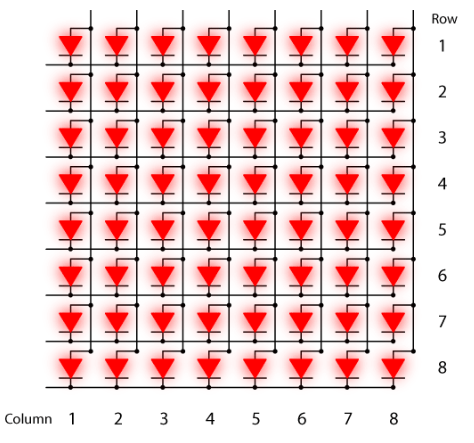

From the diagram, we can see that a simple 8 × 8 LED matrix would normally require 16 pins to control it (8 rows and 8 columns).  For example, sending a high signal to column 1 will activate that column. 

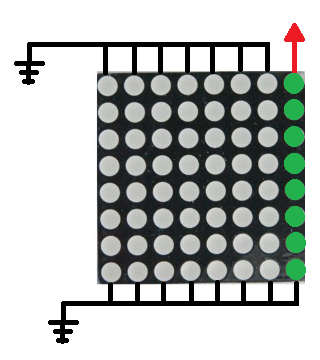

Then, by controlling the rows, we can decide which LEDs in that column turn on or off. Suppose we want to turn on only the first two LEDs in column 1. In that case, we would send a high voltage to column 1 and, to select the rows signals we send High signal to all rows except the first and second one so only  those two LEDs are active, while the others remain off.

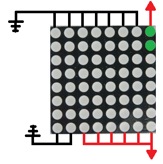

However, when we try to draw more complex shapes, we may encounter a problem. Some parts of the drawing may require certain rows or columns to be on and off at the same time, which is not possible in a simple matrix control scheme. As a result, the displayed image may appear incomplete or incorrect.  
To solve this issue, we can split the drawing into multiple frames. For example, to draw a smiling face, the first frame could display the eyes, and the second frame could display the mouth. By switching very quickly between these frames, we create the illusion that both parts are displayed simultaneously. Because of the persistence of vision, the observer perceives the full smiling face instead of separate images.

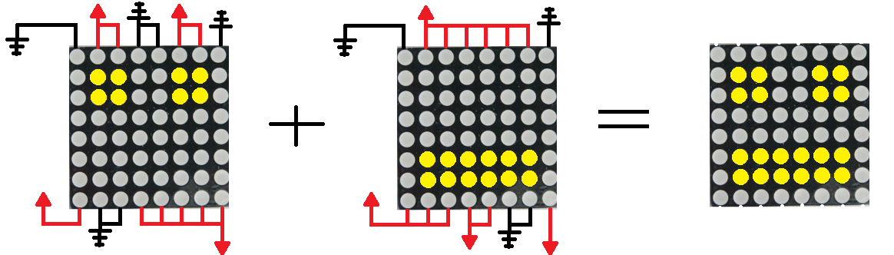


Using all 16 pins  would consume most of the available pins on an Arduino, to simplify working with an LED matrix, modules are often paired with a driver chip such as the MAX7219. This chip handles all the multiplexing internally, so we don't need to control each LED individually. As a result, we will need only three digital pins Data, Clock, and Load (CS).

The MAX7219 works by receiving commands serially in 16-bit packets. Inside the chip, there's a 16-bit shift register that collects these bits, an 8×8 memory (like SRAM) to store which LEDs should be on, and built-in multiplexing logic that rapidly scans the rows (or digits) to make the whole display look steadily lit through persistence of vision.

- **Data pin (DIN)**: This is where the actual information flows in. The Arduino sends one bit at a time (0 or 1) for example, the first 8 bits might be the register address, and the next 8 bits are the value or pattern..
- **Clock pin (CLK)**: This provides the timing. On each rising edge of the clock signal, the MAX7219 samples and shifts in one bit from the DIN line into its internal shift register. Without proper clock pulses synchronized with the data, nothing gets loaded correctly.
- **CS / LOAD pin**: This acts as the "latch" or chip select signal (active low). While CS is held **low**, the chip listens and shifts in bits with every CLK pulse. After exactly 16 clock pulses (16 bits sent), the Arduino pulls CS high this rising edge tells the MAX7219 "ok, the full command is ready now decode it and apply it to the display or registers."

In short, to communicate with the MAX7219, the Arduino first pulls CS (Chip Select) low to indicate that data transmission is starting. Then, for 16 clock cycles, the Arduino sets the desired bit on the DIN (Data) pin and pulses the CLK (Clock) pin high and then low. Each clock pulse sends one bit to the chip.  After the 16th clock pulse, the Arduino pulls CS high. The MAX7219 then latches the 16 bits, interprets them as an address and data, and updates the display memory or configuration settings such as brightness or scan limit. Once this is done, the MAX7219 automatically handles the continuous row-by-row scanning of the LED matrix, so the Arduino does not need to refresh the display unless the data changes.


Manually setting and configuring all this ourselves timing the bits, generating 16 precise CLK pulses per command, managing CS edges, sending init sequences like turning off shutdown mode, setting scan limit to 8 rows, choosing no-decode mode for matrix control, etc. would be a hard and error-prone task.

Arduino simplifies this enormously by providing libraries such as LedControl, MD_MAX72XX, or MD_Parola these handle all the complex low-level configuration, timing, bit-shifting, and command formatting for us. 

Let’s create a simple project to display a heart on the LED matrix. First, we need to build the circuit.  
Start by connecting the **VCC** and GND pins of the Arduino to the VCC and GND pins of the MAX7219 module to power the display.  
Next, connect the three control pins between the Arduino and the driver: connect Data (DIN) to pin 13, CLK to pin 11, and CS to pin 12 of the Arduino. These three pins will handle the communication between the Arduino and the MAX7219.

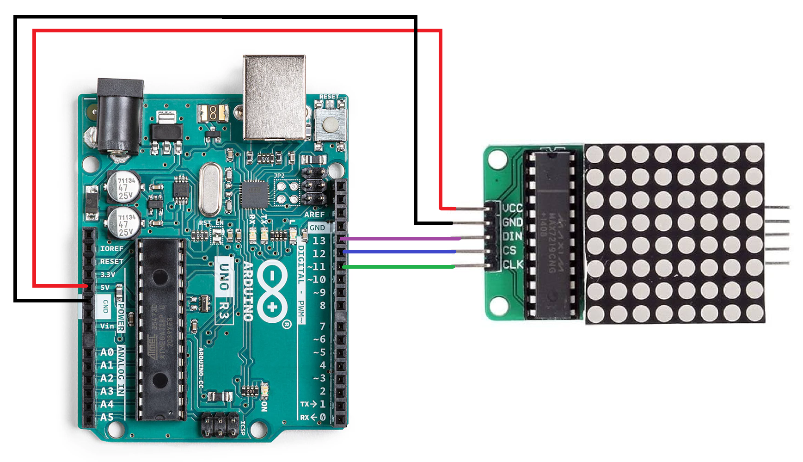

Now let’s create our program to control the MAX7219. We will use the **LedControl** library to simplify communication with the driver.
First, we include the library in our program. After that, we create an object of the LedControl class. In the constructor, we pass the pins used for communication: 13 for DIN (Data), 11 for CLK (Clock), and 12 for CS (Chip Select). We also specify the number of LED matrices connected, which in this case is **1**.   
Inside the `setup()` function, we begin by waking up the display (since it starts in power-saving mode). Then we set the brightness level, and finally clear the display so we start with a blank screen.

Next, we define an 8×8 matrix of bits that represents the shape of a heart. Each row of this matrix corresponds to one row of LEDs on the display.

Finally, inside the `loop()` function, we iterate through the rows of this matrix and send each row to the display using the library function, which lights up the LEDs to form the heart pattern on the LED matrix.

```cpp 
#include <LedControl.h>

LedControl lc = LedControl(13, 11, 12, 1); 

void setup() {
  lc.shutdown(0, false); // Wake up the display
  lc.setIntensity(0, 8); // Set brightness level (0 to 15)
  lc.clearDisplay(0);    // Clear the screen
}

byte heart[8] = { 
	B00000000, 
	B01100110, 
	B11111111, 
	B11111111, 
	B11111111, 
	B01111110, 
	B00111100, 
	B00011000 
};
void loop() {
	for (int row = 0; row < 8; row++) {
		lc.setRow(0, row, heart[row]); 
	}

}
```
The library provide us additional function to work with the matrix led for example
- ``lc.setLed(0, row, col, state)`` to light individual pixels
- ``lc.setColumn(0, col, value)`` to control by column instead of row

If we want to use more than one LED matrix (for example 16×8, 24×8, or 32×8 displays), we connect several MAX7219 modules in series. In this case, we must change the configuration when creating the `LedControl` object.   
When we create the object, the last parameter specifies the number of devices (matrices) connected.
```cpp 
LedControl lc = LedControl(13, 11, 12, 2); // for two matrices (16×8)
LedControl lc = LedControl(13, 11, 12, 3); // for three matrices (24×8)
LedControl lc = LedControl(13, 11, 12, 4); //  for four matrices (32×8)
```
Each matrix has its own device address:

|Device|Address|
|---|---|
|First matrix|0|
|Second matrix|1|
|Third matrix|2|
|Fourth matrix|3|
Inside the `setup()` function we must initialize each device separately, just like we did for the first one.
```cpp
void setup() {  
  // example two matrix
  for (int i = 0; i < 2; i++) {  
    lc.shutdown(i, false); 
    lc.setIntensity(i, 8);  
    lc.clearDisplay(i);     
  }  
  
}
```
Finally when displaying data, we specify the device address as the first parameter.
```cpp
lc.setRow(0, 0, B11111111); // first matrix  
lc.setRow(1, 0, B11111111); // second matrix
```

### Seven Segment Display
Seven-segment displays are digital displays made up of seven LED segments arranged to form numbers 0-9 and some letters. These segments are labeled with letters from **A** to **G**. By turning on specific combinations of these segments, we can form any number. For example, to display the number "1", we turn on segments B and C.     
There are two main types of seven-segment displays:
- **Common Cathode:** All the negative pins (GND) of the LEDs are connected together. We send a HIGH signal to a segment's pin to turn it ON.
- **Common Anode:** All the positive pins (VCC) of the LEDs are connected together. We send a LOW signal to a segment's pin to turn it ON.

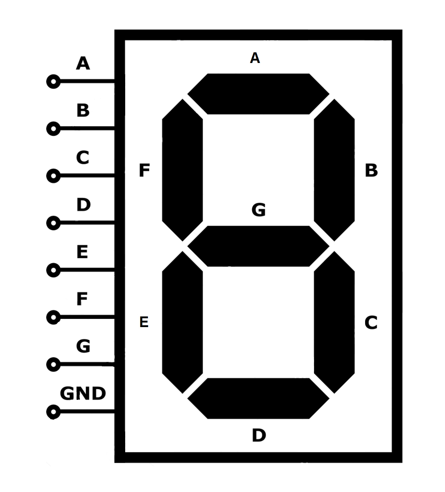

If we attempted to control each segment directly, we would need **8 digital pins** from the Arduino (7 segments plus the decimal point). While this approach works for a single digit, it quickly becomes inefficient when working with multiple digits.  To solve this problem, some 7-segment displays are used with a BCD-to-7-segment decoder/encoder, which reduces the number of required Arduino pins from 7 to only 4 control pins.  In this case, the information is sent using BCD (Binary-Coded Decimal) encoding, where each decimal digit is represented by its binary equivalent. We can use the following table:

| Decimal Digit | BCD (a,b,c,d) |
| ------------- | ------------- |
| 0             | 0000          |
| 1             | 0001          |
| 2             | 0010          |
| 3             | 0011          |
| 4             | 0100          |
| 5             | 0101          |
| 6             | 0110          |
| 7             | 0111          |
| 8             | 1000          |
| 9             | 1001          |

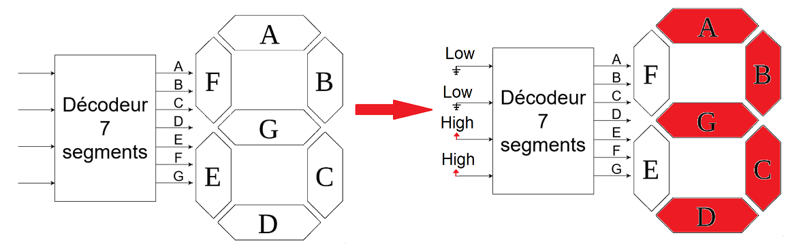

In many applications, we need to display numbers larger than a single digit, such as two-digit, four-digit, or more. A four-digit 7-segment display is created by combining four individual 7-segment displays into a single module. Each digit has an additional control pin that determines which digit is currently active. For example, pins D1, D2, D3, and D4 control which of the four 7-segment digits is enabled, while the segment pins a, b, c, d, e, f, g, and DP control which LEDs light up in the selected digit.

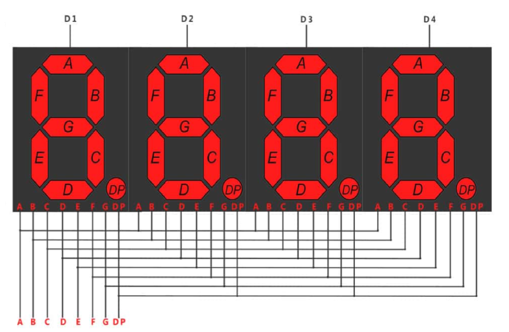

If we tried to control all four digits manually, we would need 12 pins: 8 pins for segments and 4 pins for digit selection. To reduce the number of pins, we can use a BCD  encoder, which allows us to drive all four digits using only 9 pins (4 for BCD input + 5 for segments including the decimal point) we can use 8 if we remove the decimal point.

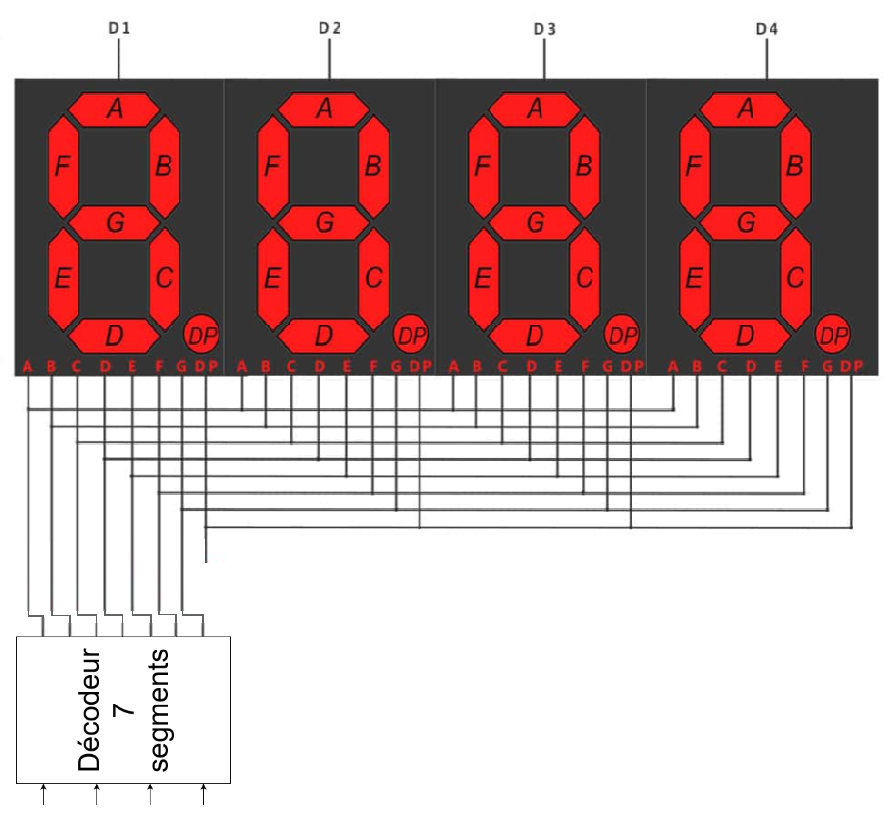

The **TM1637** is the most popular driver for 4-digit, 7-segment displays because it reduces a complex wiring setup which would normally require 8 or more pins to just two control pins (plus power).    
Inside the chip, there is a specialized SRAM data set and a 7-segment decoder. It handles the multiplexing automatically, meaning it switches between the four digits so rapidly that they appear to be on simultaneously, the control pins are :
- **DIO (Data Input/Output):** This pin is a two-way street. Not only does the Arduino send segment data in, but the TM1637 sends an ACK (Acknowledgment) bit back to the Arduino after every byte to confirm it was received. 
- **CLK (Clock Pin):** This is the heartbeat of the communication. The TM1637 "reads" the data on the DIO pin during the falling edge of the clock signal. 

To communicate with the TM1637, the Arduino first sends a Start Signal by pulling the DIO (Data) line low while the CLK (Clock) line remains high, signaling the chip to wake up and listen. Next, the Arduino sends an 8-bit Command one bit at a time, where each bit is sampled by the chip on the falling edge of the clock. After every 8 bits, the TM1637 pulls the DIO line low for one clock cycle this is the ACK, a handshake that confirms the byte was received. The Arduino then sends the Address of the specific digit it wants to update, followed by the Segment Data . Finally, the Arduino sends a Stop Signal by pulling DIO high while CLK is high. This "latches" the data into the internal memory, and the TM1637’s built-in multiplexer immediately takes over, rapidly scanning the digits to keep them lit without any further help from the Arduino.

Arduino provides the TM1637Display.h library, which simplifies working with the display by offering a simplified interface that handles all the clock signaling and synchronization internally.

Let’s create a simple counter project that counts from 99 down to 0. We start by building the circuit: connect the GND pin of the TM1637 to the GND of the Arduino, and the VCC pin to the VCC of the Arduino. After that, connect the CLK pin to pin 2 on the Arduino, and finally connect the DIO pin to pin 3.

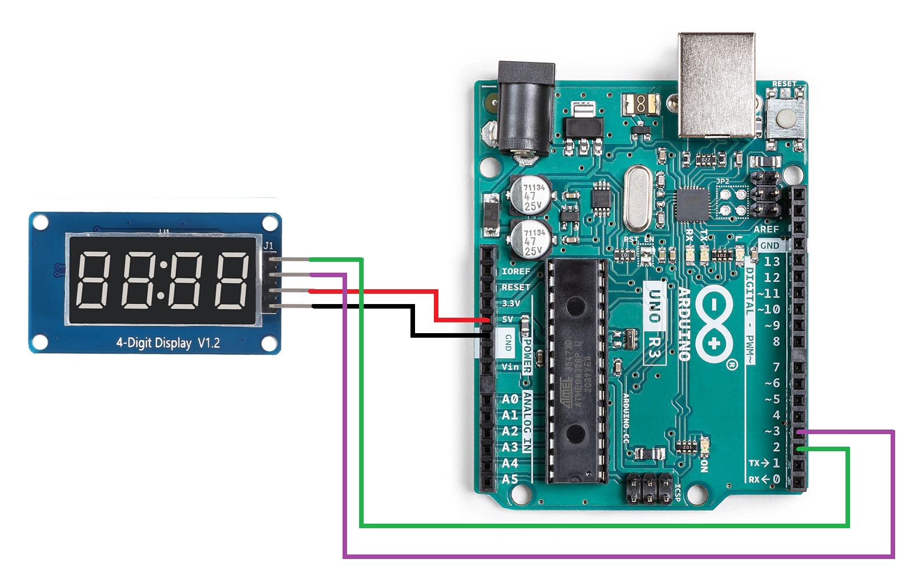

To work with the TM1637 display driver, we first include the TM1637 library in our code. After that, we create an object for the display and specify the **CLK** and **DIO** pins that connect the module to the microcontroller.  
Next, inside the setup() function, we initialize the display and set the brightness level.

Finally, in the loop() function, we can write data to the display. To show numbers, we use the function showNumberDec(). In this example, we create a for loop that counts from 99 down to 0 to display a countdown on the screen. After each number is displayed, we add a small delay of 500 milliseconds so the numbers change at a visible speed.

```cpp
#include <TM1637Display.h>  
  

// Create the display object  
TM1637Display display(2, 3);  
  
void setup() {  
	display.setBrightness(5);  
}  
  
void loop() {  

	for (int i = 99; i >= 0; i--) {  
  
		display.showNumberDec(i, true);  
  
		delay(500);  
	}  
}
```
The `showNumberDec` take two arguments: 
- The number to display  
- A boolean value (`true` or `false`)  determine whether leading zeros should be displayed.
    - `true` leading zeros are shown (for example: **0007**, **0023**).
    - `false` leading zeros are hidden (for example: **7**, **23**).


The library also provides other useful functions to work with the display device.
`showNumberDecEx()`  This function is similar to **`showNumberDec()`**, but it allows extra control over the **dots or colon** on the display (useful for clocks or timers).
```cpp
display.showNumberDecEx(1234, 0b01000000, true); // turn on the colon
display.showNumberDecEx(1234, 0b10000000, true);   // turn on a dot
```
`setSegments()`  This function allows us to **send raw segment data directly** to the 7-segment display.   Each byte represents which **segments (a–g)** should be turned on for a digit.
```cpp
uint8_t data[] = {0x3f, 0x06, 0x5b, 0x4f};  
display.setSegments(data);
```

| Hex value | Digit shown |
| --------- | ----------- |
| 0x3F      | 0           |
| 0x06      | 1           |
| 0x5B      | 2           |
| 0x4F      | 3           |
So this array represents the digits:
```
0 1 2 3
```
### LCD Display
LED matrices and seven-segment displays are very useful when we need to display numbers or simple shapes. However, they have an important limitation.  Seven-segment displays are mainly designed for numbers, and LED matrices require a large number of LEDs and complex control if we want to display readable text. To solve this problem, we use **LCD displays (Liquid Crystal Displays)**. These displays allow us to show **text characters and sometimes small symbols**, making them ideal for building user interfaces.

An LCD (Liquid Crystal Display) works using a special material called **liquid crystals**. These materials have properties between a liquid and a solid crystal.

Inside the LCD module, there are several layers:
1. Two polarizing filters
2. A layer of liquid crystals
3. Glass plates with transparent electrodes
4. A backligh

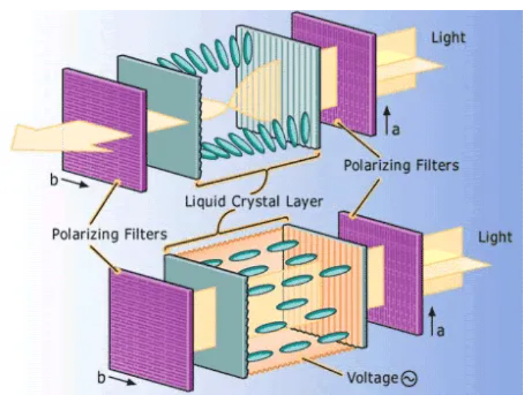

Unlike LED displays, **LCD pixels do not emit light themselves**. Instead, they act as tiny shutters that control how light passes through the screen.When the internal controller applies a voltage to specific pixel areas, the liquid crystals physically **twist**. This twisting changes the polarization of the light. While light passes through the crystals naturally when no electricity is applied (making the screen look blank and glowing), the twisted crystals cause the second (front) polarizing filter to **block the light**. As a result, the pixel appears **dark**, while the surrounding areas remain bright. This blocked light creates the dark "pixels" that form our letters, numbers, and symbols against the bright background.

There is multiple modules of LCD but the most common modules available in the market are:
- **16 × 2 LCD** Displays 16 characters per row and 2 rows.
- **20 × 4 LCD** Displays 20 characters per row and 4 rows.
- **40 × 2 LCD** Displays 40 characters per row and 2 rows.
- **40 × 4 LCD** Displays 40 characters per row and 4 rows.

A standard character LCD module typically has 16 pins. These pins are used for power, control signals, data communication, and backlight control, To communicate with the LCD directly, we have two possible modes for sending data from the Arduino:
- 8-bit mode
- 4-bit mode

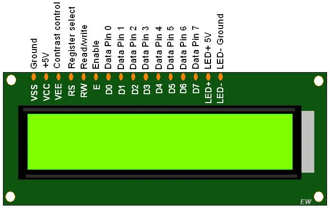

In 8-bit mode, the Arduino uses all eight data pins (D0–D7) of the LCD to send one full byte of data at a time. This method is faster because the entire character is transmitted in a single operation.

However, this mode requires many Arduino pins:
- 8 pins for data
- 3 control pins (RS, RW, Enable)

This means a total of 11 pins, which is a large portion of the available pins on most Arduino boards. Because of this, 8-bit mode is rarely used in simple projects.  

In 4-bit mode, the LCD receives data in two steps instead of one.  First, the Arduino sends the higher 4 bits, then it sends the lower 4 bits of the same byte. The LCD internally combines these two parts to reconstruct the full 8-bit value.  
This approach reduces the number of required pins:
- 4 data pins (D4–D7)
- 2 control pins (RS and Enable)


The RW pin is usually connected to GND, meaning the Arduino only writes to the display. As a result, we only need 6 Arduino pins, which makes this mode much more practical, and therefore it is the most commonly used configuration.

Let’s create a simple “Hello World” example using a 16×2 LCD in 4-bit mode. First, connect the LCD to the Arduino: connect RS to pin 12, EN to pin 11, D4 to pin 5, D5 to pin 4, D6 to pin 3, and D7 to pin 2. For power connections, connect VSS, RW, and K to GND, and VDD and A to 5V. The V0 pin, which controls the contrast, is usually connected to the middle pin of a potentiometer placed between 5V and GND so the text visibility can be adjusted.

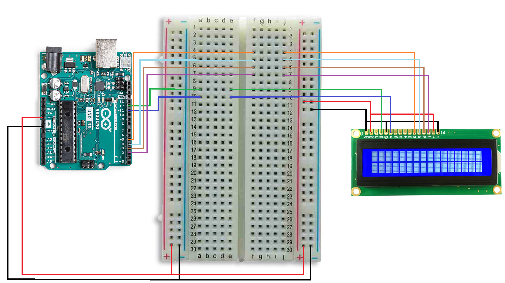

We can program and configure the LCD directly using its **datasheet**, but this requires sending many low-level commands and managing precise timing, which makes the process complex. Arduino simplifies this by providing the **`LiquidCrystal`** library, which already handles the low-level communication with the display. To use it, we first include **`LiquidCrystal.h`**, then create an LCD object and specify the pins connected to the display. In the **`setup()`** function we initialize the LCD by defining the number of **columns and rows**, and inside the **`loop()`** function we can use **`print()`** to display text on the screen.
```cpp
#include <LiquidCrystal.h>

LiquidCrystal lcd(12, 11, 5, 4, 3, 2);  // RS, EN, D4, D5, D6, D7

void setup() {
  lcd.begin(16, 2);  // Columns, rows
  lcd.print("Hello, World!");
}

void loop() {
  lcd.print("Hello, World!");
}
```
The library also provides many additional functions that make it easier to control and format the display output. Some of the most useful functions include:
- **`lcd.clear()`** Clears the entire display and moves the cursor back to the first position.
- **`lcd.setCursor(column, row)`** Moves the cursor to a specific position on the screen before printing text.
- **`lcd.home()`** Returns the cursor to the top-left corner of the display.
- **`lcd.cursor()`** Shows the cursor on the screen.
- **`lcd.noCursor()`** Hides the cursor.
- **`lcd.blink()`** – Makes the cursor blink.
- **`lcd.noBlink()`** – Stops the cursor from blinking.
- **`lcd.scrollDisplayLeft()`** – Scrolls the entire display one position to the left.

Everything works well with this setup, but there is one small drawback: the LCD requires six Arduino pins to operate. Using so many pins can limit the number of other devices or sensors we can connect to the Arduino.

To solve this problem, we can use an I2C module attached to the LCD. This module acts as an interface that converts the I2C communication protocol into the parallel signals required by the LCD. With this module, the number of pins needed is reduced to only two communication pins: SDA (data) and SCL (clock). 

Let’s now use the I2C interface to build the same project. First, we build the circuit. We start by connecting the GND and VCC pins of the I2C LCD module to the GND and 5V pins of the Arduino to power the display. After that, we connect the SDA pin of the module to the SDA pin of the Arduino (A4 on Arduino Uno), and the SCL pin to the SCL pin (A5 on Arduino Uno). With these four connections, the LCD can communicate with the Arduino using the I2C protocol.

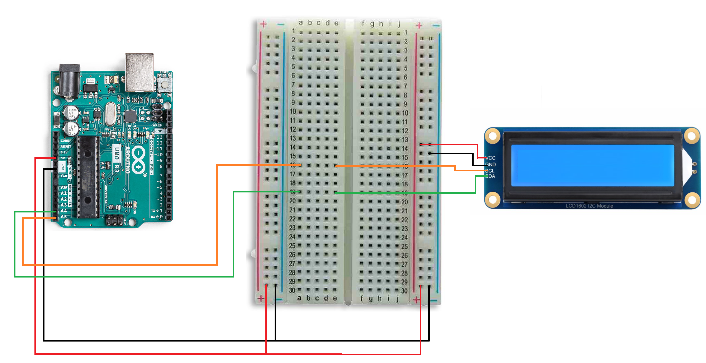

Now we can control the LCD using the **`LiquidCrystal_I2C.h`** library. First, we include the library in our program. After that, we create an LCD object where we specify the **I2C address**, along with the **number of columns and rows** of the display. The address identifies the LCD module on the I2C bus (commonly **0x27** or **0x3F** depending on the module).

Inside the **`setup()`** function, we initialize the LCD using `lcd.init()` and turn on the backlight using `lcd.backlight()`. Finally, in the **`loop()`** function, we can display text on the screen using the `print()` function.
```cpp
#include <LiquidCrystal_I2C.h>  
  
LiquidCrystal_I2C lcd(0x27, 16, 2); // Address, columns, rows  
  
void setup() {  
lcd.init();  
lcd.backlight();  
lcd.print("Hello, World!");  
}  
  
void loop() {  
lcd.print("Hello, World!");  
}
```

For larger sizes like 40x2 or 40x4, we use similar setup but specify dimensions in begin
```cpp
LiquidCrystal_I2C lcd(0x27, 40, 2); // 40×2 LCD  
LiquidCrystal_I2C lcd(0x27, 40, 4); // 40×4 LCD
```
The **`LiquidCrystal_I2C`** library comes with many additional functions that make it easy to control and format the LCD. Besides `print()` and `setCursor()`, some of the most useful functions include:
- **`lcd.clear()`** Clears the entire display and resets the cursor to the top-left corner.
- **`lcd.home()`** Moves the cursor back to the first column of the first row.
- **`lcd.setCursor(col, row)`** Positions the cursor at a specific column and row before printing text.
- **`lcd.backlight()`** Turns on the LCD backlight.
- **`lcd.noBacklight()`** Turns off the backlight.
- **`lcd.cursor()`** Shows the cursor on the screen.
- **`lcd.noCursor()`** Hides the cursor.
- **`lcd.blink()`** Makes the cursor blink.
- **`lcd.noBlink()`** Stops the cursor from blinking.
- **`lcd.scrollDisplayLeft()`** Scrolls the entire display one position to the left.
- **`lcd.scrollDisplayRight()`** Scrolls the display one position to the right.
- **`lcd.createChar(location, charmap)`** Allows creating custom characters or symbols (up to 8 custom characters).
## Connectivity and Communication
We used different sensors and display devices with an Arduino Uno board. However, in large projects we may need many devices, which can exceed the number of available pins on a single Arduino board.  
To solve this problem, we can use networking techniques. By connecting multiple Arduino boards together, we can expand the number of available pins and distribute tasks among several boards. In addition, networking allows different devices in the system to communicate with each other and exchange data, making the overall system more efficient and scalable for complex projects.
### Serial Communication
Serial communication is one of the most common ways for an **Arduino** board to communicate with a computer or with other devices. It is a method of transmitting data **sequentially, bit by bit**, over a communication channel.   
When we program our Arduino, we use serial communication. By plugging in the **USB cable**, a serial communication link is established between the Arduino board and the computer. Through this connection, we can upload our program to the microcontroller.

However, serial communication is not only used for programming. We can also **send and receive data** between the computer and the Arduino board. This is very useful for **debugging programs**, because it allows us to display messages or variable values while the program is running.

To use serial communication in Arduino programs, we use the **Serial library**, which provides functions for sending and receiving data.

For two devices to talk serially, they need to agree on a few rules, primarily the **Baud Rate**, which represent the speed of the communication (bits per second). Common speeds are 9600 or 115200. If the sender is talking at 9600 and the receiver is listening at 115200, the data will look like gibberish and corrupted.
#### Creating Project
Let’s create a simple example of sending a message using serial communication. First, we connect the Arduino board to our computer using a USB cable. Then, in the Arduino IDE, we create a new sketch.  To work with serial communication, we use the `Serial` object. We first initialize the communication by specifying the baud rate inside the `setup()` function using `Serial.begin()`.   
Once the communication is started, we can send data from the Arduino to the computer inside the `loop()` function using `Serial.print()` or `Serial.println()`.
```cpp
void setup() {  
  Serial.begin(9600); // Start serial communication at 9600 baud  
}  
  
void loop() {  
  Serial.println("Hello from Arduino"); // Send a message  
  delay(1000); // Wait 1 second  
}
```
Now the Arduino will send the message **“Hello from Arduino”** to our computer. We can read this message by opening the Serial Monitor from the **Tools** menu in the Arduino IDE.

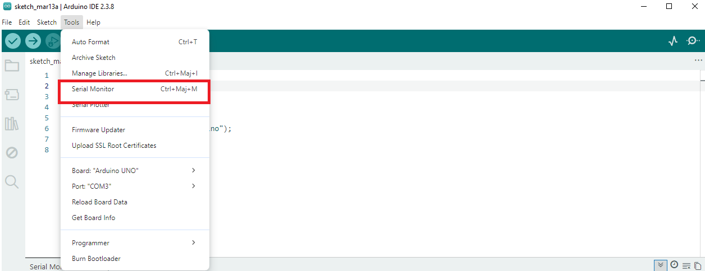

This will open a small window that **displays the message** on the screen.

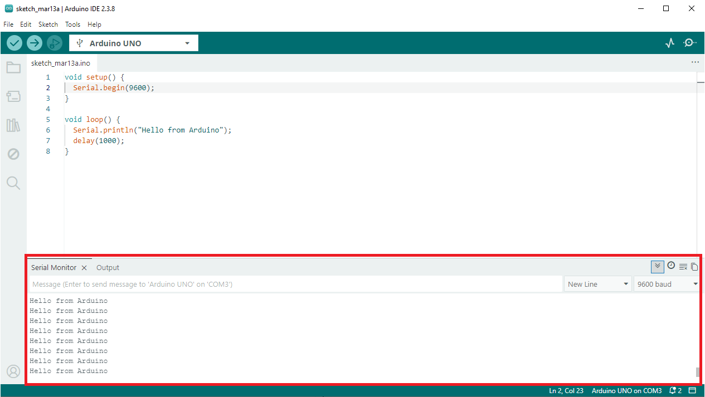

We can also send data from the IDE to the Arduino board. To do this, we add a small condition inside the `loop()` function to check if data has been received. This is done using `Serial.available()`, which returns the number of bytes available to read. If data is available, we can read it byte by byte using `Serial.read()`.
```cpp
void setup() {
  Serial.begin(9600); // Initialize serial communication at 9600 baud
  Serial.println("Arduino is ready. Send me a message!");

}

void loop() {

  if (Serial.available() > 0) {
    char receivedChar = Serial.read(); 
    Serial.print("You sent: ");            
    Serial.println(receivedChar); 
  }
}
```
Now send data from the ide we use the input box in the serial monitor

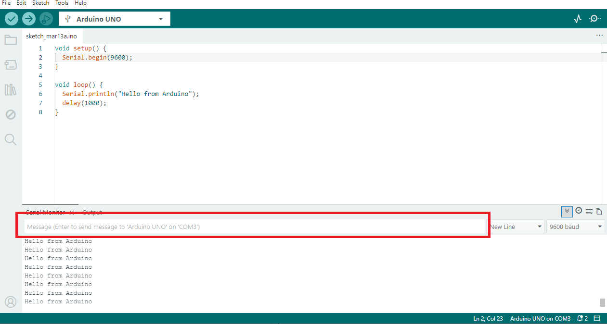

The `Serial.available()` function returns the number of bytes available to read. We can use this value in a **`for` loop** instead of repeatedly using an `if` statement. 
```cpp
void setup() {  
	Serial.begin(9600); 
	Serial.println("Arduino is ready. Type something in the Serial Monitor!");  
}  
  
void loop() {  
	for (int i = 0; i < Serial.available(); i++) {  
		char receivedChar = Serial.read(); 
		Serial.print("You sent: ");  
		Serial.println(receivedChar); 
	}
}
```
### UART Protocol
UART, which stands for Universal Asynchronous Receiver/Transmitter, is a hardware protocol used for serial communication between devices. With this communication protocol, we can connect our **Arduino board** to another Arduino board or to other electronic devices such as sensors, GPS modules, or Bluetooth modules.   

UART communication uses two main pins:
- **TX (Transmit)** sends data from the device
- **RX (Receive)** receives data from another device

#### UART Architecture
To connect two devices together using UART communication, we link the transmitter (TX) of the first device to the receiver (RX) of the second device. Similarly, the receiver (RX) of the first device is connected to the transmitter (TX) of the second device. In other words, TX connects to RX, and RX connects to TX.   
In addition, both devices must share a common ground (GND) so that they use the same voltage reference.   

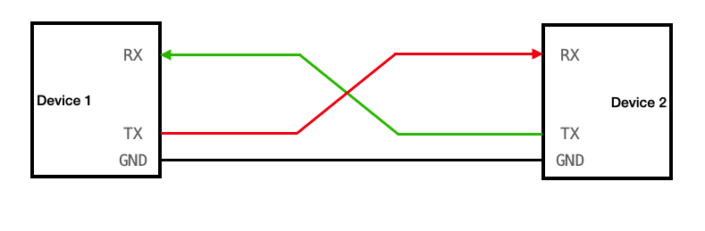

After connecting the devices, we must ensure that both sides use the same baud rate, which defines the communication speed in bits per second. 
#### Working Principle
The data is transmitted as a sequence of electrical signals over the **TX (Transmit)** line. Each signal represents a binary value, where a **HIGH voltage level represents 1** and a **LOW voltage level represents 0**.   
The line normally stays in a HIGH state when idle. When a device wants to send data, it begins by transmitting a start bit, which is a LOW signal. This transition from HIGH to LOW informs the receiver that a new data frame is starting and allows it to synchronize its timing based on the configured **baud rate**.

After the start bit, the transmitter sends the data bits, usually 8 bits per byte, one bit at a time over the TX (Transmit) line. Each bit is represented by an electrical signal where a HIGH voltage level represents 1 and a LOW voltage level represents 0.

Once the data bits have been transmitted, an optional parity bit may be added for basic error detection. This bit helps the receiver verify whether the transmitted data may have been corrupted during transmission.

Finally, the frame ends with one or more stop bits, which are HIGH signals. The stop bit marks the end of the data frame and returns the line to the idle HIGH state, allowing the receiver to recognize that the transmission has finished before waiting for the next start bit. 

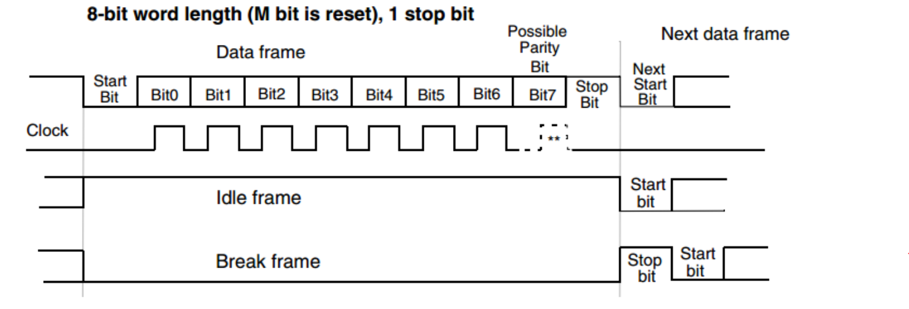
#### Arduino UART Configuration
The Arduino Uno contains a single hardware UART module. This UART is connected to the following pins:
- **Pin 1 TX (Transmit)**
- **Pin 0 RX (Receive)**

This can create a limitation because UART communication is a point-to-point protocol, meaning it normally connects only two devices at a time. In addition, these same pins are also used for communication with the computer when uploading programs or using the Serial Monitor.  
To overcome this limitation, we can create software-based serial ports using the `SoftwareSerial` library. This library allows UART-like communication on other digital pins of the Arduino, for example pins 10 and 11, while keeping the hardware UART free for communication with the computer.
#### Creating Project
Let’s create a simple project where we connect three Arduino boards together using the UART protocol. In this project, we will use a master–slave architecture, where one Arduino acts as the master and the other two act as slaves. The master will send commands through UART communication, and the slave boards will perform actions based on the received command.   
First, we need to connect the three Arduino boards together. Since UART communication uses TX and RX  lines, the transmitter of one device must be connected to the receiver of the other device.

Because the Arduino Uno has only one hardware UART, we will use the hardware serial for communication between the master and one slave, and a software serial port for communication with the second slave.   
The connections are as follows:   
**Master to Slave 1 (Hardware UART)**
- Master **TX (Pin 1)** Slave 1 **RX (Pin 0)**
- Master **RX (Pin 0)** Slave 1 **TX (Pin 1)**

**Master to Slave 2 (Software UART)**
- Master **Pin 11 (TX)** Slave 2 **RX (Pin 0)**
- Master **Pin 10 (RX)** Slave 2 **TX (Pin 1)**
    
Finally, all three boards must share a common ground (GND).

After connecting the Arduino boards together, we will add output and input components, Each slave Arduino will have an LED connected to it. we use pin 9 on the slaves board to control the led we connect them through 220Ω resistor. 

Next, we add two push buttons to the master Arduino. These buttons will allow the user to send commands to the slave boards. We use pin 7 and pin 8 for the buttons: pin 7 will control the first slave Arduino, and pin 8 will control the second slave Arduino. When a button is pressed, the master Arduino will send a command through **UART**, and the corresponding slave will perform the required action.

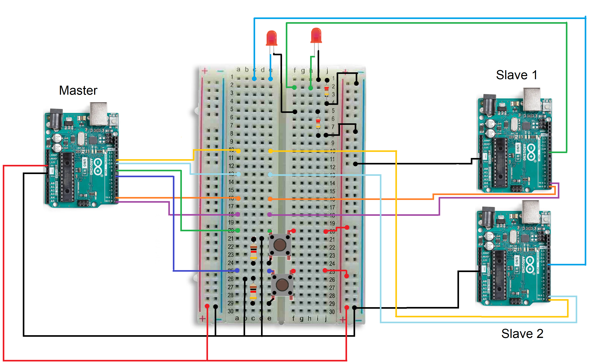

Now let’s create our programs, starting with the **master Arduino**.
First, we import the `SoftwareSerial` library to create a second UART port for communication with the second slave. Inside the `setup()` function, we initialize our UART communication:
- The first UART uses the standard hardware serial for the first slave.
- The second UART uses pins 11 (TX) and 10 (RX) for the second slave.

We also configure pins 7 and 8 as input pins to read the state of the push buttons.  
Next, we create two boolean variables to keep track of the LED state for each slave. These variables will toggle every time a button is pressed.  
Inside the `loop()` function, we read the state of the push buttons:
- If the button connected to **pin 7** is pressed, we toggle the first boolean variable and send a message (`"ON"` or `"OFF"`) to the **first slave**.
- If the button connected to **pin 8** is pressed, we **toggle the second boolean variable** and send a message to the **second slave**.

Finally, we add a **small delay of 500 ms** to **debounce the buttons** and prevent multiple rapid triggers from a single press.
```cpp
#include <SoftwareSerial.h>  


SoftwareSerial slave2Serial(10, 11); // RX, TX  

bool led1State = false;  
bool led2State = false;  
  
void setup() {  
// Initialize UART communication  
	Serial.begin(9600); // Hardware UART for first slave  
	slave2Serial.begin(9600); // Software UART for second slave  
  
	pinMode(7, INPUT);  
	pinMode(8, INPUT);  
}  
  
void loop() {  
	if (digitalRead(7) == HIGH) {  
		led1State = !led1State; 
		if (led1State) {  
			Serial.println("ON"); 
		} else {  
			Serial.println("OFF");  
		}  
	delay(500);  
	}  
  
	if (digitalRead(8) == HIGHT) {  
		led2State = !led2State; 
		if (led2State) {  
			slave2Serial.println("ON");  
		} else {  
			slave2Serial.println("OFF");  
		}  
	delay(500); 
	}  
}
```
Now we create the program for the slave board, First, inside the `setup()` function, we set pin 9 as an output pin for the LED and start serial communication at a baud rate of 9600, which must match the master.  Next, we create a string variable to store the data received from the master through UART.

Finally, inside the `loop()` function, we check if data has been sent using `Serial.available()`. If data is available, we read it. If the received message is `"ON"`, we turn the LED on. If it is `"OFF"`, we turn the LED off.
```cpp
String receivedData = ""; 
  
void setup() {  
	pinMode(9, OUTPUT);  
	Serial.begin(9600); 
}  
  
void loop() {  
 
	if (Serial.available() > 0) {  
		receivedData = Serial.readStringUntil('\n'); 
		if (receivedData == "ON") {  
			digitalWrite(9, HIGH);
		} else if (receivedData == "OFF") {  
			digitalWrite(9, LOW); 
		}  
	}  
}
```
### I2C Protocol
The UART protocol works perfectly, but it has a small limitation: it is a point-to-point communication protocol. This means that it normally connects only two devices together. If we want to add more devices,  we need more pins and more independent serial ports (like using `SoftwareSerial`). As the number of sensors and modules grows, we quickly consume all our available pins. To solve this, a new protocol has been developed: **I2C**.

**I2C**, which stands for Inter-Integrated Circuit, is a serial communication protocol that allows multiple devices to communicate using only two wires. With I2C, we can connect many devices such as sensors, displays, EEPROM memory, and other microcontrollers to the same communication bus while using only two pins on the Arduino.  
The two communication lines used in the I2C protocol are:
- **SDA (Serial Data Line)** used to transfer data between devices
- **SCL (Serial Clock Line)** used to synchronize the communication using a clock signal
#### I2C Architecture
Unlike UART, where each connection requires a separate pair of wires, all I2C devices share the same SDA and SCL lines. This allows multiple devices to be connected in parallel on the same bus.   
In an I2C system, devices are organized using a master–slave architecture:
- The master device controls the communication and generates the clock signal on the SCL line.
- The slave devices respond to the master when they are addressed.
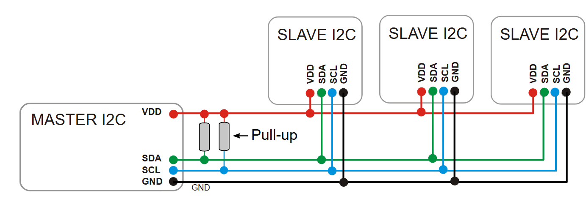

Each slave device connected to the I2C bus has a unique address. When the master wants to communicate with a specific device, it sends the address of that device on the SDA line. Only the device with the matching address will respond, while the others remain inactive.
#### Working Principle
The Communication in I2C follows a specific sequence of events. The master begins by generating a Start condition, which occurs when the SDA line changes from HIGH to LOW while SCL is HIGH. This signals all devices on the bus that a communication session is beginning.

After the start condition, the master sends the 7-bit address of the slave device, followed by a read/write bit that indicates whether the master wants to send data to the slave or receive data from it.

Once the address is transmitted, the addressed slave responds with an ACK (acknowledge) bit, confirming that it is ready to communicate. The master and slave can then exchange data bytes, where each byte consists of 8 bits followed by another acknowledge bit.

When the communication is finished, the master sends a Stop condition, which occurs when the SDA line changes from LOW to HIGH while SCL is HIGH. This indicates that the data transmission has ended and the bus becomes idle again.


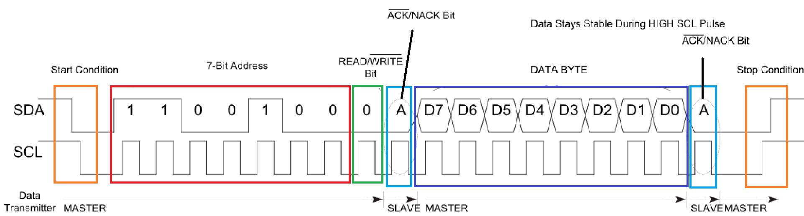


#### Arduino I2C Configuration
On the Arduino Uno, the hardware I2C interface uses the following pins:
- **A4 – SDA (Serial Data)**
- **A5 – SCL (Serial Clock)**

These pins allow the Arduino to communicate with multiple I2C devices using the same two wires.
#### Creating Project
Now let's create a simple project where three Arduino boards and an LCD display communicate using the I2C protocol. In this system, one Arduino acts as the **master**, while the other two act as **slave devices**. The master sends commands to the slaves, and each slave controls an LED based on the received command. In addition, an LCD display connected to the master Arduino shows the current state of each slave’s LED.    
First, we connect the three Arduino boards and the LCD display using the I2C bus.
- All **SDA pins (A4)** are connected together.
- All **SCL pins (A5)** are connected together.
- All devices share a common GND.

Next, we connect an LED to each slave Arduino.  Each LED is connected to pin 9 through a 220Ω resistor.
On the master Arduino, we add two push buttons to send commands to the slaves:
- Pin 7 controls the first slave
- Pin 8 controls the second slave

When a button is pressed, the master Arduino sends a command through the I2C bus to the corresponding slave device. The slave receives the command and toggles the state of its LED. At the same time, the LCD display connected to the master Arduino is updated to show the current state of each slave’s LED.

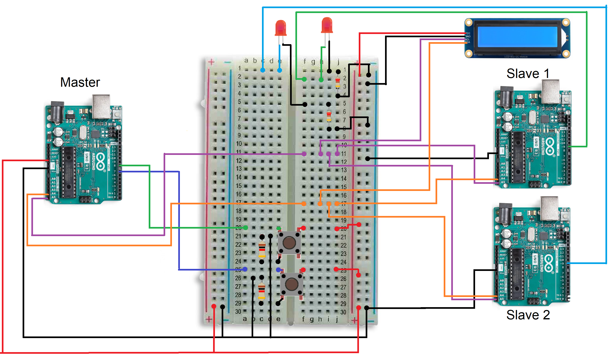
Now let's create the program for the master Arduino.   
First, we include the Wire library, which allows the Arduino to communicate using the I2C protocol, and the LiquidCrystal_I2C library, which allows us to control the LCD display through the I2C bus.  
Inside the `setup()` function, we initialize the I2C communication using `Wire.begin()`, configure the button pins as inputs, and initialize the LCD display. The LCD is then used to display the current state of each slave’s LED.

Inside the `loop()` function, the Arduino continuously checks whether one of the buttons is pressed. When a button is pressed, the master toggles the state of the corresponding slave LED and sends a command to that slave using its I2C address. After sending the command, the LCD display is updated to show the new state of each slave.
```cpp
#include <Wire.h>
#include <LiquidCrystal_I2C.h>

LiquidCrystal_I2C lcd(0x27, 16, 2); // LCD I2C address

bool led1State = false;
bool led2State = false;

void setup() {

    Wire.begin(); 
    pinMode(7, INPUT);
    pinMode(8, INPUT);
    lcd.init();
    lcd.backlight();
    lcd.setCursor(0,0);
    lcd.print("Slave1: OFF");
    lcd.setCursor(0,1);
    lcd.print("Slave2: OFF");
}

void loop() {
    if (digitalRead(7) == HIGH) {
        led1State = !led1State;
        Wire.beginTransmission(8); // Address of slave 1
        lcd.setCursor(0,0);
	    lcd.print("Slave1: ");
        if (led1State) {
	        lcd.print("ON ");
            Wire.write("ON");
        } else {
            lcd.print("OFF");
            Wire.write("OFF");
        }
        Wire.endTransmission();
        delay(500);
    }

    if (digitalRead(8) == HIGH) {
        led2State = !led2State;
        Wire.beginTransmission(9); // Address of slave 2
        lcd.setCursor(0,1);
        lcd.print("Slave2: ");
        if (led2State) {
            lcd.print("ON ");
            Wire.write("ON");
        } else {
            lcd.print("OFF");
            Wire.write("OFF");
        }
        Wire.endTransmission();
        delay(500);
    }
}
```
Next, we create the program for the slave Arduino boards. Both slave boards will run the same program*, but each one will have a different I2C address.

Inside the `setup()` function, we initialize the I2C communication using `Wire.begin(address)`, where the address uniquely identifies the slave device on the I2C bus. We also register a function called `receiveEvent()`, which is automatically executed whenever the slave receives data from the master.    
Inside this function, the slave reads the received message and **controls the LED accordingly**.
```cpp
#include <Wire.h>

String receivedData = "";

void setup() {

    pinMode(9, OUTPUT);

    Wire.begin(8); // Change to 9 for the second slave
    Wire.onReceive(receiveEvent);
}

void loop() {
}

void receiveEvent(int bytes) {

    receivedData = "";

    while (Wire.available()) {
        char c = Wire.read();
        receivedData += c;
    }

    if (receivedData == "ON") {
        digitalWrite(9, HIGH);
    }
    else if (receivedData == "OFF") {
        digitalWrite(9, LOW);
    }
}
```
### SPI Protocol
The I2C protocol is highly efficient for connecting many devices with just two wires, but it has some limitations. Because it uses a single data line for both sending and receiving, it operates in half-duplex mode it cannot send and receive data at the same time. Additionally, the use of pull-up resistors limits its maximum communication speed. When a project requires transferring large amounts of data very quickly such as reading an SD card or driving a high-resolution color display I2C can become a bottleneck. To solve this need for speed and simultaneous two-way communication, we use the SPI protocol.   
SPI, which stands for Serial Peripheral Interface, is a synchronous serial communication protocol designed for short-distance, high-speed communication. Unlike I2C, SPI operates in full-duplex mode, meaning devices can send and receive data simultaneously.  
Instead of just two wires, SPI typically uses four communication lines:  
- **MOSI (Master Out Slave In):** Used by the master to send data to the slave.    
- **MISO (Master In Slave Out):** Used by the slave to send data back to the master.
- **SCK (Serial Clock):** Used to synchronize the communication, generated by the master.
- SS (Slave Select) or CS (Chip Select): Used by the master to choose which specific slave it wants to talk to.

#### SPI Architecture
Unlike I2C, where all devices share the same lines and are identified by a software address, SPI uses a dedicated hardware line for every slave device.
- The master device controls the clock (SCK) and initiates all communication.
- The slave devices remain idle until the master activates their specific Slave Select (SS) line.
    
When the master wants to communicate with a specific slave, it pulls the SS line of that slave LOW. This "wakes up" the slave. All other slaves whose SS lines are HIGH will ignore the master's clock and data signals, effectively disconnecting their MISO lines from the bus so they don't interfere.

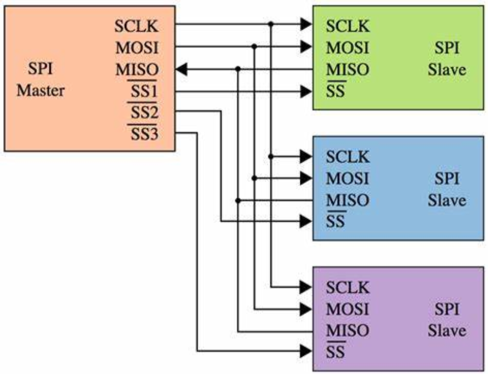

#### Working Principle
Communication in SPI is incredibly fast because it relies on simple shift registers rather than complex addressing and acknowledgment sequences.

The process begins when the master pulls the SS line of the target slave LOW. The master then starts generating the clock signal on the SCK line.

During each clock cycle, full-duplex data transfer occurs: the master sends one bit of data out on the MOSI line, and the slave reads it. At the exact same time, the slave sends one bit of data out on the MISO line, and the master reads it. This simultaneous exchange continues until the full data byte is transferred.

Because there are no addresses to send and no acknowledge (ACK) bits to wait for, the data flows seamlessly and continuously. Once the data exchange is complete, the master pulls the SS line HIGH, ending the communication and putting the slave back to sleep.

 SPI ideal for high-speed sensors, displays, SD cards, and other timing-sensitive peripherals.
 
 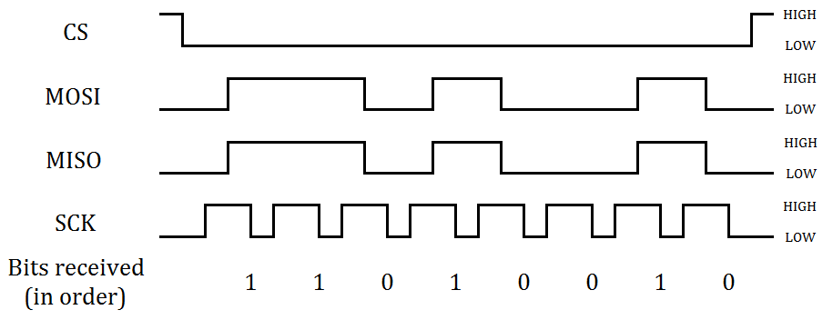


#### Arduino SPI Configuration
On the Arduino Uno, the hardware SPI interface is tied to specific pins:
- **11 – MOSI (Master Out Slave In)**
- **12 – MISO (Master In Slave Out)**
- **13 – SCK (Serial Clock)**
- **10 – SS (Slave Select)** While pins 11, 12, and 13 must be shared among all SPI devices, the master can use any available digital pin to act as an additional SS pin when communicating with multiple slaves.


#### Creating Project
Now let's create a simple project where three Arduino boards communicate using the SPI protocol. One Arduino acts as the master, while the other two act as slave devices, the master sends commands to the slaves based on button presses, and each slave controls an LED based on the received command.

First, we connect the three Arduino boards using the SPI bus:
- All **MOSI pins (11)** are connected together.
- All **MISO pins (12)** are connected together.
- All **SCK pins (13)** are connected together.
- All devices share a common GND.
    
Next, we establish the Slave Select connections. The master Arduino uses two different pins to control the slaves:
- Master Pin 10 connects to Slave 1's Pin 10 (SS1).
- Master Pin 9 connects to Slave 2's Pin 10 (SS2).
    
We connect an LED to Pin 9 of each slave Arduino. On the master Arduino, we add two push buttons:
- Pin 7 controls the first slave.
- Pin 8 controls the second slave.


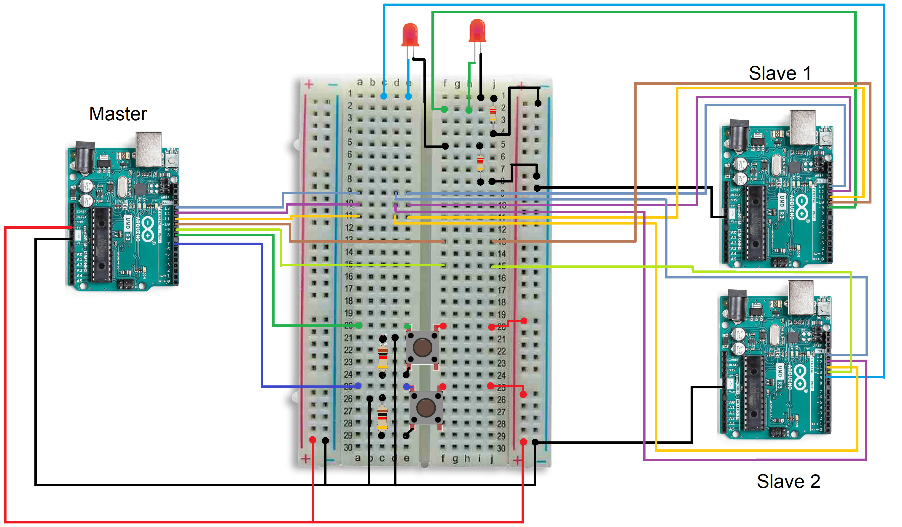


Now let's create our program. We start with the master Arduino program.
First, we include the SPI library, which allows the Arduino to communicate using the SPI protocol. After that, we create two variables to store the state of each slave LED. These variables help us keep track of whether the LED is currently ON or OFF so that every button press toggles its state.

Inside the `setup()` function, we configure the push buttons (pins 7 and 8) as inputs. We also configure the Slave Select pins as outputs because the master controls them. Initially, we set both SS pins to HIGH so that no slave device is selected when the system starts. Finally, we initialize the SPI communication using `SPI.begin()`.  
Inside the `loop()` function, the Arduino continuously checks if one of the buttons is pressed. When a button is pressed, the master toggles the corresponding LED state variable. Then it selects the appropriate slave by setting its **SS pin LOW**, sends the command using `SPI.transfer()`, and finally sets the SS pin **HIGH** again to end the communication.

```cpp
#include <SPI.h>

bool led1State = false;
bool led2State = false;

void setup() {
    pinMode(7, INPUT);
    pinMode(8, INPUT);
    
    // Set SS pins as outputs
    pinMode(9, OUTPUT);
    pinMode(10, OUTPUT);
    
    // Keep SS pins HIGH so no slaves are selected initially
    digitalWrite(9, HIGH);
    digitalWrite(10, HIGH);
    
    // Initialize SPI communication
    SPI.begin();
}

void loop() {
    // Check button 1
    if (digitalRead(7) == HIGH) {
        led1State = !led1State;
        
        digitalWrite(9, LOW);  // Select Slave 1
        if (led1State) {
            SPI.transfer('O');  
			SPI.transfer('N');  
        } else {
            SPI.transfer('O');  
			SPI.transfer('F');  
			SPI.transfer('F');           
        }
        digitalWrite(9, HIGH); // Deselect Slave 1
        
        delay(500);
    }

    if (digitalRead(8) == HIGH) {
        led2State = !led2State;
        
        digitalWrite(10, LOW);  // Select Slave 2
        if (led2State) {
            SPI.transfer('O');  
			SPI.transfer('N');            
        } else {
            SPI.transfer('O');  
			SPI.transfer('F');  
			SPI.transfer('F');         
        }
        digitalWrite(10, HIGH); // Deselect Slave 2
        
        delay(500);
    }
}
```
Next, we create the program for the slave Arduino boards. In Arduino, acting as an SPI slave requires turning on a specific hardware register and using an interrupt to catch incoming data. Both slave boards will run the exact same program because the master dictates who it is talking to via the hardware SS wiring.

Inside the `setup()` function, we configure the Arduino to operate as an **SPI slave device**. First, we set the LED pin as an output. Then we enable **SPI in slave mode** by activating the SPI hardware in the control register. We also enable **SPI interrupts** so the Arduino can automatically react whenever the master sends data.   
When the master transmits data through the SPI bus, the **`SPI_STC_vect` interrupt service routine** is automatically triggered. Inside this routine, the received byte is read from the **SPI Data Register (`SPDR`)** and stored in a variable.  
Since the master sends the messages **"ON"** and **"OFF"**, the slave collects the incoming characters into a small string. Once the message is complete, the program checks the received command and **turns the LED ON or OFF accordingly**.

Inside the `loop()` function, the Arduino simply checks if a new command has been received. If the command is `"ON"`, the LED is turned on. If the command is `"OFF"`, the LED is turned off.
```cpp
#include <SPI.h>

volatile String receivedData = "";
volatile bool newData = false;

void setup() {
    pinMode(9, OUTPUT);
    SPCR |= bit(SPE);
    SPI.attachInterrupt();
}


ISR (SPI_STC_vect) {

    char c = SPDR;  
    receivedData += c;  
    if (receivedData == "ON" || receivedData == "OFF") {
        newData = true;
    }
}

void loop() {

    if (newData) {
        if (receivedData == "ON") {
            digitalWrite(9, HIGH);
        }
        else if (receivedData == "OFF") {
            digitalWrite(9, LOW);
        }
        receivedData = "";  
        newData = false;    
    }
}
```
### Wireless Communication
Up to this point, we have connected all of our devices and microcontrollers using physical wires. But what if we want to control our project from across the room, or monitor sensor data from anywhere in the world? Arduino Uno do not have built-in wireless capabilities.  
To solve this, we rely on external add-on components called wireless modules. These modules act as a bridge, taking the wired protocols we just learned about (usually UART or SPI) and translating them into invisible radio waves. The two most common ways to cut the cord are through Bluetooth and Wi-Fi.
#### Bluetooth
Bluetooth is a short-range wireless communication standard. It is perfect for connecting two devices directly together (point-to-point) over short distances, such as controlling an Arduino from a smartphone or linking two robots in the same room.  
At its core, a basic Arduino Bluetooth module acts as a "wireless serial cable." It uses radio frequencies in the 2.4 GHz band to transmit data. When we type a character on our phone's Bluetooth app, it travels through the air to the module. The module then translates that radio signal back into a standard UART serial signal (RX and TX) that the Arduino can easily read, exactly as if it were plugged in via a USB cable.

To add Bluetooth to an Arduino, we typically use an inexpensive module like the HC-05 or HC-06.  
The **HC-05** module can operate in both master and slave modes, it can either initiate a connection to another Bluetooth device or wait for another device to connect to it.  
The **HC-06** module is simpler and works only in slave mode, meaning it can only receive connections from another device such as a smartphone or computer.

Let's create a simple project where we control an LED using a smartphone through Bluetooth with the HC-05 module. In this system, the smartphone sends commands wirelessly to the Arduino through Bluetooth. The HC-05 receives the data and forwards it to the Arduino through serial communication, and the Arduino turns the LED ON or OFF depending on the received command.

First, connect the **HC-05 Bluetooth module** to the Arduino:
- **VCC to 5V**
- **GND to GND**
- **TX to Arduino RX (Pin 0)**
- **RX to Arduino TX (Pin 1)**    

Next, connect an LED to pin 6 of the Arduino through a 220 Ω resistor, and connect the other side of the LED to GND.

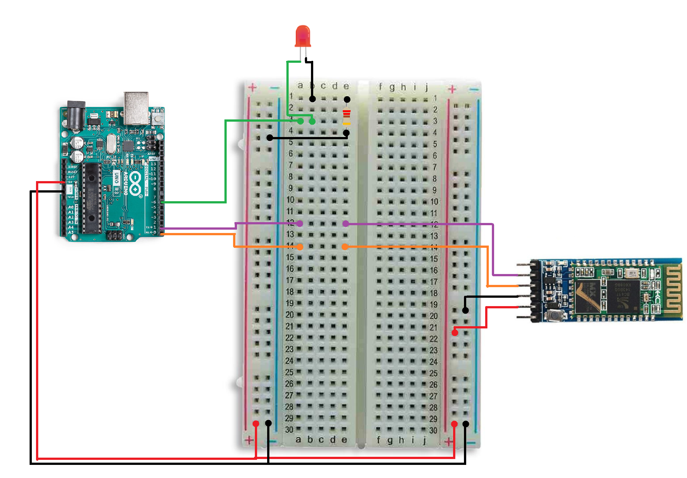

Now let’s create our program. Since the HC-05 uses the UART protocol, we start by initializing the serial communication in the `setup()` function so that the Arduino can communicate with the Bluetooth module. After that, we configure **pin 6 as an output pin** to control the LED.

Inside the `loop()` function, the Arduino continuously checks if data is available from the Bluetooth module. When a message is received, the Arduino reads it, trims any extra whitespace, and compares it with the expected commands to control the LED. Sending "ON" turns the LED on, while "OFF" turns it off.
```cpp 


String receivedData = "";

void setup() {
  pinMode(6, OUTPUT);
  Serial.begin(9600);        
}

void loop() {
 
  if (Serial.available()) {
    receivedData = Serial.readString();
    receivedData.trim();
    if (receivedData == "ON") {
      digitalWrite(6, HIGH);
    }

    else if (receivedData == "OFF") {
      digitalWrite(6, LOW);
   
    }
  }
}
```
Once the program is uploaded, we pair our smartphone with the HC-05 module (default password is usually 1234 or 0000). Then using [Bluetooth terminal app](https://play.google.com/store/apps/details?id=de.kai_morich.serial_bluetooth_terminal) we can send the commands ON or OFF to control the LED wirelessly.  

If there is a problem with the Bluetooth communication, we can debug it by displaying the data received from the Bluetooth app in the Serial Monitor.  First, connect the Bluetooth module to the Arduino:  
- VCC with 5V
- GND with GND
- TX with Pin 2
- RX with Pin 3

Next, in our program we create a software serial communication on pins 2 and 3 using the SoftwareSerial library. This allows the Arduino to communicate with the Bluetooth module while still using the normal serial port for debugging.  
Finally, in the ``loop()`` function, the Arduino reads the data sent by the Bluetooth app and prints it in the Serial Monitor so we can see exactly what is being received.

```cpp
#include <SoftwareSerial.h>

SoftwareSerial bluetooth(2, 3); // RX, TX

String receivedData = "";

void setup() {
  Serial.begin(9600);       // Serial Monitor
  bluetooth.begin(9600);    // Bluetooth module

  Serial.println("Bluetooth debugging started...");
}

void loop() {

  if (bluetooth.available()) { 
    receivedData = bluetooth.readString();
    receivedData.trim(); 
    Serial.print("Data received: ");
    Serial.println(receivedData);
  }

}
```
If an extra line appears after the received data is printed, that means the phone app is sending the message with a newline character. This can be changed in the app settings. Alternatively, in the Arduino program we can use ``readStringUntil('\n')``, which stops reading when it reaches the newline character.
#### Debug and Configure The Bluetooth module
The good thing about the HC-05 and HC-06 Bluetooth Module is that they can be configured. We can change several settings such as the device name, password, and baud rate. These settings are modified using AT commands.  

The HC-05 module is more advanced and supports many configuration commands. Some useful commands include checking the connection with ``AT``, reading or changing the device name using ``AT+NAME``, viewing the device address using ``AT+ADDR``, checking the firmware version using ``AT+VERSION``, changing the baud rate using ``AT+UART``, changing the role (master or slave) using ``AT+ROLE``, resetting the module using ``AT+RESET``, restoring factory settings with AT+ORGL, and changing the password using ``AT+PSWD``.

The HC-06 module supports fewer commands because it works only as a slave device. However. With AT commands we can check the connection using ``AT``, change the device name using ``AT+NAME``, change the baud rate using ``AT+BAUD``, change the pairing password using ``AT+PIN``, and check the firmware version using ``AT+VERSION``.  

Here simple example of program to configure the HC module, by using the Serial Monitor, any command typed in the Serial Monitor is sent to the Bluetooth module. The response from the module is then printed back to the Serial Monitor.  
```cpp
#include <SoftwareSerial.h>

SoftwareSerial bluetooth(2, 3); 

void setup() {

  Serial.begin(9600);
  bluetooth.begin(9600);   
  Serial.println("Enter AT commands:");

}

void loop() {
  // Send command from Serial Monitor to Bluetooth
  if (Serial.available()) {
    bluetooth.write(Serial.read());
  }

  // Show response from Bluetooth module
  if (bluetooth.available()) {
    Serial.write(bluetooth.read());
  }
}
```
Example of commands for HC-05
```
AT
AT+NAME=MyBluetooth // will  set name
AT+PSWD=1234 // will set password
AT+UART=9600,0,0
```
If there was problem when sending the command using the serial monitor, try change it setting to send the message only and don't add new line after the command, this can be set from here.

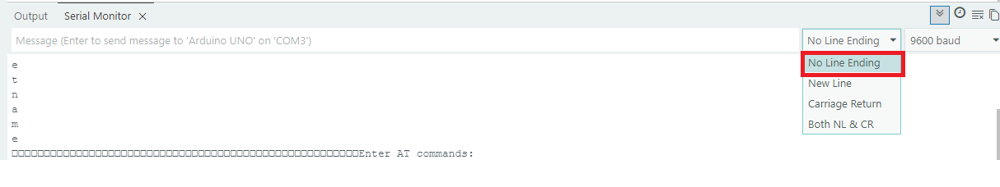

#### Wi-Fi
Wi-Fi is a wireless communication technology that allows devices to connect over a network instead of directly to each other. Unlike Bluetooth, which is mainly used for short-range point-to-point communication, Wi-Fi enables an Arduino to communicate over longer distances and even connect to the internet. This makes it ideal for IoT (Internet of Things) applications such as remote monitoring, smart home systems, and web-based control.  
At its core, a basic Arduino Wi-Fi module acts as a "wireless network bridge." It uses radio frequencies in the 2.4 GHz band to transmit and receive data over a network using standard network protocols like TCP/IP. When a command is sent from a web browser or an app over the Wi-Fi network, it travels to the router and then to the module. The module translates these complex network packets (TCP/IP) back into standard UART serial signals (RX and TX), which the Arduino can read exactly as if it were plugged in via a USB cable.

Since the Arduino UNO does not have built-in Wi-Fi, we need an external module such as the ESP8266. This module  communicates with the Arduino using serial (UART), similar to the Bluetooth modules, but it adds full Wi-Fi networking capabilities, It can operate in Station (STA) mode to connect to an existing Wi-Fi router, Access Point (AP) mode to broadcast its own standalone Wi-Fi network, or both simultaneously.

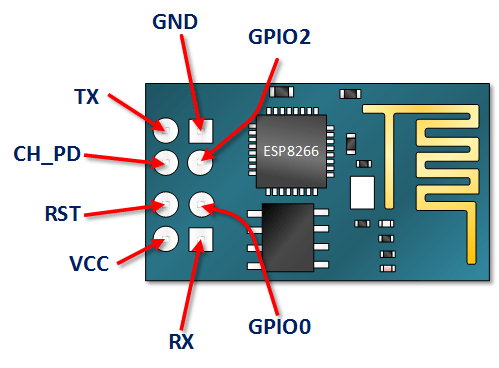


Let’s create a simple project where we display weather data on an LCD using an API through Wi-Fi with the ESP-01 module. In this system, the ESP-01 connects to the internet, requests weather data from an API, sends the raw response to the Arduino through serial communication, and the Arduino extracts useful information (like temperature) and displays it on the LCD.

First, Lets create the circuit we start by connecting the ESP-01 Wi-Fi module to the Arduino. The ESP-01 operates strictly on 3.3V logic, so its VCC must be connected to 3.3V, not 5V:
- **VCC to 3.3V**
- **CH_PD (or EN) to 3.3V**
- **GND to GND**
- **TX to Arduino RX (Pin 0)**
- **RX to Arduino TX (Pin 1)**

Next, we connect the  **I2C LCD display (16x2 with I2C module)** to reduce the number of pins:
- **VCC to 5V**
- **GND to GND**
- **SDA to A4 (Arduino Uno)**
- **SCL to A5 (Arduino Uno)**

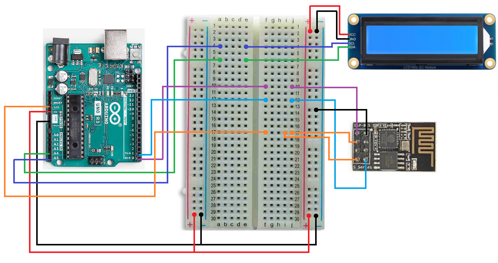

Now let’s create our program. The ESP-01 uses the UART protocol to communicate via AT commands, we start by initializing serial communication in the `setup()` function. We will send AT commands to connect to the Wi-Fi network, after that we initialize the I2C LCD.  
Inside the `loop()` function, the Arduino requests weather data periodically. When the ESP-01 receives the response, it sends the raw JSON data back. We read this data, extract useful values , and display them on the LCD.

```cpp
#include <Wire.h>
#include <LiquidCrystal_I2C.h>

LiquidCrystal_I2C lcd(0x27, 16, 2); 
String receivedData = "";

void setup() {
  Serial.begin(115200); 
  lcd.init();
  lcd.backlight();
  lcd.print("Connecting...");
  
  delay(1000);
  
  Serial.println("AT+CWMODE=1"); 
  delay(1000);
  Serial.println("AT+CWJAP=\"YourNetworkName\",\"YourPassword\""); // replace with your data
  delay(5000);
  lcd.clear();
  lcd.print("WiFi Connected");
}

void loop() {
  Serial.println("AT+CIPSTART=\"TCP\",\"api.openweathermap.org\",80");
  delay(2000);
  // Replace with your API key and city
  String request = "GET /data/2.5/weather?q=London&appid=YOUR_API_KEY HTTP/1.1\r\nHost: api.openweathermap.org\r\n\r\n";
  Serial.print("AT+CIPSEND=");
  Serial.println(request.length());
  delay(1000);
  Serial.print(request);
  delay(5000);

  // Read response
  if (Serial.available()) {
    receivedData = Serial.readString();
    int tempIndex = receivedData.indexOf("temp");
    if (tempIndex != -1) { 
      String tempValue = receivedData.substring(tempIndex + 6, tempIndex + 11);
      lcd.clear();
      lcd.setCursor(0, 0);
      lcd.print("Temp:");
      lcd.setCursor(0, 1);
      lcd.print(tempValue);
    }
  }
  delay(10000); // Update every 10 seconds
}
```
The ESP8266 is configured using AT commands same as the hC-05. In our Program First, we use `AT+CWMODE=1` to choose the connection mode, where 1 means Station mode, allowing the module to connect to an existing Wi-Fi network.

After that, we use `AT+CWJAP` to establish the connection. We send the network name followed by a comma and then the password, so the ESP-01 can join the Wi-Fi.  
Next, we use `AT+CIPSTART` to start a TCP connection with the weather server (`api.openweathermap.org`) on port 80. Then we use `AT+CIPSEND` to send the HTTP request that asks for the weather data.

The module then sends back the response (in JSON format) through serial communication. To extract the temperature, we search for the keyword `"temp"` inside the received string. Once found, we shift 6 characters forward because the response format is like `"temp":23.45`, so the actual value starts right after `"temp":`. The `indexOf` function returns the index of the letter **t**, and with that shift, we can get the temperature value and display it on the I2C LCD.

#### Debug and Configure The Wifi module
The ESP-01 module is very advanced and supports a wide range of networking commands. It can operate in Station mode (STA) or Access Point mode (AP), which means it can either connect to our home router or create its own Wi-Fi network for other devices to connect to directly.

Some useful commands include checking if the module is responding with `AT`, setting the Wi-Fi mode using `AT+CWMODE`, joining a network using `AT+CWJAP`, checking the assigned IP address using `AT+CIFSR`, enabling multiple connections with `AT+CIPMUX`, starting a server with `AT+CIPSERVER`, and resetting the module using `AT+RST`.

We can test and explore these commands using the Serial Monitor. First, we change the wiring and use pins 2 and 3 for UART communication:
- VCC with 3.3V
- CH_PD with 3.3V
- GND with GND
- TX with Pin 2
- RX with Pin 3

After that, we create a simple sketch that allows us to send commands from the Serial Monitor and display the responses from the module:
```cpp
#include <SoftwareSerial.h>

SoftwareSerial wifi(2, 3); 

void setup() {
  Serial.begin(9600);
  wifi.begin(115200);   

  Serial.println("Enter AT commands:");
}

void loop() {
  // Send command from Serial Monitor to Wi-Fi module
  if (Serial.available()) {
    wifi.write(Serial.read());
  }

  // Show response from Wi-Fi module
  if (wifi.available()) {
    Serial.write(wifi.read());
  }
}
```
If random or garbled characters appear in the Serial Monitor, it usually means the baud rate of the ESP-01 is mismatched. While 115200 is standard, older firmware versions sometimes use 9600. We can change `wifi.begin(115200)` to `wifi.begin(9600)` to test this.


