## Objectives
- Working with Display Devices

## Display Devices
When working on embedded system projects, we often need a way to see what is happening inside our microcontroller.
This is where display devices come in. Display devices are essential output components that allow the microcontroller to communicate directly with the external world. They help us retrieve information, display sensor data, show alerts, and create user interfaces. Instead of just turning on a single LED to indicate a state, displays allow us to show numbers, text, and even complex graphics.
### LED Matrix
The simplest display device is LED matrix, it is a 2D array of LEDs arranged in rows and columns. The most common size is the 8x8 LED matrix, which contains 64 individual LEDs packed into a single module.
If we tried to control 64 LEDs individually, we would need 64 digital pins, which most microcontroller does not have. To solve this, the LEDs are wired using a technique called multiplexing. The anodes (positive sides) of the LEDs in each row are connected together, and the cathodes (negative sides) in each column are connected together.

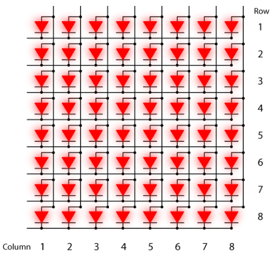

From the diagram, we can see that a simple 8 × 8 LED matrix would normally require 16 pins to control it (8 rows and 8 columns). For example, sending a high signal to column 1 will activate that column.

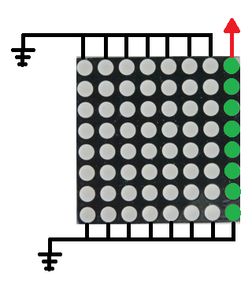

Then, by controlling the rows, we can decide which LEDs in that column turn on or off. Suppose we want to turn on only the first two LEDs in column 1. In that case, we would send a high voltage to column 1 and, to select the rows signals we send High signal to all rows except the first and second one so only those two LEDs are active, while the others remain off.

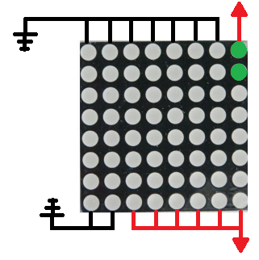

However, when we try to draw more complex shapes, we may encounter a problem. We might run into conflicts where turning on specific LEDs causes other unwanted LEDs to light up. As a result, the displayed image may appear incomplete or incorrect. To solve this issue, we can split the drawing into multiple frames. For example, to draw a smiling face, the first frame could display the eyes, and the second frame could display the mouth. By switching very quickly between these frames, we create the illusion that both parts are displayed simultaneously. Because of the persistence of vision, the observer perceives the full smiling face instead of separate images.

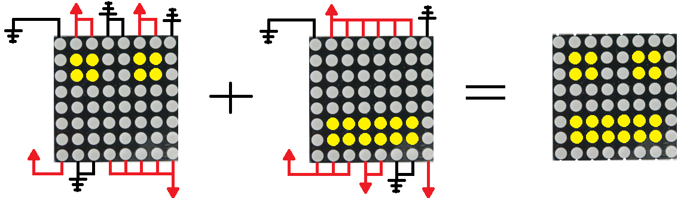


Following this method we can draw most of the shape we want but there is small problem using all 16 pins would consume most of the available pins on our microcontroller, to simplify working with an LED matrix, we use a driver chips such as the MAX7219. This chip handles all the multiplexing internally, so we don't need to control each LED individually. As a result, we will need only three digital pins Data, Clock, and Load (CS).
#### MAX7219
The MAX7219 driver helps us control an LED matrix while reducing the number of control pins to only three. To manage all the LEDs, it contains an internal 8×8 memory (similar to SRAM) that stores which LEDs should be on. Its internal circuitry then translates this data and applies it to the LED matrix. We communicate with this driver using SPI communication, where the data flow is controlled using three pins:

- **Data pin (DIN)**: This is where the actual information flows in. We send one bit at a time. The first 8 bits represent the register address, and the next 8 bits represent the value or pattern.
- **Clock pin (CLK)**: This provides the timing. On each rising edge of the clock signal, the MAX7219 samples and shifts in one bit from the DIN line into its internal shift register.
- **CS / LOAD pin**: This acts as the latch or chip select signal (active low). While CS is held **low**, the chip listens and shifts in bits with every CLK pulse. After exactly 16 clock pulses (16 bits sent), we pull CS high. This rising edge tells the MAX7219, “OK, the full command is ready now decode it and apply it to the display or registers.”

In short, to communicate with the MAX7219, we first pull CS (Chip Select) low to indicate that data transmission is starting. Then, for 16 clock cycles, we set the desired bit on the DIN (Data) pin and pulse the CLK (Clock) pin high and then low. Each clock pulse sends one bit to the chip. After the 16th clock pulse, we pull CS high. The MAX7219 then latches the 16 bits, interprets them as an address and data, and updates the display memory or configuration settings such as brightness or scan limit. Once this is done, the MAX7219 automatically handles the continuous row-by-row scanning of the LED matrix, Here diagram illustrate the operation.

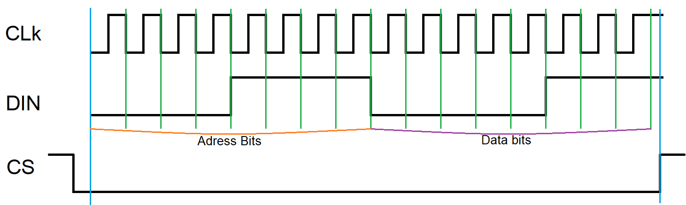

Manually setting and configuring all this ourselves would be a hard and error-prone task, Arduino simplifies this enormously by providing libraries such as ``LedControl``, ``MD_MAX72XX``, or ``MD_Parola`` these handle all the complex low-level configuration for us. 

Let’s create a simple project to display a heart on the LED matrix. First, we need to build the circuit.  
Start by connecting the **VCC** and GND pins of the Arduino to the VCC and GND pins of the MAX7219 module.  
Next, connect the three control pins between the Arduino and the driver: connect Data (DIN) to pin 13, CLK to pin 11, and CS to pin 12 of the Arduino. These three pins will handle the communication between the Arduino and the MAX7219.

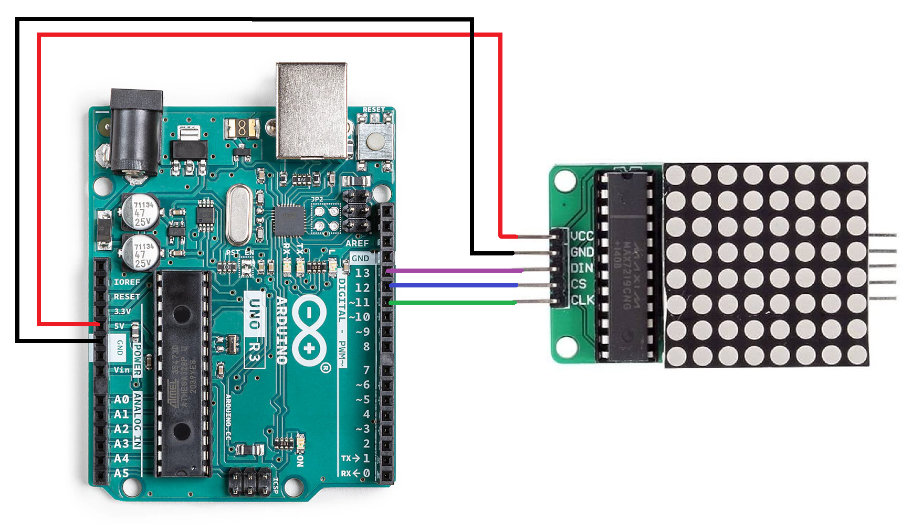

Now let’s create our program to control the MAX7219. We will use the **LedControl** library, First, we include the library in our program. After that, we create an object of the LedControl class. In the constructor, we pass the pins used for communication: 13 for DIN (Data), 11 for CLK (Clock), and 12 for CS (Chip Select). We also specify the number of LED matrices connected, which in this case is 1.   
```
```cpp 
#include <LedControl.h>

LedControl lc = LedControl(13, 11, 12, 1); 
```
Inside the `setup()` function, we begin by waking up the display. Then we set the brightness level, and finally clear the display so we start with a blank screen.
```
void setup() {
  lc.shutdown(0, false); // Wake up the display
  lc.setIntensity(0, 8); // Set brightness level (0 to 15)
  lc.clearDisplay(0);    // Clear the screen
}
```
Next, we define an 8×8 matrix of bits that represents the shape of a heart. Each row of this matrix corresponds to one row of LEDs on the display.
```
byte heart[8] = { 
	B00000000, 
	B01100110, 
	B11111111, 
	B11111111, 
	B11111111, 
	B01111110, 
	B00111100, 
	B00011000 
};
```
Finally, inside the `loop()` function, we iterate through the rows of this matrix and send each row to the display using the library function, which lights up the LEDs to form the heart pattern on the LED matrix.

```cpp 
void loop() {
	for (int row = 0; row < 8; row++) {
		lc.setRow(0, row, heart[row]); 
	}

}
```
The library provide us additional function to work with the matrix led for example
- ``lc.setLed(0, row, col, state)`` to light individual pixels
- ``lc.setColumn(0, col, value)`` to control by column instead of row
#### Multiple Led Matrix
If we want to use more than one LED matrix for example 16×8, 24×8, or 32×8 displays, we connect several MAX7219 modules in series. In this case, we must change the configuration when creating the `LedControl` object.   
When we create the object, the last parameter specifies the number of devices (matrices) connected.
```cpp 
LedControl lc = LedControl(13, 11, 12, 2); // for two matrices (16×8)
LedControl lc = LedControl(13, 11, 12, 3); // for three matrices (24×8)
LedControl lc = LedControl(13, 11, 12, 4); //  for four matrices (32×8)
```
Each matrix has its own device address:

|Device|Address|
|---|---|
|First matrix|0|
|Second matrix|1|
|Third matrix|2|
|Fourth matrix|3|

Inside the `setup()` function we must initialize each device separately, just like we did for the first one.
```cpp
void setup() {  
  // example two matrix
  for (int i = 0; i < 2; i++) {  
    lc.shutdown(i, false); 
    lc.setIntensity(i, 8);  
    lc.clearDisplay(i);     
  }  
  
}
```
Finally when displaying data, we specify the device address as the first parameter.
```cpp
lc.setRow(0, 0, B11111111); // first matrix  
lc.setRow(1, 0, B11111111); // second matrix
```
### Seven Segment Display
Seven-segment displays are digital displays made up of seven LED segments arranged to form numbers 0-9 and some letters. These segments are labeled with letters from A to G. By turning on specific combinations of these segments, we can form any number.     
For example, to display the number "1", we turn on segments B and C.  
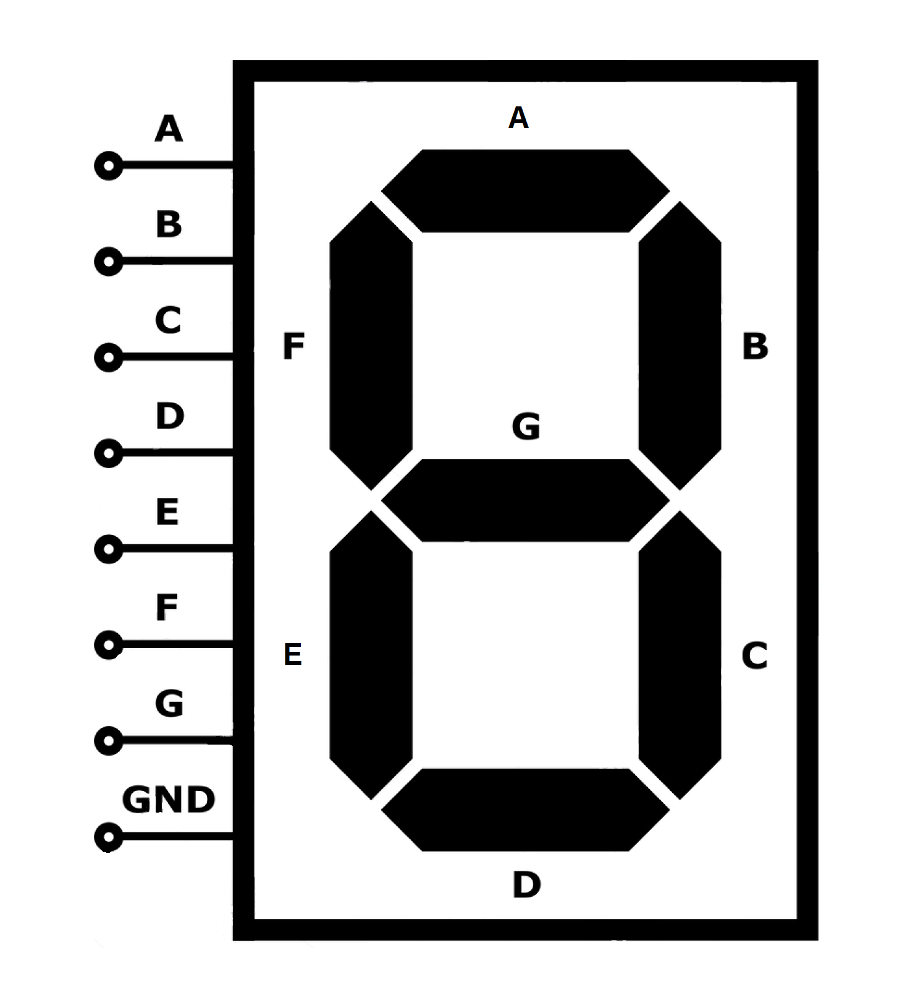

There are two main types of seven-segment displays:
- **Common Cathode:** All the negative pins (GND) of the LEDs are connected together. We send a HIGH signal to a segment's pin to turn it ON.
- **Common Anode:** All the positive pins (VCC) of the LEDs are connected together. We send a LOW signal to a segment's pin to turn it ON.

If we try to control each segment individually, we would need 7 GPIO pins. This works fine for a single display, but when using multiple 7-segment digits, we would quickly run out of available GPIO pins.

To address this, many 7-segment displays are paired with a BCD-to-7-segment decoder. This approach reduces the number of required GPIO pins from 7 down to just 4 control pins. Instead of driving each segment directly, we send the digit value using BCD (Binary-Coded Decimal) encoding, where each decimal digit is represented by its binary equivalent.

The decoder then translates this binary input into the appropriate signals to illuminate the correct segments. The corresponding mapping can be seen in the table below:

| Decimal Digit | BCD (a,b,c,d) |
| ------------- | ------------- |
| 0             | 0000          |
| 1             | 0001          |
| 2             | 0010          |
| 3             | 0011          |
| 4             | 0100          |
| 5             | 0101          |
| 6             | 0110          |
| 7             | 0111          |
| 8             | 1000          |
| 9             | 1001          |


For example, with a common cathode 7-segment display, we can display the digit "3" by sending a BCD signal  of (low, low, high, high), as shown below:  

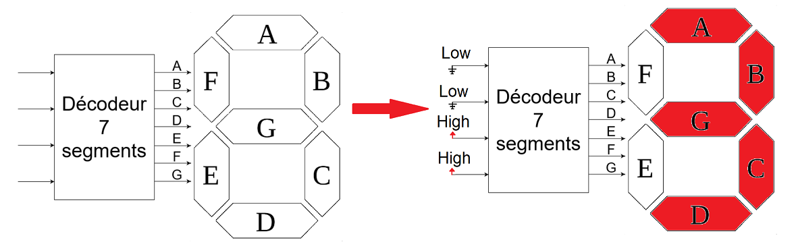

### Four-digit 7-segment
In many applications, we need to display numbers with more than one digit, such as two-digit, four-digit, or larger values. A four-digit 7-segment display is formed by combining four individual 7-segment digits into a single module. This is achieved by connecting all corresponding segment pins together, while adding a separate control (select) pin for each digit to determine which one is active at any given time.

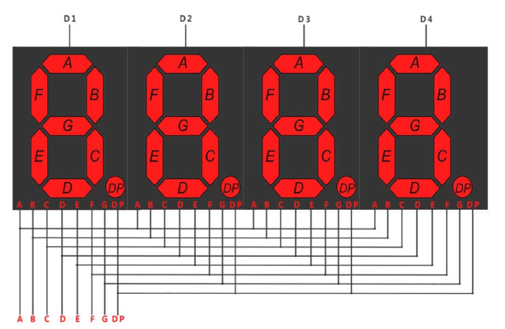

If we tried to control all four digits manually, we would need 12 pins: 8 pins for segments and 4 pins for digit selection. To reduce the number of pins, we can use a BCD encoder, which allows us to drive all four digits using only 9 pins (4 for BCD input + 5 for segments including the decimal point) we can use 8 if we remove the decimal point.

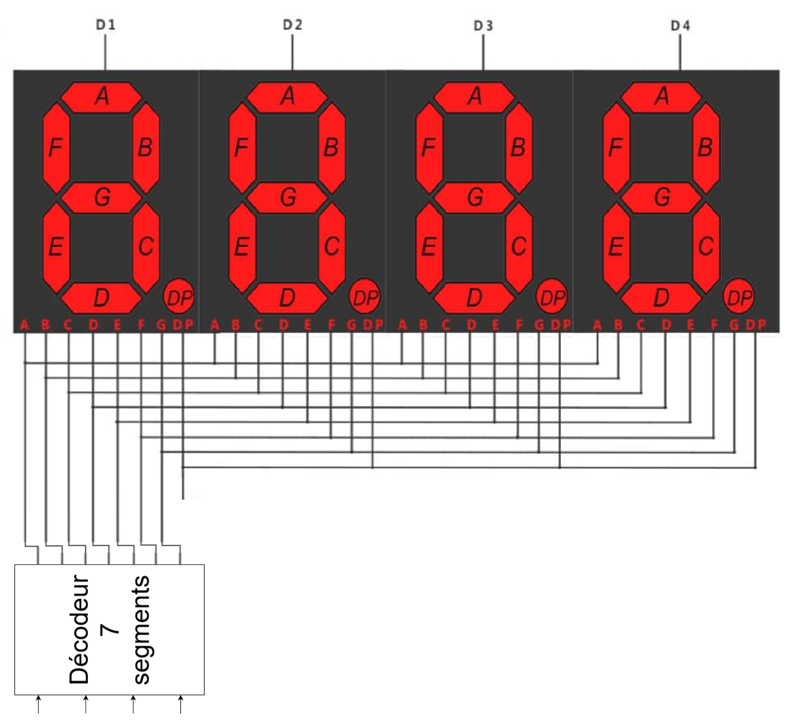

#### The TM1637
The TM1637 is a dedicated LED drive control circuit commonly used with four-digit 7-segment displays. Much like the MAX7219, its primary goal is to drastically reduce the number of GPIO pins needed to drive the display. While a standard 4-digit display might require up to 12 pins, the TM1637 reduces this to just two communication pins, alongside power and ground.

We communicate with the TM1637 using a 2-wire serial protocol that is very similar to I2C, though it lacks device addressing. The data flow is managed using these two pins:
- **Data pin (DIO):** This bidirectional pin is used to transfer data into and out of the chip. We send commands and display data over this line, one bit at a time.
- **Clock pin (CLK):** This provides the timing for the data transfer. Data on the DIO pin must be stable while the clock is high, and it can only change state while the clock is low.

Unlike MAX7219 which relies on a Chip Select (CS) pin to indicate the start and end of a transmission, the TM1637 relies on specific signaling conditions on the data and clock lines:
- START condition: The transmission begins when the DIO line is pulled LOW while the CLK line remains HIGH.
- STOP condition: The transmission ends when the DIO line is pulled HIGH while the CLK line is HIGH.
- Data Transmission: Between the start and stop conditions, 8 bits of data are sent, Least Significant Bit (LSB) first. After the 8 bits are sent, a 9th clock pulse is generated to allow the TM1637 to send an Acknowledge (ACK) signal by pulling the DIO line low, after that we can set the stop condition to stop data transmission or we can send another pack of data.

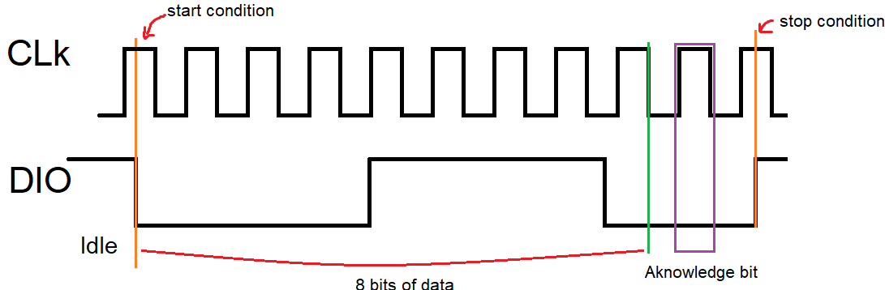

In Arduino we have the ``TM1637Display.h`` library, which simplifies working with the display by offering a simplified interface that handles all the clock signaling and synchronization internally.

Let’s create a simple counter project that counts from 99 down to 0. We start by building the circuit, we connect GND and VCC of the TM1637 with thee GND and VCC the Arduino. After that, connect the CLK pin to pin 2 on the Arduino, and finally connect the DIO pin to pin 3.

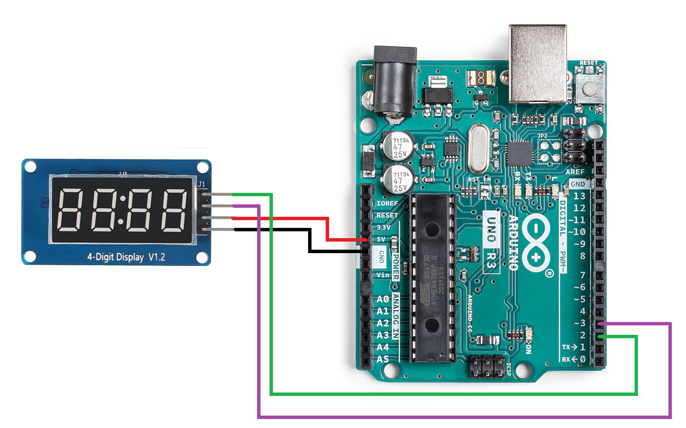

Now in our sketch we include the TM1637 library. After that, we create an object for the display and specify the **CLK** and **DIO** pins that connect the module to the microcontroller. 
```cpp
#include <TM1637Display.h>  

// Create the display object  
TM1637Display display(2, 3);  
```
Next, inside the setup() function, we initialize the display and set the brightness level.
```
void setup() {  
	display.setBrightness(5);  
}  
```
Finally, in the loop() function, we can write data to the display. To show numbers, we use the function showNumberDec().   
The `showNumberDec` take two arguments: 
- The number to display  
- A boolean value (`true` or `false`)  determine whether leading zeros should be displayed.
    - `true` leading zeros are shown (for example: **0007**, **0023**).
    - `false` leading zeros are hidden (for example: **7**, **23**).

In this example, we create a for loop that counts from 99 down to 0 to display a countdown on the screen. After each number is displayed, we add a small delay of 500 milliseconds so the numbers change at a visible speed.

```cpp
  
void setup() {  
	display.setBrightness(5);  
}  
  
void loop() {  

	for (int i = 99; i >= 0; i--) {  
  
		display.showNumberDec(i, true);  
  
		delay(500);  
	}  
}
```
The library also provides other useful functions to work with the display device.   

**`showNumberDecEx()`** This function is similar to **`showNumberDec()`**, but it allows extra control over the **dots or colon** on the display (useful for clocks or timers).
```cpp
display.showNumberDecEx(1234, 0b01000000, true); // turn on the colon
display.showNumberDecEx(1234, 0b10000000, true);   // turn on a dot
```
**`setSegments()`** This function allows us to send raw segment data directly to the 7-segment display.   Each byte represents which segments (a–g) should be turned on for a digit.
```cpp
uint8_t data[] = {0x3f, 0x06, 0x5b, 0x4f};  
display.setSegments(data);
```

| Hex value | Digit shown |
| --------- | ----------- |
| 0x3F      | 0           |
| 0x06      | 1           |
| 0x5B      | 2           |
| 0x4F      | 3           |

So this array represents the digits:
```
0 1 2 3
```
### LCD Display
LED matrices and seven-segment displays are very useful when we need to display numbers or simple shapes. However, they have an important limitation. Seven-segment displays are mainly designed for numbers, and LED matrices require a large number of LEDs and complex control if we want to display readable text. To solve this problem, we use LCD displays (Liquid Crystal Displays). These displays allow us to show text characters and sometimes small symbols, making them ideal for building user interfaces.

An LCD (Liquid Crystal Display) works using a special material called **liquid crystals**. These materials have properties between a liquid and a solid crystal.

Inside the LCD module, there are several layers:
1. Two polarizing filters
2. A layer of liquid crystals
3. Glass plates with transparent electrodes
4. A backlight

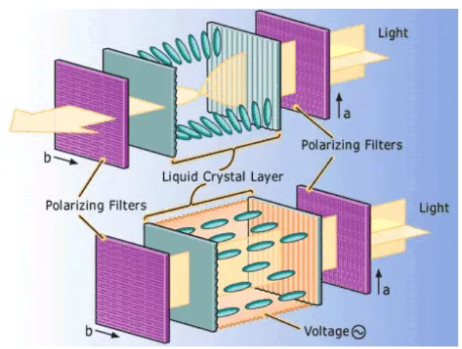

Unlike LED displays, LCD pixels do not emit light themselves. Instead, they act as tiny shutters that control how light passes through the screen.When the internal controller applies a voltage to specific pixel areas, the liquid crystals physically twist. This twisting changes the polarization of the light. While light passes through the crystals naturally when no electricity is applied, the twisted crystals cause the second (front) polarizing filter to block the light. As a result, the pixel appears dark, while the surrounding areas remain bright. This blocked light creates the dark "pixels" that form our letters, numbers, and symbols.       

There is multiple modules of LCD but the most common modules available in the market are:
- **16 × 2 LCD** Displays 16 characters per row and 2 rows.
- **20 × 4 LCD** Displays 20 characters per row and 4 rows.
- **40 × 2 LCD** Displays 40 characters per row and 2 rows.
- **40 × 4 LCD** Displays 40 characters per row and 4 rows.

A standard 16 × 2 LCD module typically has 16 pins. These pins are used for power, control signals, data communication, and backlight control. 

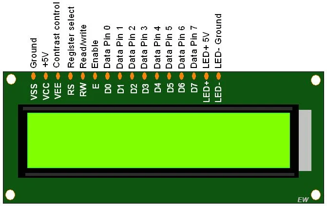

To communicate with the LCD directly, we have two possible modes:
- 8-bit mode
- 4-bit mode

In 8-bit mode, we uses all eight data pins (D0–D7) of the LCD to send one full byte of data at a time. This method is faster because the entire character is transmitted in a single operation. However, this mode requires many GPIO pins:
- 8 pins for data
- 2 control pins (RS, Enable)

In 4-bit mode, the LCD receives data in two steps instead of one. First, we sends the higher 4 bits, then we sends the lower 4 bits of the same byte. The LCD internally combines these two parts to reconstruct the full 8-bit value.  
This approach reduces the number of required pins:
- 4 data pins (D4–D7)
- 2 control pins (RS and Enable)


Let’s create a simple “Hello World” example using a 16×2 LCD in 4-bit mode. First, connect the LCD to the Arduino: connect RS to pin 12, EN to pin 11, D4 to pin 5, D5 to pin 4, D6 to pin 3, and D7 to pin 2. For power connections, connect VSS, RW, and K to GND, and VDD and A to 5V. 

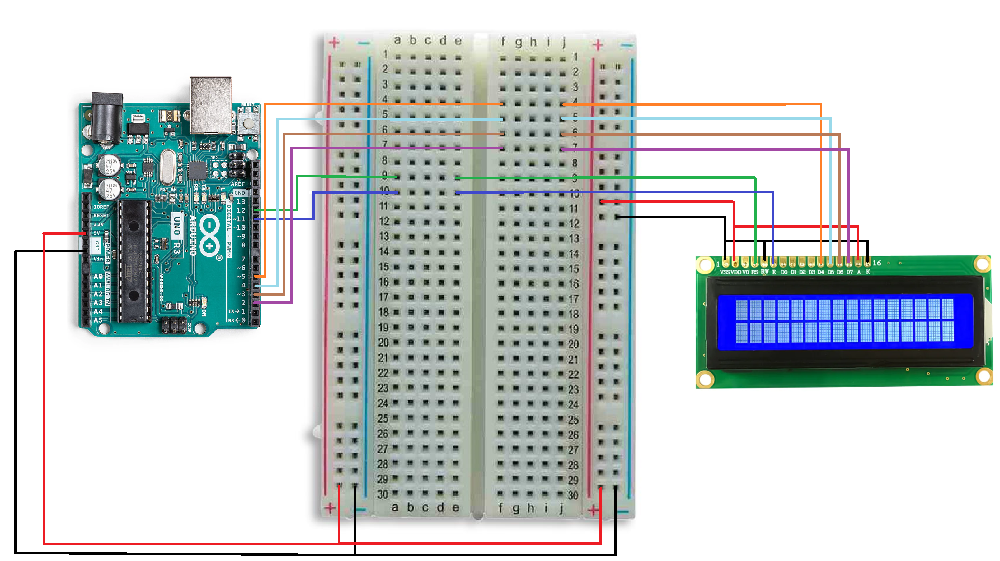

We can program and configure the LCD directly using its datasheet, but this requires sending many low-level commands and managing precise timing, which makes the process complex. Arduino simplifies this by providing the **`LiquidCrystal`** library, which already handles the low-level communication with the display. 

To use it, we first include **`LiquidCrystal.h`**, then create an LCD object and specify the pins connected to the display. In the **`setup()`** function we initialize the LCD by defining the number of **columns and rows**, and inside the **`loop()`** function we can use **`print()`** to display text on the screen.
```cpp
#include <LiquidCrystal.h>

LiquidCrystal lcd(12, 11, 5, 4, 3, 2);  // RS, EN, D4, D5, D6, D7

void setup() {
  lcd.begin(16, 2);  // Columns, rows
  lcd.print("Hello, World!");
}

void loop() {
  lcd.print("Hello, World!");
}
```
The library also provides many additional functions that make it easier to control and format the display output. Some of the most useful functions include:
- **`lcd.clear()`** Clears the entire display and moves the cursor back to the first position.
- **`lcd.setCursor(column, row)`** Moves the cursor to a specific position on the screen before printing text.
- **`lcd.home()`** Returns the cursor to the top-left corner of the display.
- **`lcd.cursor()`** Shows the cursor on the screen.
- **`lcd.noCursor()`** Hides the cursor.
- **`lcd.blink()`** – Makes the cursor blink.
- **`lcd.noBlink()`** – Stops the cursor from blinking.
- **`lcd.scrollDisplayLeft()`** – Scrolls the entire display one position to the left.

#### LCD with I2C module
Everything works well with this setup, but there is one small drawback: the LCD requires six Arduino pins to operate. Using so many pins can limit the number of other devices or sensors we can connect to the Arduino.

To solve this problem, we can use an I2C module attached to the LCD. This module acts as an interface that converts the I2C communication protocol into the parallel signals required by the LCD. With this module, the number of pins needed is reduced to only two communication pins: SDA (data) and SCL (clock). 

Let’s now use the I2C interface to build the same project. First, we build the circuit. We start by connecting the GND and VCC pins of the I2C LCD module to the GND and 5V pins of the Arduino, After that, we connect the SDA pin of the module to the SDA pin of the Arduino (A4 on Arduino Uno), and the SCL pin to the SCL pin (A5 on Arduino Uno).

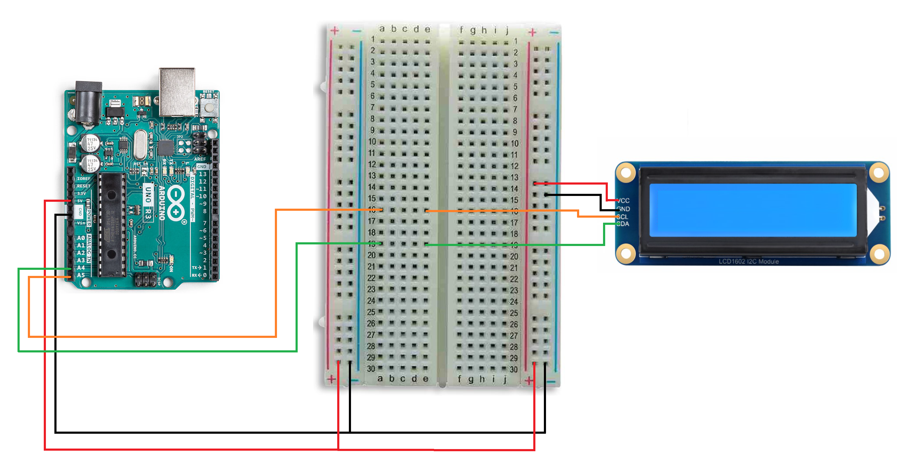

Now we can control the LCD using the **`LiquidCrystal_I2C.h`** library. First, we include the library in our program. After that, we create an LCD object where we specify the I2C address, along with the number of columns and rows of the display. The address identifies the LCD module on the I2C bus it is commonly **0x27** or **0x3F** depending on the module.
```
#include <LiquidCrystal_I2C.h>  
  
LiquidCrystal_I2C lcd(0x27, 16, 2); // Address, columns, rows  
```
Inside the **`setup()`** function, we initialize the LCD using `lcd.init()` and turn on the backlight using `lcd.backlight()`.
```cpp
void setup() {  
lcd.init();  
lcd.backlight();  
lcd.print("Hello, World!");  
}  
```
Finally, in the **`loop()`** function, we can display text on the screen using the `print()` function.
```
void loop() {  
lcd.print("Hello, World!");  
}
```
For larger sizes like 40x2 or 40x4, we use similar setup but specify dimensions in begin
```cpp
LiquidCrystal_I2C lcd(0x27, 40, 2); // 40×2 LCD  
LiquidCrystal_I2C lcd(0x27, 40, 4); // 40×4 LCD
```
The **`LiquidCrystal_I2C`** library comes with many additional functions that make it easy to control and format the LCD. Besides `print()` and `setCursor()`, some of the most useful functions include:
- **`lcd.clear()`** Clears the entire display and resets the cursor to the top-left corner.
- **`lcd.home()`** Moves the cursor back to the first column of the first row.
- **`lcd.setCursor(col, row)`** Positions the cursor at a specific column and row before printing text.
- **`lcd.backlight()`** Turns on the LCD backlight.
- **`lcd.noBacklight()`** Turns off the backlight.
- **`lcd.cursor()`** Shows the cursor on the screen.
- **`lcd.noCursor()`** Hides the cursor.
- **`lcd.blink()`** Makes the cursor blink.
- **`lcd.noBlink()`** Stops the cursor from blinking.
- **`lcd.scrollDisplayLeft()`** Scrolls the entire display one position to the left.
- **`lcd.scrollDisplayRight()`** Scrolls the display one position to the right.
- **`lcd.createChar(location, charmap)`** Allows creating custom characters or symbols (up to 8 custom characters).
