## Objectives
- Working with ATmega328P
- Functional Programming

## ATmega328P
### Introduction
Arduino helps simplify working with microcontrollers by providing easy-to-use functions and a user-friendly development environment. However, this simplicity comes at a cost. We lose a certain level of control over the hardware and the microcontroller itself, and our programs may run slower due to the overhead of built-in functions.  
For example, when reading a button press using standard Arduino functions, we often introduce delays to handle issues like debouncing. These delays can slow down the overall performance of the program.  
To overcome these limitations, we can program the Arduino at a lower level by bypassing the built-in functions and working directly with the microcontroller. This allows us to achieve faster execution and greater control over the hardware.  
The first step in doing this is to understand the internal structure of the microcontroller, specifically the ATmega328P, which the Arduino board is built on.
### ATmega328P Structure
The ATmega328P is an 8-bit microcontroller, which means it processes data in chunks of 8 bits (1 byte) at a time. In practical terms, this defines how the processor handles arithmetic operations, memory access, and data transfer. For example, when performing calculations or moving data between registers, the microcontroller works most efficiently with 8-bit values. While it can handle larger data types, such as 16-bit or 32-bit values, these require multiple operations.

The ATmega328P comes in a package with multiple pins (28 pins in the common DIP version), and each pin has a specific function. Some pins are used for power supply (VCC, GND), others for digital input/output, and some provide special functionalities such as analog input, communication lines (UART, SPI, I2C), or clock signals. These pins are the physical interface between the microcontroller and the external world, allowing it to interact with sensors, displays, and other components.
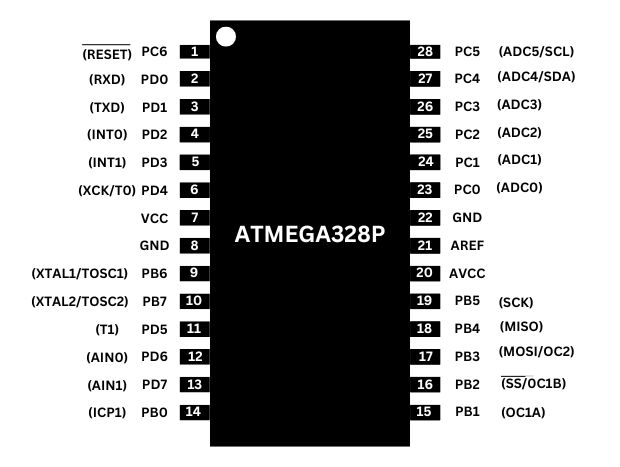

To fully understand how the microcontroller operates and how we can control it at a low level, we need to explore its main internal components, including the CPU, memory system, registers, and peripherals, and see how each of them contributes to the overall functionality of the microcontroller.
#### Central Processing Unit
The **Central Processing Unit (CPU)** is the brain of a computing system. It is an integrated circuit that contains millions of transistors working together to perform mathematical and logical operations using logic gates and Boolean algebra.

The CPU used in the ATmega32 is based on an 8-bit AVR RISC (Reduced Instruction Set Computer) architecture. This architecture uses a small set of simple instructions that can be executed very quickly. Most instructions are completed in a single clock cycle, which increases processing efficiency.

The main components of the CPU are:
- **Arithmetic Logic Unit (ALU)** Performs arithmetic operations such as addition and subtraction, and logical operations such as AND, OR, NOT, and XOR.
- **Register File** The CPU contains **32 general-purpose 8-bit registers** that are directly connected to the ALU. These registers allow fast data access and enable many instructions to execute in a single clock cycle.
- **Program Counter (PC)**  Stores the address of the next instruction to be fetched and executed from the program memory.
- **Instruction Register and Instruction Decoder**  The instruction register holds the current instruction, while the decoder interprets it and generates the control signals required for execution.
- **Stack Pointer (SP)** Points to the top of the stack in memory and is used during function calls, interrupts, and return operations.
- **Status Register (SREG)** Contains several flags that indicate the result of ALU operations, such as Zero (Z), Carry (C), Negative (N), and Overflow (V).
- **Clock Unit**  Provides the timing signal that synchronizes all CPU operations and determines the speed at which instructions are executed.


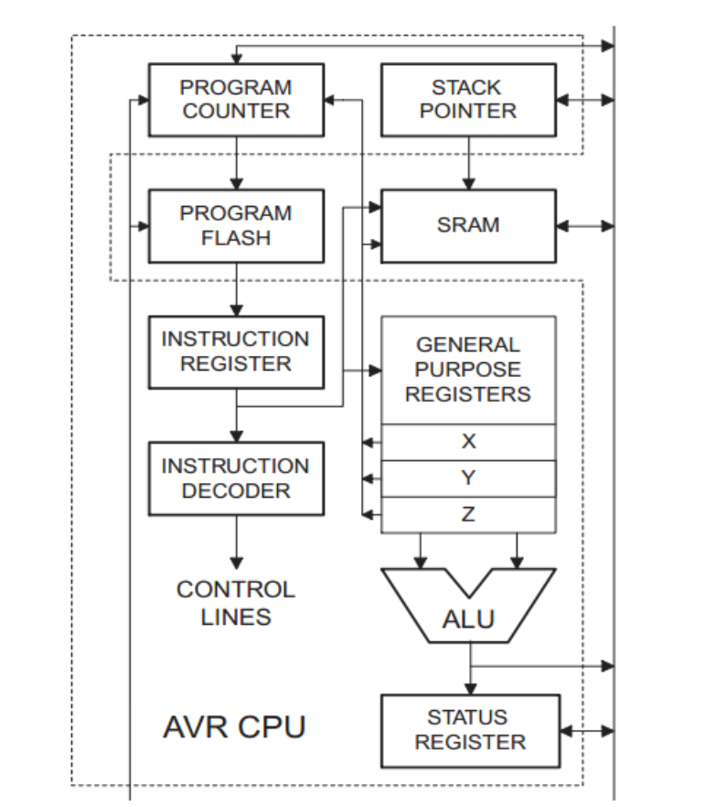

#### Memory
Memory is an essential component in a computing system used to store instructions and data required for program execution. It is built from electronic circuits composed of logic gates and flip-flops, which use sequential logic to store information. Data in memory is represented using binary values (Boolean representation), where electrical signals correspond to logical states: 1 represents the presence of a signal (high voltage) and 0 represents the absence of a signal (low voltage).  
The ATmega328P uses a Harvard architecture, meaning that program memory and data memory are separated. This architecture allows the CPU to access instructions and data simultaneously, which improves overall system performance and execution speed.    
The memory system consists of several types of memory, each designed for a specific purpose.
- **Flash Memory (Program Memory)** Flash memory is used to store the program instructions that the CPU executes. It is non-volatile, meaning the stored program remains even when power is removed. The ATmega328P contains 32 KB of Flash memory used for storing firmware or application code.
- **SRAM (Static Random Access Memory)** SRAM is used to store temporary data during program execution. It holds variables, the stack, and intermediate data used by the CPU. Unlike Flash, SRAM is volatile, meaning its contents are lost when the power is turned off. The ATmega328P provides 2 KB of SRAM.
- **EEPROM (Electrically Erasable Programmable Read-Only Memory)** EEPROM is a non-volatile data memory used to store data that must be preserved even when the device is powered off. It is typically used for storing configuration parameters or calibration data, Unlike Flash, it can be modified during runtime. The ATmega328P includes 1 KB of EEPROM.

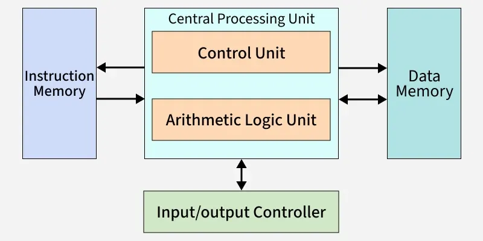

#### Registers
Registers are small, high-speed storage elements located within the microcontroller and used to hold data temporarily during program execution. They are implemented using flip-flops and sequential logic circuits, allowing them to store binary values that can be accessed extremely quickly by the processor.

In the **ATmega328P**, registers play a critical role in controlling both the CPU operations and the internal peripherals of the microcontroller. Some registers are **CPU registers**, meaning they are directly used by the processor core during instruction execution such as the **General Purpose Registers (R0–R31)**, the **Status Register (SREG)**, and the **Stack Pointer registers (SPH and SPL)** . Others are **peripheral registers**, which are used to configure and control hardware modules such as timers, communication interfaces, and analog converters.

The register system in the ATmega328P can therefore be divided into two main categories:

- **CPU Registers** directly used by the processor core (e.g., General Purpose Registers, Status Register, and Stack Pointer).
- **Peripheral / I/O Registers** used to configure and control hardware modules like GPIO, timers, ADC, and communication interfaces.

Each group of registers has a specific role in the operation of the microcontroller.

#### General Purpose Registers
The **ATmega328P** contains 32 general-purpose 8-bit registers R0 – R31, These registers are directly connected to the Arithmetic Logic Unit (ALU), allowing arithmetic and logical operations to be executed very quickly, Each register stores 8 bits of data, they are used to store operands, intermediate results, and temporary data  
Because these registers are inside the CPU core, they are considered CPU registers and provide the fastest data access available in the system.   
Some of these registers can also be combined to form 16-bit pointer registers, which are used for indirect addressing.

|Register Pair|Pointer Name|Purpose|
|---|---|---|
|R27:R26|**X Register**|Indirect SRAM addressing|
|R29:R28|**Y Register**|Indirect addressing with displacement|
|R31:R30|**Z Register**|Indirect addressing and program memory access|
These pointer registers allow the CPU to efficiently access data stored in memory.
#### Status Register (SREG) 
The Status Register (SREG) is a special CPU register that stores status flags generated by the ALU after arithmetic and logical operations.
Each bit in this register represents a flag describe properties of the result. These flags are used by the CPU to make decisions during conditional branching and program control.

|Bit|Name|Meaning|
|---|---|---|
|7|I|Global Interrupt Enable|
|6|T|Bit Copy Storage|
|5|H|Half Carry|
|4|S|Sign Bit|
|3|V|Overflow|
|2|N|Negative|
|1|Z|Zero|
|0|C|Carry|

For example, if an arithmetic operation produces a result equal to zero, the Zero (Z) flag is set, allowing the program to perform conditional jumps based on that result.

#### Stack Pointer Registers 
The Stack Pointer (SP) is a special register inside the CPU that manages the stack, which is a dedicated area of SRAM used for temporary data storage while a program is running. The stack works like a pile of items: data can be placed on top of the stack or removed from the top of the stack. The stack pointer always holds the memory address of the current top of the stack, allowing the CPU to know where the next value should be stored or retrieved.

In the ATmega328P, the stack pointer is 16 bits. Since the CPU registers are 8 bits wide, the stack pointer is implemented using two separate registers. 

|Register|Description|
|---|---|
|**SPH**|Stack Pointer High byte|
|**SPL**|Stack Pointer Low byte|

The stack commonly used during function calls, where the CPU saves the Program Counter (PC) value on the stack. This value is the address of the next instruction in the program, allowing the CPU to return to the correct place after the function finishes.   
The stack is also used during interrupts. When an interrupt occurs, the CPU automatically saves the Program Counter (PC) on the stack before jumping to the interrupt service routine (ISR). This allows the CPU to resume the interrupted program at the correct instruction after the interrupt routine completes.    
When data is pushed onto the stack, the Stack Pointer (SP) automatically updates to point to the new top of the stack. When data is popped, the Stack Pointer moves back to the next value below it. This allows the CPU to manage temporary data automatically during program execution.
#### Timer/Counter Registers 
The Timer/Counter in the ATmega328P is a special hardware module inside the CPU used to measure time, count events, or generate precise delays. It works like a small clock that can increment a number automatically based on the system clock or external signals. The value of this counter is stored in Timer/Counter registers, which the CPU can read or write to control timing operations.   
There are three main timers in the ATmega328P: Timer0, Timer1, and Timer2. Each timer has its own set of registers, which usually include:

|Register|Description|
|---|---|
|**TCNTx**|Timer/Counter register that holds the current count value of the timer (x = 0, 1, 2)|
|**TCCRnA / TCCRnB**|Timer/Counter Control Registers that configure how the timer works (mode, clock source, prescaler)|
|**OCRnx**|Output Compare Registers used to compare the timer value and trigger actions like toggling pins or generating interrupts|
|**TIMSKn**|Timer Interrupt Mask Register used to enable or disable specific timer interrupts|
|**TIFRn**|Timer Interrupt Flag Register that indicates when a timer event, such as overflow or compare match, has occurred|

The Timer/Counter is commonly used for delays, generating PWM signals, or counting external events. For example, the CPU can set the TCNTx register to zero, configure a prescaler in TCCRnB, and wait for the timer to reach a specific value in OCRnx. When the timer reaches this value, an interrupt can be triggered, or a pin can toggle automatically.

Whenever the timer counts, the TCNTx register automatically updates with each clock pulse. This allows the CPU to track time or events precisely without constantly checking the counter. Interrupt flags in TIFRn are set automatically when the timer reaches certain conditions, signaling the CPU to execute the corresponding interrupt routine.
#### I/O Registers
The **I/O Registers** in the ATmega328P are special memory locations inside the CPU used to control and interact with the microcontroller’s hardware, They are mostly used to control and read the digital pins of the microcontroller.
The ATmega328P has three main I/O ports: PORTB, PORTC, and PORTD. Together, these ports provide a total of 23 general-purpose digital I/O pins. Each port has three associated registers:

| Register  | Description                                                                                        |
| --------- | -------------------------------------------------------------------------------------------------- |
| **PORTx** | Controls the output value of digital pins. Writing `1` sets the pin high, writing `0` sets it low. |
| **DDRx**  | Data Direction Register determines whether a pin is configured as an **input** or **output**.      |
| **PINx**  | Reads the current state of digital pins. It shows whether a pin is high or low.                    |

- **PORTB** has 8 pins: PB0 – PB7
- **PORTC** has 7 pins: PC0 – PC6
- **PORTD** has 8 pins: PD0 – PD7


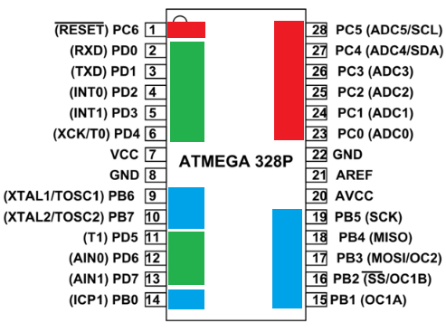

For example, to make PB5 an output and turn it high, the CPU sets the corresponding bit in DDRB to `1` and sets the bit in PORTB to `1`. To read whether PD2 is high or low, the CPU reads the PINx register for PORTD.
#### ADC Registers
The Analog-to-Digital Converter (ADC) in the ATmega328P is a module that allows the CPU to read analog voltages from sensors or other devices and convert them into digital numbers the CPU can process. The ADC uses special ADC registers to control its operation, select the input channel, start conversions, and read the results.    
The main ADC registers in the ATmega328P are:

| Register        | Description                                                                                                                                  |
| --------------- | -------------------------------------------------------------------------------------------------------------------------------------------- |
| **ADMUX**       | ADC Multiplexer Selection Register selects which analog input pin to read and sets the reference voltage for conversion                      |
| **ADCSRA**      | ADC Control and Status Register A controls starting the conversion, enabling/disabling the ADC, and setting the conversion speed (prescaler) |
| **ADCSRB**      | ADC Control and Status Register B used for advanced features like trigger sources for automatic conversions                                  |
| **ADCL / ADCH** | ADC Data Registers store the 10-bit digital result of the conversion. ADCL contains the lower 8 bits, ADCH contains the upper 2 bits         |
| **DIDR0**       | Digital Input Disable Register disables the digital input buffers on specific analog pins to reduce power consumption and noise              |

The ATmega328P has 6 dedicated analog input pins: ADC0 – ADC5 (on PORTC). Each pin can measure a voltage between 0V and the reference voltage (usually 5V).  
To use the ADC, the CPU we selects an input channel in ADMUX, enables the ADC in ADCSRA, and starts a conversion. When the conversion is complete, the 10-bit result is stored in ADCL and ADCH, which the CPU can read to get the digital value corresponding to the analog voltage.   
The ADC registers allow the CPU to read sensors like temperature sensors, light sensors, or potentiometers efficiently, converting real-world analog signals into digital numbers the program can use.
#### USART Registers
The USART (Universal Synchronous and Asynchronous Receiver and Transmitter) used for serial communication. It allows the microcontroller to send and receive data one bit at a time over communication lines. This is commonly used to communicate with devices such as computers, sensors, or other microcontrollers.   
The USART module uses several registers to configure communication settings, send data, and receive data.

| Register            | Description                                                                                                         |
| ------------------- | ------------------------------------------------------------------------------------------------------------------- |
| **UCSR0A**          | USART Control and Status Register A – contains status flags such as transmission complete and data received         |
| **UCSR0B**          | USART Control and Status Register B – enables or disables the transmitter, receiver, and USART interrupts           |
| **UCSR0C**          | USART Control and Status Register C – configures the communication format, such as data bits, parity, and stop bits |
| **UBRR0H / UBRR0L** | USART Baud Rate Registers – set the communication speed (baud rate)                                                 |
| **UDR0**            | USART Data Register – holds the data byte to be transmitted or the byte that was received                           |

To **send data**, the CPU writes a byte to the UDR0 register. The USART hardware then transmits the data serially through the TX pin.  
To receive data, the USART hardware stores the received byte in **UDR0**, and the CPU reads this register to obtain the data.

The baud rate of the communication is configured using UBRR0H and UBRR0L, which determine how fast bits are transmitted. The communication format, such as the number of data bits and stop bits, is configured using UCSR0C.
The ATmega328P uses two pins for USART communication:
- **PD0 (RX)** – receives serial data
- **PD1 (TX)** – transmits serial data

These registers allow the CPU to exchange data with external devices efficiently using serial communication.

#### Interrupt Registers
Finally The Interrupt Registers in the ATmega328P are used to control and manage interrupts. An interrupt allows the CPU to pause the current program and immediately execute a special function called an Interrupt Service Routine (ISR) when a specific event occurs, such as a timer event, a pin change, or incoming serial data.     
These registers allow the CPU to enable or disable interrupts and check whether an interrupt event has occurred.   
The main interrupt-related registers include:

| Register   | Description                                                                                                  |
| ---------- | ------------------------------------------------------------------------------------------------------------ |
| **SREG**   | Status Register – contains the **Global Interrupt Enable (I) bit**, which enables or disables all interrupts |
| **EIMSK**  | External Interrupt Mask Register – enables or disables external interrupts                                   |
| **EIFR**   | External Interrupt Flag Register – indicates when an external interrupt event has occurred                   |
| **PCICR**  | Pin Change Interrupt Control Register – enables pin change interrupts for specific ports                     |
| **PCIFR**  | Pin Change Interrupt Flag Register – indicates when a pin change interrupt has occurred                      |
| **TIMSKn** | Timer Interrupt Mask Registers – enable or disable timer-related interrupts                                  |
| **TIFRn**  | Timer Interrupt Flag Registers – indicate when timer interrupt events occur                                  |

The Global Interrupt Enable bit (I) in the SREG register controls whether interrupts are allowed at all. When this bit is set to **1**, interrupts are enabled. When it is **0**, all interrupts are disabled.   
Each interrupt source also has its own **enable bit** in a mask register such as **EIMSK** or **TIMSKn**. This allows the CPU to enable only the interrupts that the program needs.  
When a hardware event occurs, the corresponding **interrupt flag** in a flag register (such as **EIFR** or **TIFRn**) is set. If the interrupt is enabled and global interrupts are allowed, the CPU automatically jumps to the corresponding **Interrupt Service Routine (ISR)** to handle the event.

These registers allow the CPU to respond quickly to hardware events without constantly checking device states in the main program.
### Programming The Atmega328p
The Arduino IDE and development boards simplify working with the ATmega328P microcontroller. However, this simplification does not come without a cost. The built-in functions and objects hide many low-level details and hardware abstractions. Fortunately, the Arduino IDE also allows us to program the microcontroller more directly. With a solid understanding of the ATmega328P architecture, we can write programs that provide low-level control and direct access to the microcontroller’s registers and peripherals, which can significantly improve the performance and efficiency of our projects.
#### Working With I/O Pins
Let us begin with the input and output pins. The digital and analog I/O pins of the Arduino can be controlled directly through hardware registers. These pins are organized into groups, each managed by three main registers: PORTB, PORTC, and PORTD. These ports correspond to specific Arduino pins as shown in the following table:

| Port      | Arduino Pins |
| --------- | ------------ |
| **PORTB** | D8 – D13     |
| **PORTC** | A0 – A5      |
| **PORTD** | D0 – D7      |


The first step when working with I/O pins is to configure their data direction using the Data Direction Registers (DDRx). These registers determine whether each pin operates as an input or an output.     
Let us create a simple project to turn on an LED using direct register manipulation. In this example, we will use digital pin D13. The first step is to build a simple circuit by connecting the LED to pin D13 through 220 ohm resistor.

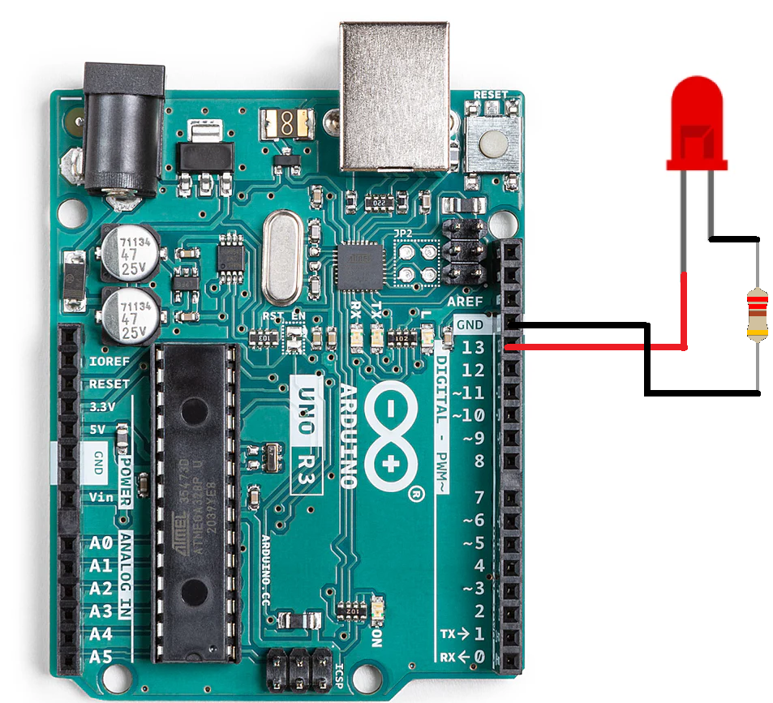

Next, we connect the Arduino Uno board to the computer and create a new sketch in the Arduino IDE. Within the `setup()` function, we configure the pin as an output by setting the corresponding bit in the Data Direction Register.
Each bit in the registers corresponds to a specific pin. The mapping between the bits and the pins is illustrated below.

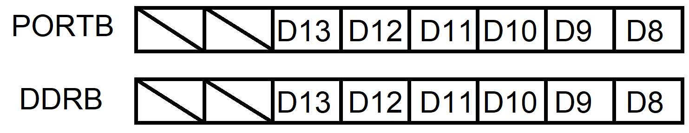

To configure **pin D13** as an output, we must set bit 6 of the **DDRB** register to **1**. This corresponds to the binary value **00100000**, which is **32** in decimal.  
Similarly, to output a **HIGH signal** on this pin, we must set bit 6 of the **PORTB** register to **1**.  
With this understanding, we can now implement a simple program to control the LED connected to pin D13.
```cpp
void setup() {
  DDRB = 0b100000;  
  PORTB = 0b100000;  
}
void loop() {

}
```
We can also configure pins to operate in input mode and read their state using the DDRx and PINx registers. To demonstrate this, we will extend our project by adding a push button connected to pin D3.   
When the button is pressed, the LED connected to pin D13 will turn on. When the button is released, the LED will turn off.   
First, we add a push button to pin D3. One side of the button is connected to the pin, and the other side is connected to **5V**, while a pull-down resistor keeps the input LOW when the button is not pressed.

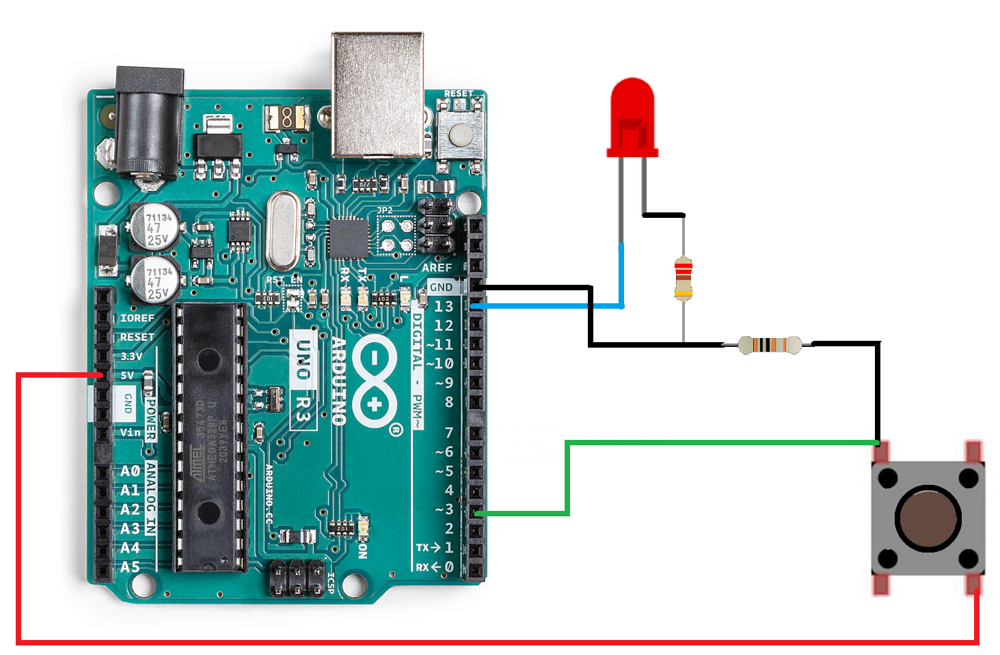

After that we edit our program in the setup function we configure the pin D3 as an input. Since D3 belongs to PORTD, we will use the DDRD register to set its direction. To read the state of the button, we use the PIND register, which contains the current logic state of the pins in PORTD.

Each bit in PIND corresponds to a pin in PORTD, just as in the DDRD and PORTD registers. Therefore, to read the state of pin D3, we check the fourth bit of the PIND register.

With this configuration, the program continuously reads the state of the button and updates the LED accordingly.
```cpp
void setup() {  
  DDRB = 0b00100000;  
  DDRD = 0b00000000;  
}  
  
void loop() {  
  if (PIND & 0b00001000) { 
    PORTB = 0b00100000;  
  } else {  
    PORTB = 0b00000000;    
  }  
}
```
We use a bitwise operator `&` to check the state of a specific bit in the register. The bitwise AND (`&`) operator performs a logical comparison between the bits of two values and returns the result of the operation.  
Since we want to check only the fourth bit corresponding to pin D3, we perform a bitwise AND operation with the binary value 00001000. This value acts as a mask that isolates the bit of interest.

If the PIND register contains a value of the form **xxxx1xxx**, the result of the operation will be **00001000**, indicating that the button is pressed. Otherwise, if the bit is 0, the result will be **00000000**, indicating that the button is not pressed.

#### Bitwise Operators
When working with microcontroller registers, data is manipulated bit by bit, since each bit typically controls or represents the state of a specific hardware feature or pin. Standard arithmetic and comparison operators are not suitable for this type of operation because they work on entire numerical values rather than on individual bits.   
For this reason, programming languages such as C and C++ provide a special category of operators known as bitwise operators. These operators allow us to directly manipulate individual bits within a variable.     
Bitwise operators perform logical operations at the binary level, enabling tasks such as setting, clearing, toggling, shifting, or testing specific bits in a register. 

The main bitwise operators used in embedded programming are:   
**Bitwise AND (`&`)**  
The AND operator returns 1 only if both bits are 1. It is commonly used with masks to check a specific bit.
```

Value:     10101100  
Mask:      00001000  (masking bit 3)  
-------------------
10101100 & 00001000 = 00001000
```
Here, only bit 3 is checked; all other bits are cleared.      
**Bitwise OR (`|`)**     
The OR operator returns 1 if at least one of the bits is 1. It is often used to set a bit without changing others.   
```

Value:     10100000  
Mask:      00001000  (setting bit 3)  
-------------------
10100000 | 00001000 = 10101000
```
Only bit 3 is set; the other bits remain unchanged.     
**Bitwise XOR (`^`)**    
The XOR operator returns 1 if the bits are different. It is commonly used to toggle a bit.
```
Value:     10101000  
Mask:      00001000  (toggle bit 3) 
-------------------
10101000 ^ 00001000 = 10100000
```
Bit 3 has been flipped from 1 to 0.      
**Bitwise NOT (`~`)**    
The NOT operator inverts all bits, turning 0s into 1s and 1s into 0s.
```
Value:     10101000  
-------------------
~10101000 = 01010111
```
All bits are inverted.     
**Left Shift (`<<`)**  
The left shift operator moves all bits left, filling vacated bits with 0s. Often used to create masks or multiply by powers of 2.
```
Value:     00000001  
-------------------
00000001 << 3 = 00001000
```
Bit 0 has moved to bit 3.   
**Right Shift (`>>`)**  
The right shift operator moves all bits right, filling vacated bits with 0s. Often used to extract specific bits.
```
Value:     00001000  
Shift >> 3:  
00001000 >> 3 = 00000001
```
Bit 3 has been shifted to the least significant bit.

#### Working With Timers and Counters
The ATmega328P microcontroller used in the Arduino Uno contains three timers: **Timer0**, **Timer1**, and **Timer2**. Each timer is controlled through a set of registers that configure its behavior and monitor its state. The most commonly used registers include the Timer/Counter Control Registers (TCCRn), the Timer/Counter Register (TCNTn), and the Timer Interrupt Flag Register (TIFRn).    
To demonstrate how timers work, we will create a simple project where an LED connected to pin D13 blinks every 5 seconds using a hardware timer.  
First, we use the same circuit as before, where the LED is connected to pin D13 through a 220 Ω resistor.


Next, we configure pin D13 as an output by setting the corresponding bit in the DDRB register. After that, we configure Timer1.     
Timer1 is a 16-bit timer, which allows it to count larger values compared to the 8-bit timers. This capability makes it suitable for generating longer and more precise delays.  
The timer counts clock pulses derived from the microcontroller’s system clock. In the ATmega328P used in the Arduino Uno, the system clock frequency is 16 MHz, meaning the microcontroller generates 16,000,000 clock pulses per second.   
This frequency is too high for directly measuring long time intervals. To address this, timers provide a mechanism called a prescaler, which divides the clock frequency by a fixed value before it reaches the timer counter. This effectively slows down the counting rate.   
For example, if we apply a prescaler of 1024, the timer will increment once for every 1024 clock pulses instead of every single clock pulse. The effective counting frequency of the timer becomes:
```
16,000,000 / 1024 = 15625 counts per second
```
This means that 15,625 timer counts correspond to one second. Therefore, to generate a 5-second delay, the timer must count:
```
15625 × 5 = 78125 counts
```
Since Timer1 is a 16-bit timer with a maximum value of 65535, we instead use the overflow flag to detect when the timer reaches its maximum value and then we just check one counter value is greater or equal 12590.   
To configure the timer, we use the TCCR1B register to set the prescaler and enable the timer. The TCNT1 register holds the current timer count, while the TIFR1 register indicates when an overflow occurs.   
We can use the following table to set the prescaler   

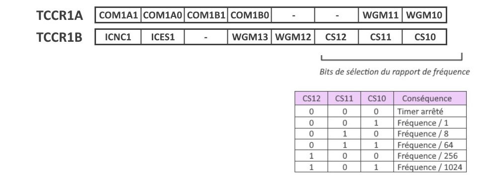
The **TCCR1A** register contains **8 bits** that are used to configure part of the behavior of **Timer1**. These bits mainly control how the timer interacts with certain output pins and help define the operating mode of the timer.
- **COM1A1 and COM1A0 (bits 7–6):** Control the behavior of the **OC1A pin** (Output Compare A) when the timer reaches a compare value. These bits allow the timer to automatically **toggle, set, or clear the pin**. This feature is often used in **PWM generation or automatic signal output**.
- **COM1B1 and COM1B0 (bits 5–4):** Work in the same way as the previous bits but for the **OC1B pin** (Output Compare B). They control how this second output pin behaves during a compare match.
- **Bits 3 and 2:** These bits are **reserved**, meaning they are not used in this register. They are normally kept **0** to ensure proper operation.
- **WGM11 and WGM10 (bits 1–0):** These bits are part of the Waveform Generation Mode (WGM) configuration. Together with the WGM bits in the TCCR1B register, they determine how the timer operates, such as normal counting mode, CTC mode, or PWM modes.

We dont need automatic control of output pins , and we want the timer to work in a basic mode, so we set this register to
```
TCCR1A = 0b00000000;
```
To check whether a timer overflow has occurred, we read the TIFR1 register (Timer/Counter1 Interrupt Flag Register). This register contains several status flags that indicate events related to Timer1, the TOV1 bit in the TIFR1 register is set to 1 when Timer1 overflows, meaning the counter has reached its maximum value and returned to 0.

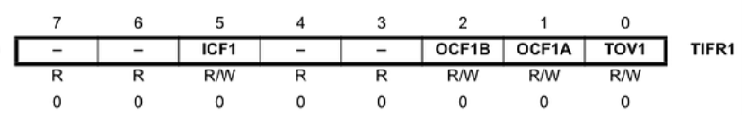

With this information, we can implement the LED blinking program. In the `setup()` function, we configure the necessary registers to initialize the timer and set the LED pin as an output.   
In the `loop()` function, the program continuously checks whether an overflow has occurred. If an overflow is detected and the value of TCNT1 is greater than or equal to 12590, the program toggles the output pin connected to the LED. After that, the timer counter and the overflow flag are reset so the timing process can start again.
```cpp
void setup() {
  DDRB = 0b00100000;      // Set D13 as output
  TCCR1A = 0b00000000;    // Timer1 normal mode
  TCCR1B = 0b00000101;    // Prescaler = 1024
  TCNT1  = 0;  

}
void loop() {
    if (TIFR1 & 0b00000001 && TCNT1 >= 12590) { // Approximate 5 seconds
      TIFR1 = 0b00000001;       // clear timer overflow flag
      PORTB ^= 0b00100000;      // Toggle LED
      TCNT1 = 0;
    }
}
```
#### Working With Interrupts
Another important feature of microcontrollers is the ability to use interrupts. An interrupt allows the microcontroller to immediately respond to an event without constantly checking for it inside the `loop()` function.    
Normally, a program runs instructions sequentially. However, when an interrupt event occurs, the microcontroller temporarily pauses the current program, executes a special function called an Interrupt Service Routine (ISR), and then returns to the main program.  

Interrupts are useful when reacting to external events, such as pressing a button, receiving data, or when a timer reaches a certain value.  
The ATmega328P microcontroller used in the Arduino Uno provides several interrupt sources. One of the most commonly used is the external interrupt, which can be triggered by a signal change on specific pins.

To demonstrate how interrupts work, we will create a simple project where a push button toggles an LED connected to **pin D13**. Each time the button is pressed, an interrupt is triggered and the LED changes its state.

First, we build the circuit by connecting:

- an **LED** to **pin D13** through a **220 Ω resistor**
- a **push button** to **pin D3**, we connect it to VCC through a pull-up resistor, and the other side of the button is connected to GND.

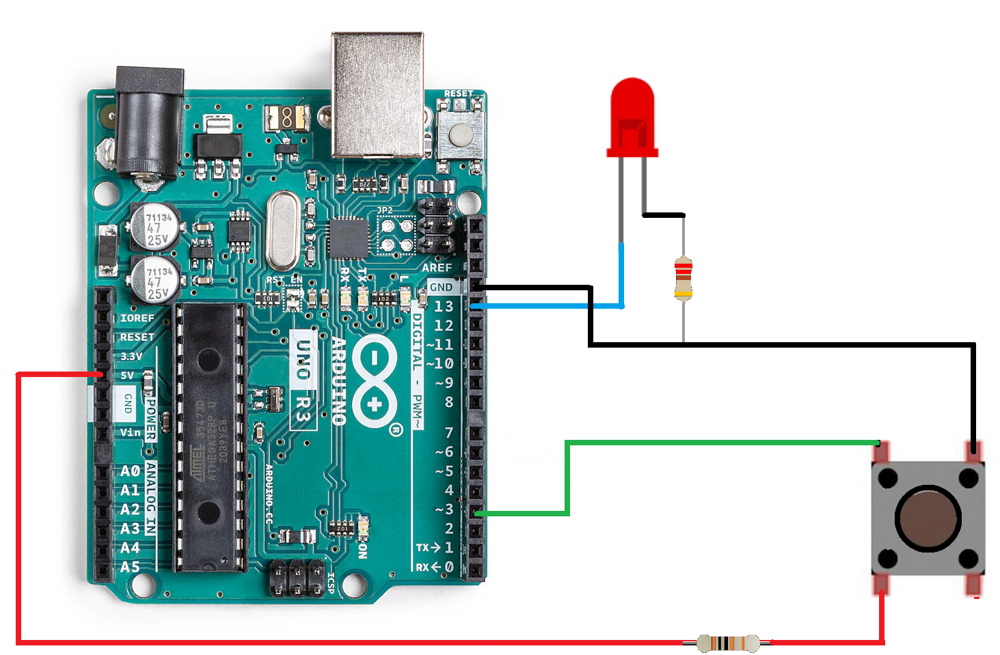


Next, we configure the LED pin as an output and the button pin as an input. To enable the external interrupt, several registers must be configured.

The EIMSK register (External Interrupt Mask Register) is used to enable or disable external interrupts. Each bit corresponds to one interrupt source.
- **INT0 (bit 0):** Enables the interrupt for **pin D2**
- **INT1 (bit 1):** Enables the interrupt for **pin D3**

To enable the interrupt for **pin D3**, we set **bit 1** of the **EIMSK** register.   
The **EICRA** register (**External Interrupt Control Register A**) defines which signal change triggers the interrupt. For example, the interrupt can occur on a low level, rising edge, falling edge, or any logical change.   
For our project, we configure the interrupt to trigger on the falling edge, which occurs when the button is pressed.   

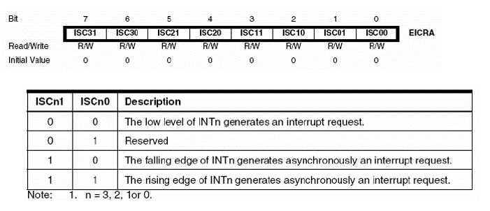

After enabling the interrupt, we also need to enable global interrupts using the `sei()` function. Without this step, the microcontroller will ignore all interrupt events.   
When the interrupt occurs, the microcontroller automatically calls a special function called the **Interrupt Service Routine (ISR)**. Inside this function, we simply toggle the LED.

The following program implements this behavior.
```cpp
#include <avr/interrupt.h>

void setup() {
  DDRB = 0b00100000;     
  DDRD = 0b00000000;   
  EIMSK = 0b00000010;    
  EICRA = 0b00000010; 
  PORTB = 0; 
  PORTD = 0b1000; 
  sei();                 
}

void loop() {
}

ISR(INT1_vect) {
  PORTB ^= 0b00100000;   

}
```
