## Objectives
- Exploring Communication Protocols
- Wireless Connectivity in Arduino

## Comunication Protocols 
We used different sensors and display devices with an Arduino Uno board. However, in large projects we may need many devices, which can exceed the number of available pins on a single Arduino board.  
To solve this problem, we can use networking techniques. By connecting multiple Arduino boards together, we can expand the number of available pins and distribute tasks among several boards. In addition, networking allows different devices in the system to communicate with each other and exchange data, making the overall system more efficient and scalable for complex projects.
### Serial Communication
Serial communication is one of the most common ways for an Arduino board to communicate with a computer or with other devices. It is a method of transmitting data sequentially, bit by bit, over a communication channel.   
When we program our Arduino, we use serial communication. By plugging in the USB cable, a serial communication link is established between the Arduino board and the computer. Through this connection, we can upload our program to the microcontroller.

However, serial communication is not only used for programming. We can also send and receive data between the computer and the Arduino board. This is very useful for debugging programs, because it allows us to display messages or variable values while the program is running.

To use serial communication in Arduino programs, we use the Serial library, which provides functions for sending and receiving data.

For two devices to talk serially, they need to agree on a few rules, primarily the Baud Rate, which represent the speed of the communication (bits per second). Common speeds are 9600 or 115200. If the sender is talking at 9600 and the receiver is listening at 115200, the data will look like gibberish and corrupted.
#### Creating Project
Let’s create a simple example of sending a message using serial communication. First, we connect the Arduino board to our computer using a USB cable. Then, in the Arduino IDE, we create a new sketch.  To work with serial communication, we use the `Serial` object. We first initialize the communication by specifying the baud rate inside the `setup()` function using `Serial.begin()`.   
Once the communication is started, we can send data from the Arduino to the computer inside the `loop()` function using `Serial.print()` or `Serial.println()`.
```cpp
void setup() {  
  Serial.begin(9600); // Start serial communication at 9600 baud  
}  
  
void loop() {  
  Serial.println("Hello from Arduino"); // Send a message  
  delay(1000); // Wait 1 second  
}
```
Now the Arduino will send the message “Hello from Arduino” to our computer. We can read this message by opening the Serial Monitor from the Tools menu in the Arduino IDE.

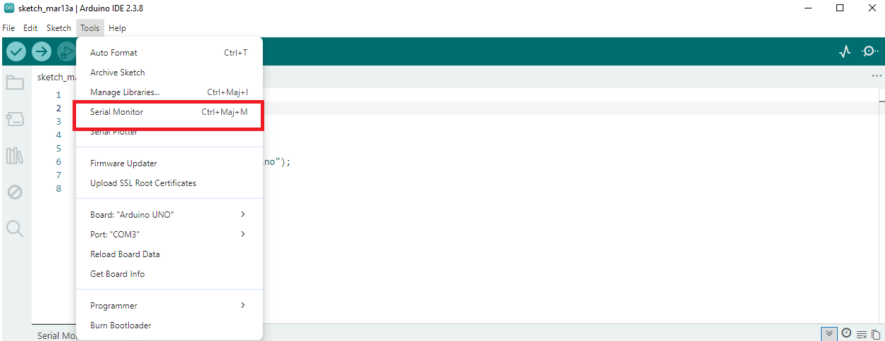

This will open a small window that displays the message on the screen.

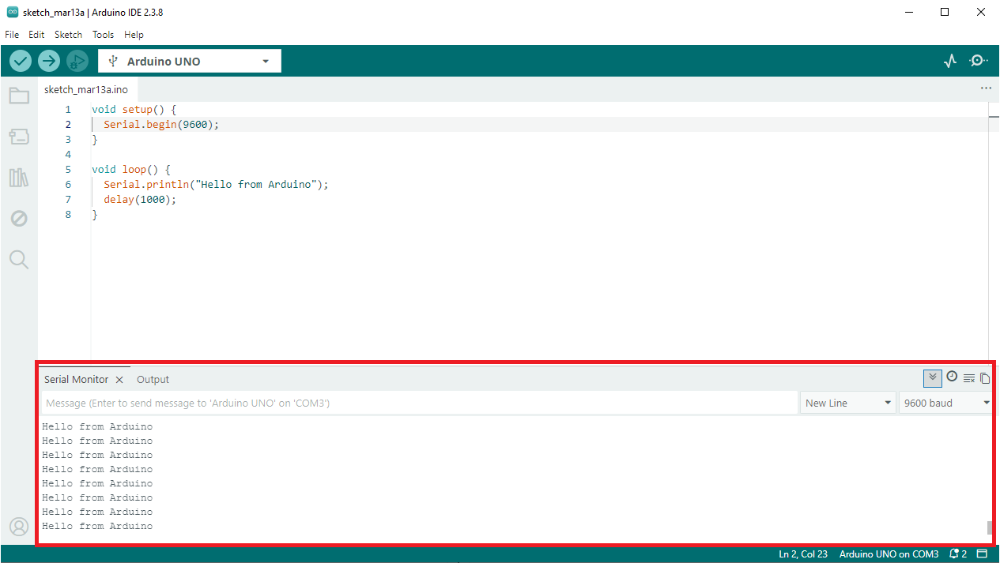

We can also send data from the IDE to the Arduino board. To do this, we add a small condition inside the `loop()` function to check if data has been received. This is done using `Serial.available()`, which returns the number of bytes available to read. If data is available, we can read it byte by byte using `Serial.read()`.
```cpp
void setup() {
  Serial.begin(9600); // Initialize serial communication at 9600 baud
  Serial.println("Arduino is ready. Send me a message!");

}

void loop() {

  if (Serial.available() > 0) {
    char receivedChar = Serial.read(); 
    Serial.print("You sent: ");            
    Serial.println(receivedChar); 
  }
}
```
Now send data from the ide we use the input box in the serial monitor

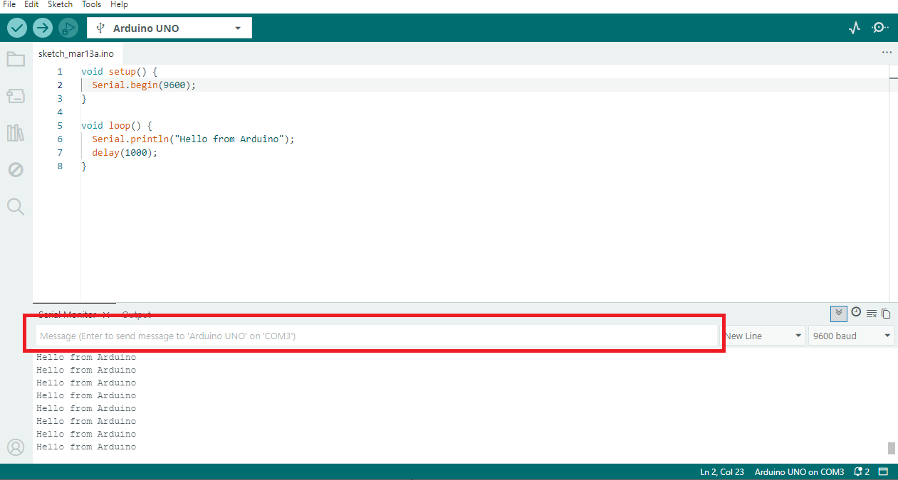

The `Serial.available()` function returns the number of bytes available to read. We can use this value in a `for` loop instead of repeatedly using an `if` statement. 
```cpp
void setup() {  
	Serial.begin(9600); 
	Serial.println("Arduino is ready. Type something in the Serial Monitor!");  
}  
  
void loop() {  
	for (int i = 0; i < Serial.available(); i++) {  
		char receivedChar = Serial.read(); 
		Serial.print("You sent: ");  
		Serial.println(receivedChar); 
	}
}
```
### UART Protocol
UART, which stands for Universal Asynchronous Receiver/Transmitter, is a hardware protocol used for serial communication between devices. With this communication protocol, we can connect our Arduino board to another Arduino board or to other electronic devices such as sensors, GPS modules, or Bluetooth modules.   

UART communication uses two main pins:
- TX (Transmit) sends data from the device
- RX (Receive) receives data from another device

#### UART Architecture
To connect two devices together using UART communication, we link the transmitter (TX) of the first device to the receiver (RX) of the second device. Similarly, the receiver (RX) of the first device is connected to the transmitter (TX) of the second device. In other words, TX connects to RX, and RX connects to TX.   
In addition, both devices must share a common ground (GND) so that they use the same voltage reference.   

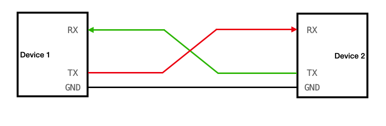

After connecting the devices, we must ensure that both sides use the same baud rate, which defines the communication speed in bits per second. 
#### Working Principle
The data is transmitted as a sequence of electrical signals over the TX (Transmit) line. Each signal represents a binary value, where a HIGH voltage level represents 1 and a LOW voltage level represents 0.   
The line normally stays in a HIGH state when idle. When a device wants to send data, it begins by transmitting a start bit, which is a LOW signal. This transition from HIGH to LOW informs the receiver that a new data frame is starting and allows it to synchronize its timing based on the configured baud rate.

After the start bit, the transmitter sends the data bits, usually 8 bits per byte, one bit at a time over the TX (Transmit) line. Each bit is represented by an electrical signal where a HIGH voltage level represents 1 and a LOW voltage level represents 0.

Once the data bits have been transmitted, an optional parity bit may be added for basic error detection. This bit helps the receiver verify whether the transmitted data may have been corrupted during transmission.

Finally, the frame ends with one or more stop bits, which are HIGH signals. The stop bit marks the end of the data frame and returns the line to the idle HIGH state, allowing the receiver to recognize that the transmission has finished before waiting for the next start bit. 

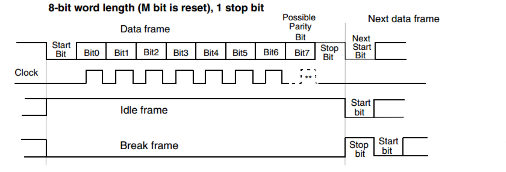

#### Arduino UART Configuration
The Arduino Uno contains a single hardware UART module. This UART is connected to the following pins:
- Pin 1 TX (Transmit)
- Pin 0 RX (Receive)

This can create a limitation because UART communication is a point-to-point protocol, meaning it normally connects only two devices at a time. In addition, these same pins are also used for communication with the computer when uploading programs or using the Serial Monitor.  
To overcome this limitation, we can create software-based serial ports using the `SoftwareSerial` library. This library allows UART-like communication on other digital pins of the Arduino, for example pins 10 and 11, while keeping the hardware UART free for communication with the computer.
#### Creating Project
Let’s create a simple project where we connect three Arduino boards together using the UART protocol. In this project, we will use a master–slave architecture, where one Arduino acts as the master and the other two act as slaves. The master will send commands through UART communication, and the slave boards will perform actions based on the received command.   
First, we need to connect the three Arduino boards together. Since UART communication uses TX and RX  lines, the transmitter of one device must be connected to the receiver of the other device.

Because the Arduino Uno has only one hardware UART, we will use the hardware serial for communication between the master and one slave, and a software serial port for communication with the second slave.   
The connections are as follows:   
Master to Slave 1 (Hardware UART)
- Master TX (Pin 1) Slave 1 RX (Pin 0)
- Master RX (Pin 0) Slave 1 TX (Pin 1)

Master to Slave 2 (Software UART)
- Master Pin 11 (TX) Slave 2 RX (Pin 0)
- Master Pin 10 (RX) Slave 2 TX (Pin 1)
    
Finally, all three boards must share a common ground (GND).

After connecting the Arduino boards together, we will add output and input components, Each slave Arduino will have an LED connected to it. we use pin 9 on the slaves board to control the led we connect them through 220Ω resistor. 

Next, we add two push buttons to the master Arduino. These buttons will allow the user to send commands to the slave boards. We use pin 7 and pin 8 for the buttons: pin 7 will control the first slave Arduino, and pin 8 will control the second slave Arduino. When a button is pressed, the master Arduino will send a command through UART, and the corresponding slave will perform the required action.

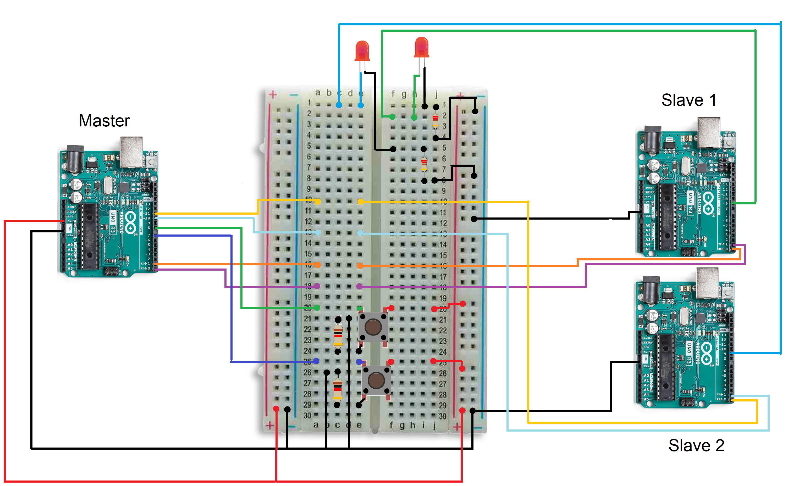

Now let’s create our programs, starting with the master Arduino.
First, we import the `SoftwareSerial` library to create a second UART port for communication with the second slave. Inside the `setup()` function, we initialize our UART communication:
- The first UART uses the standard hardware serial for the first slave.
- The second UART uses pins 11 (TX) and 10 (RX) for the second slave.

We also configure pins 7 and 8 as input pins to read the state of the push buttons.  
Next, we create two boolean variables to keep track of the LED state for each slave. These variables will toggle every time a button is pressed.  
Inside the `loop()` function, we read the state of the push buttons:
- If the button connected to pin 7 is pressed, we toggle the first boolean variable and send a message (`"ON"` or `"OFF"`) to the first slave.
- If the button connected to pin 8 is pressed, we toggle the second boolean variable and send a message to the second slave.

Finally, we add a small delay of 500 ms to debounce the buttons and prevent multiple rapid triggers from a single press.
```cpp
#include <SoftwareSerial.h>  


SoftwareSerial slave2Serial(10, 11); // RX, TX  

bool led1State = false;  
bool led2State = false;  
  
void setup() {  
// Initialize UART communication  
	Serial.begin(9600); // Hardware UART for first slave  
	slave2Serial.begin(9600); // Software UART for second slave  
  
	pinMode(7, INPUT);  
	pinMode(8, INPUT);  
}  
  
void loop() {  
	if (digitalRead(7) == HIGH) {  
		led1State = !led1State; 
		if (led1State) {  
			Serial.println("ON"); 
		} else {  
			Serial.println("OFF");  
		}  
	delay(500);  
	}  
  
	if (digitalRead(8) == HIGHT) {  
		led2State = !led2State; 
		if (led2State) {  
			slave2Serial.println("ON");  
		} else {  
			slave2Serial.println("OFF");  
		}  
	delay(500); 
	}  
}
```
Now we create the program for the slave board, First, inside the `setup()` function, we set pin 9 as an output pin for the LED and start serial communication at a baud rate of 9600, which must match the master.  Next, we create a string variable to store the data received from the master through UART.

Finally, inside the `loop()` function, we check if data has been sent using `Serial.available()`. If data is available, we read it. If the received message is `"ON"`, we turn the LED on. If it is `"OFF"`, we turn the LED off.
```cpp
String receivedData = ""; 
  
void setup() {  
	pinMode(9, OUTPUT);  
	Serial.begin(9600); 
}  
  
void loop() {  
 
	if (Serial.available() > 0) {  
		receivedData = Serial.readStringUntil('\n'); 
		if (receivedData == "ON") {  
			digitalWrite(9, HIGH);
		} else if (receivedData == "OFF") {  
			digitalWrite(9, LOW); 
		}  
	}  
}
```
### I2C Protocol
The UART protocol works perfectly, but it has a small limitation: it is a point-to-point communication protocol. This means that it normally connects only two devices together. If we want to add more devices,  we need more pins and more independent serial ports (like using `SoftwareSerial`). As the number of sensors and modules grows, we quickly consume all our available pins. To solve this, a new protocol has been developed: I2C.

I2C, which stands for Inter-Integrated Circuit, is a serial communication protocol that allows multiple devices to communicate using only two wires. With I2C, we can connect many devices such as sensors, displays, EEPROM memory, and other microcontrollers to the same communication bus while using only two pins on the Arduino.  
The two communication lines used in the I2C protocol are:
- SDA (Serial Data Line) used to transfer data between devices
- SCL (Serial Clock Line) used to synchronize the communication using a clock signal
#### I2C Architecture
Unlike UART, where each connection requires a separate pair of wires, all I2C devices share the same SDA and SCL lines. This allows multiple devices to be connected in parallel on the same bus.   
In an I2C system, devices are organized using a master–slave architecture:
- The master device controls the communication and generates the clock signal on the SCL line.
- The slave devices respond to the master when they are addressed.

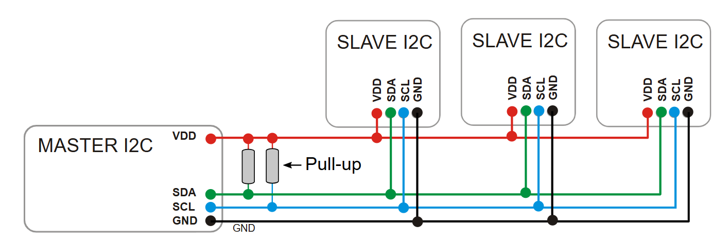

Each slave device connected to the I2C bus has a unique address. When the master wants to communicate with a specific device, it sends the address of that device on the SDA line. Only the device with the matching address will respond, while the others remain inactive.
#### Working Principle
The Communication in I2C follows a specific sequence of events. The master begins by generating a Start condition, which occurs when the SDA line changes from HIGH to LOW while SCL is HIGH. This signals all devices on the bus that a communication session is beginning.

After the start condition, the master sends the 7-bit address of the slave device, followed by a read/write bit that indicates whether the master wants to send data to the slave or receive data from it.

Once the address is transmitted, the addressed slave responds with an ACK (acknowledge) bit, confirming that it is ready to communicate. The master and slave can then exchange data bytes, where each byte consists of 8 bits followed by another acknowledge bit.

When the communication is finished, the master sends a Stop condition, which occurs when the SDA line changes from LOW to HIGH while SCL is HIGH. This indicates that the data transmission has ended and the bus becomes idle again.

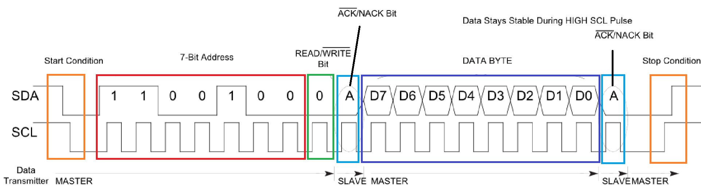


#### Arduino I2C Configuration
On the Arduino Uno, the hardware I2C interface uses the following pins:
- A4 – SDA (Serial Data)
- A5 – SCL (Serial Clock)

These pins allow the Arduino to communicate with multiple I2C devices using the same two wires.
#### Creating Project
Now let's create a simple project where three Arduino boards and an LCD display communicate using the I2C protocol. In this system, one Arduino acts as the master, while the other two act as slave devices. The master sends commands to the slaves, and each slave controls an LED based on the received command. In addition, an LCD display connected to the master Arduino shows the current state of each slave’s LED.    
First, we connect the three Arduino boards and the LCD display using the I2C bus.
- All SDA pins (A4) are connected together.
- All SCL pins (A5) are connected together.
- All devices share a common GND.

Next, we connect an LED to each slave Arduino.  Each LED is connected to pin 9 through a 220Ω resistor.
On the master Arduino, we add two push buttons to send commands to the slaves:
- Pin 7 controls the first slave
- Pin 8 controls the second slave

When a button is pressed, the master Arduino sends a command through the I2C bus to the corresponding slave device. The slave receives the command and toggles the state of its LED. At the same time, the LCD display connected to the master Arduino is updated to show the current state of each slave’s LED.

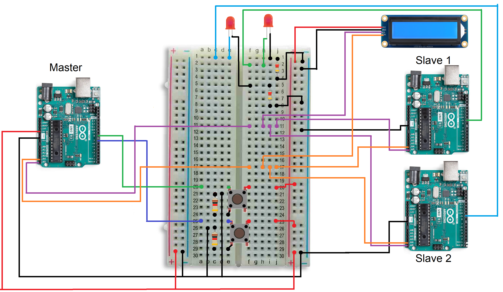

Now let's create the program for the master Arduino.   
First, we include the Wire library, which allows the Arduino to communicate using the I2C protocol, and the LiquidCrystal_I2C library, which allows us to control the LCD display through the I2C bus.  
Inside the `setup()` function, we initialize the I2C communication using `Wire.begin()`, configure the button pins as inputs, and initialize the LCD display. The LCD is then used to display the current state of each slave’s LED.

Inside the `loop()` function, the Arduino continuously checks whether one of the buttons is pressed. When a button is pressed, the master toggles the state of the corresponding slave LED and sends a command to that slave using its I2C address. After sending the command, the LCD display is updated to show the new state of each slave.
```cpp
#include <Wire.h>
#include <LiquidCrystal_I2C.h>

LiquidCrystal_I2C lcd(0x27, 16, 2); // LCD I2C address

bool led1State = false;
bool led2State = false;

void setup() {

    Wire.begin(); 
    pinMode(7, INPUT);
    pinMode(8, INPUT);
    lcd.init();
    lcd.backlight();
    lcd.setCursor(0,0);
    lcd.print("Slave1: OFF");
    lcd.setCursor(0,1);
    lcd.print("Slave2: OFF");
}

void loop() {
    if (digitalRead(7) == HIGH) {
        led1State = !led1State;
        Wire.beginTransmission(8); // Address of slave 1
        lcd.setCursor(0,0);
	    lcd.print("Slave1: ");
        if (led1State) {
	        lcd.print("ON ");
            Wire.write("ON");
        } else {
            lcd.print("OFF");
            Wire.write("OFF");
        }
        Wire.endTransmission();
        delay(500);
    }

    if (digitalRead(8) == HIGH) {
        led2State = !led2State;
        Wire.beginTransmission(9); // Address of slave 2
        lcd.setCursor(0,1);
        lcd.print("Slave2: ");
        if (led2State) {
            lcd.print("ON ");
            Wire.write("ON");
        } else {
            lcd.print("OFF");
            Wire.write("OFF");
        }
        Wire.endTransmission();
        delay(500);
    }
}
```
Next, we create the program for the slave Arduino boards. Both slave boards will run the same program*, but each one will have a different I2C address.

Inside the `setup()` function, we initialize the I2C communication using `Wire.begin(address)`, where the address uniquely identifies the slave device on the I2C bus. We also register a function called `receiveEvent()`, which is automatically executed whenever the slave receives data from the master.    
Inside this function, the slave reads the received message and controls the LED accordingly.
```cpp
#include <Wire.h>

String receivedData = "";

void setup() {

    pinMode(9, OUTPUT);

    Wire.begin(8); // Change to 9 for the second slave
    Wire.onReceive(receiveEvent);
}

void loop() {
}

void receiveEvent(int bytes) {

    receivedData = "";

    while (Wire.available()) {
        char c = Wire.read();
        receivedData += c;
    }

    if (receivedData == "ON") {
        digitalWrite(9, HIGH);
    }
    else if (receivedData == "OFF") {
        digitalWrite(9, LOW);
    }
}
```
### SPI Protocol
The I2C protocol is highly efficient for connecting many devices with just two wires, but it has some limitations. Because it uses a single data line for both sending and receiving, it operates in half-duplex mode it cannot send and receive data at the same time. Additionally, the use of pull-up resistors limits its maximum communication speed. When a project requires transferring large amounts of data very quickly such as reading an SD card or driving a high-resolution color display I2C can become a bottleneck. To solve this need for speed and simultaneous two-way communication, we use the SPI protocol.   
SPI, which stands for Serial Peripheral Interface, is a synchronous serial communication protocol designed for short-distance, high-speed communication. Unlike I2C, SPI operates in full-duplex mode, meaning devices can send and receive data simultaneously.  
Instead of just two wires, SPI typically uses four communication lines:  
- MOSI (Master Out Slave In): Used by the master to send data to the slave.    
- MISO (Master In Slave Out): Used by the slave to send data back to the master.
- SCK (Serial Clock): Used to synchronize the communication, generated by the master.
- SS (Slave Select) or CS (Chip Select): Used by the master to choose which specific slave it wants to talk to.

#### SPI Architecture
Unlike I2C, where all devices share the same lines and are identified by a software address, SPI uses a dedicated hardware line for every slave device.
- The master device controls the clock (SCK) and initiates all communication.
- The slave devices remain idle until the master activates their specific Slave Select (SS) line.
    
When the master wants to communicate with a specific slave, it pulls the SS line of that slave LOW. This "wakes up" the slave. All other slaves whose SS lines are HIGH will ignore the master's clock and data signals, effectively disconnecting their MISO lines from the bus so they don't interfere.

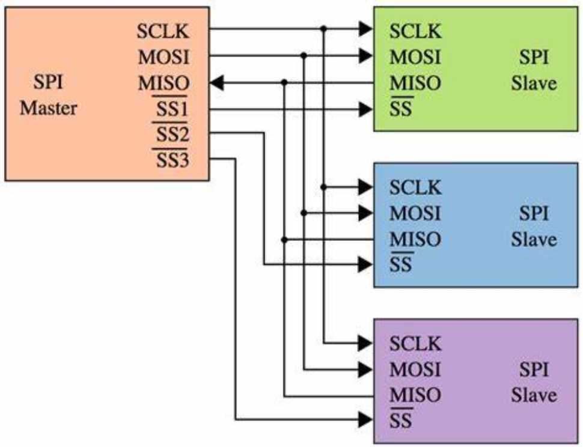

#### Working Principle
Communication in SPI is incredibly fast because it relies on simple shift registers rather than complex addressing and acknowledgment sequences.

The process begins when the master pulls the SS line of the target slave LOW. The master then starts generating the clock signal on the SCK line.

During each clock cycle, full-duplex data transfer occurs: the master sends one bit of data out on the MOSI line, and the slave reads it. At the exact same time, the slave sends one bit of data out on the MISO line, and the master reads it. This simultaneous exchange continues until the full data byte is transferred.

Because there are no addresses to send and no acknowledge (ACK) bits to wait for, the data flows seamlessly and continuously. Once the data exchange is complete, the master pulls the SS line HIGH, ending the communication and putting the slave back to sleep.

SPI ideal for high-speed sensors, displays, SD cards, and other timing-sensitive peripherals.
 
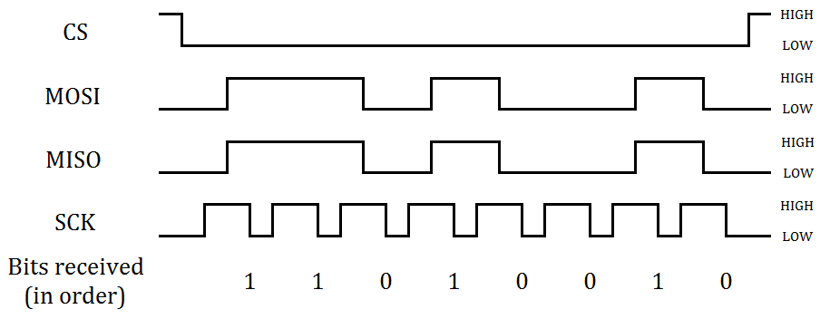

#### Arduino SPI Configuration
On the Arduino Uno, the hardware SPI interface is tied to specific pins:
- 11 – MOSI (Master Out Slave In)
- 12 – MISO (Master In Slave Out)
- 13 – SCK (Serial Clock)
- 10 – SS (Slave Select) While pins 11, 12, and 13 must be shared among all SPI devices, the master can use any available digital pin to act as an additional SS pin when communicating with multiple slaves.
#### Creating Project
Now let's create a simple project where three Arduino boards communicate using the SPI protocol. One Arduino acts as the master, while the other two act as slave devices, the master sends commands to the slaves based on button presses, and each slave controls an LED based on the received command.

First, we connect the three Arduino boards using the SPI bus:
- All MOSI pins (11) are connected together.
- All MISO pins (12) are connected together.
- All SCK pins (13) are connected together.
- All devices share a common GND.
    
Next, we establish the Slave Select connections. The master Arduino uses two different pins to control the slaves:
- Master Pin 10 connects to Slave 1's Pin 10 (SS1).
- Master Pin 9 connects to Slave 2's Pin 10 (SS2).
    
We connect an LED to Pin 9 of each slave Arduino. On the master Arduino, we add two push buttons:
- Pin 7 controls the first slave.
- Pin 8 controls the second slave.


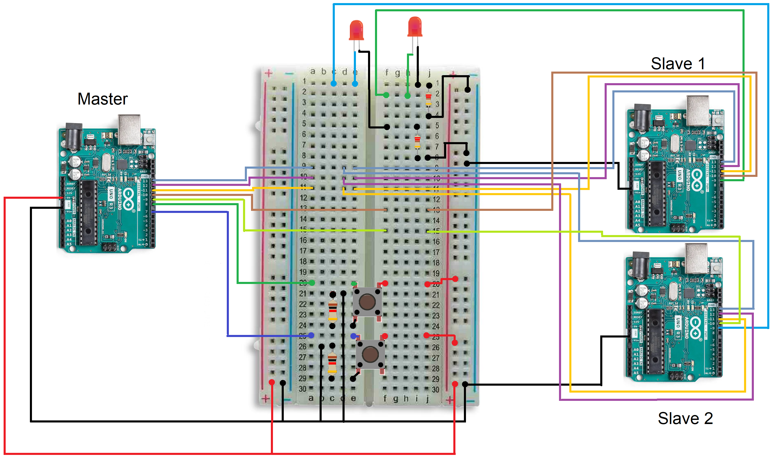


Now let's create our program. We start with the master Arduino program.
First, we include the SPI library, which allows the Arduino to communicate using the SPI protocol. After that, we create two variables to store the state of each slave LED. These variables help us keep track of whether the LED is currently ON or OFF so that every button press toggles its state.

Inside the `setup()` function, we configure the push buttons (pins 7 and 8) as inputs. We also configure the Slave Select pins as outputs because the master controls them. Initially, we set both SS pins to HIGH so that no slave device is selected when the system starts. Finally, we initialize the SPI communication using `SPI.begin()`.  
Inside the `loop()` function, the Arduino continuously checks if one of the buttons is pressed. When a button is pressed, the master toggles the corresponding LED state variable. Then it selects the appropriate slave by setting its SS pin LOW, sends the command using `SPI.transfer()`, and finally sets the SS pin HIGH again to end the communication.

```cpp
#include <SPI.h>

bool led1State = false;
bool led2State = false;

void setup() {
    pinMode(7, INPUT);
    pinMode(8, INPUT);
    
    // Set SS pins as outputs
    pinMode(9, OUTPUT);
    pinMode(10, OUTPUT);
    
    // Keep SS pins HIGH so no slaves are selected initially
    digitalWrite(9, HIGH);
    digitalWrite(10, HIGH);
    
    // Initialize SPI communication
    SPI.begin();
}

void loop() {
    // Check button 1
    if (digitalRead(7) == HIGH) {
        led1State = !led1State;
        
        digitalWrite(9, LOW);  // Select Slave 1
        if (led1State) {
            SPI.transfer('O');  
			SPI.transfer('N');  
        } else {
            SPI.transfer('O');  
			SPI.transfer('F');  
			SPI.transfer('F');           
        }
        digitalWrite(9, HIGH); // Deselect Slave 1
        
        delay(500);
    }

    if (digitalRead(8) == HIGH) {
        led2State = !led2State;
        
        digitalWrite(10, LOW);  // Select Slave 2
        if (led2State) {
            SPI.transfer('O');  
			SPI.transfer('N');            
        } else {
            SPI.transfer('O');  
			SPI.transfer('F');  
			SPI.transfer('F');         
        }
        digitalWrite(10, HIGH); // Deselect Slave 2
        
        delay(500);
    }
}
```
Next, we create the program for the slave Arduino boards. In Arduino, acting as an SPI slave requires turning on a specific hardware register and using an interrupt to catch incoming data. Both slave boards will run the exact same program because the master dictates who it is talking to via the hardware SS wiring.

Inside the `setup()` function, we configure the Arduino to operate as an SPI slave device. First, we set the LED pin as an output. Then we enable SPI in slave mode by activating the SPI hardware in the control register. We also enable SPI interrupts so the Arduino can automatically react whenever the master sends data.   
When the master transmits data through the SPI bus, the `SPI_STC_vect` interrupt service routine is automatically triggered. Inside this routine, the received byte is read from the SPI Data Register (`SPDR`) and stored in a variable.  
Since the master sends the messages "ON" and "OFF", the slave collects the incoming characters into a small string. Once the message is complete, the program checks the received command and turns the LED ON or OFF accordingly.

Inside the `loop()` function, the Arduino simply checks if a new command has been received. If the command is `"ON"`, the LED is turned on. If the command is `"OFF"`, the LED is turned off.
```cpp
#include <SPI.h>

volatile String receivedData = "";
volatile bool newData = false;

void setup() {
    pinMode(9, OUTPUT);
    SPCR |= bit(SPE);
    SPI.attachInterrupt();
}


ISR (SPI_STC_vect) {

    char c = SPDR;  
    receivedData += c;  
    if (receivedData == "ON" || receivedData == "OFF") {
        newData = true;
    }
}

void loop() {

    if (newData) {
        if (receivedData == "ON") {
            digitalWrite(9, HIGH);
        }
        else if (receivedData == "OFF") {
            digitalWrite(9, LOW);
        }
        receivedData = "";  
        newData = false;    
    }
}
```
## Wireless Communication
Up to this point, we have connected all of our devices and microcontrollers using physical wires. But what if we want to control our project from across the room, or monitor sensor data from anywhere in the world? Arduino Uno do not have built-in wireless capabilities.  
To solve this, we rely on external add-on components called wireless modules. These modules act as a bridge, taking the wired protocols we just learned about (usually UART or SPI) and translating them into invisible radio waves. The two most common ways to cut the cord are through Bluetooth and Wi-Fi.
### Bluetooth
Bluetooth is a short-range wireless communication standard. It is perfect for connecting two devices directly together (point-to-point) over short distances, such as controlling an Arduino from a smartphone or linking two robots in the same room.  
At its core, a basic Arduino Bluetooth module acts as a "wireless serial cable." It uses radio frequencies in the 2.4 GHz band to transmit data. When we type a character on our phone's Bluetooth app, it travels through the air to the module. The module then translates that radio signal back into a standard UART serial signal (RX and TX) that the Arduino can easily read, exactly as if it were plugged in via a USB cable.

To add Bluetooth to an Arduino, we typically use an inexpensive module like the HC-05 or HC-06.  
The HC-05 module can operate in both master and slave modes, it can either initiate a connection to another Bluetooth device or wait for another device to connect to it.  
The HC-06 module is simpler and works only in slave mode, meaning it can only receive connections from another device such as a smartphone or computer.

Let's create a simple project where we control an LED using a smartphone through Bluetooth with the HC-05 module. In this system, the smartphone sends commands wirelessly to the Arduino through Bluetooth. The HC-05 receives the data and forwards it to the Arduino through serial communication, and the Arduino turns the LED ON or OFF depending on the received command.

First, connect the HC-05 Bluetooth module to the Arduino:
- VCC to 5V
- GND to GND
- TX to Arduino RX (Pin 0)
- RX to Arduino TX (Pin 1)    

Next, connect an LED to pin 6 of the Arduino through a 220 Ω resistor, and connect the other side of the LED to GND.

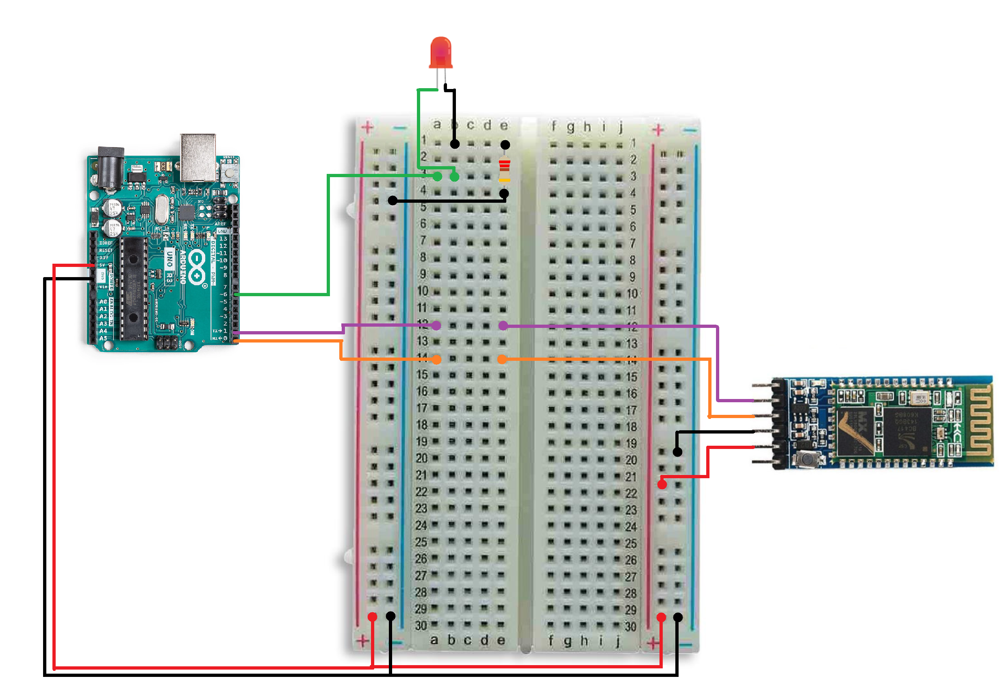

Now let’s create our program. Since the HC-05 uses the UART protocol, we start by initializing the serial communication in the `setup()` function so that the Arduino can communicate with the Bluetooth module. After that, we configure pin 6 as an output pin to control the LED.

Inside the `loop()` function, the Arduino continuously checks if data is available from the Bluetooth module. When a message is received, the Arduino reads it, trims any extra whitespace, and compares it with the expected commands to control the LED. Sending "ON" turns the LED on, while "OFF" turns it off.
```cpp 


String receivedData = "";

void setup() {
  pinMode(6, OUTPUT);
  Serial.begin(9600);        
}

void loop() {
 
  if (Serial.available()) {
    receivedData = Serial.readString();
    receivedData.trim();
    if (receivedData == "ON") {
      digitalWrite(6, HIGH);
    }

    else if (receivedData == "OFF") {
      digitalWrite(6, LOW);
   
    }
  }
}
```
Once the program is uploaded, we pair our smartphone with the HC-05 module (default password is usually 1234 or 0000). Then using [Bluetooth terminal app](https://play.google.com/store/apps/details?id=de.kai_morich.serial_bluetooth_terminal) we can send the commands ON or OFF to control the LED wirelessly.  

If there is a problem with the Bluetooth communication, we can debug it by displaying the data received from the Bluetooth app in the Serial Monitor.  First, connect the Bluetooth module to the Arduino:  
- VCC with 5V
- GND with GND
- TX with Pin 2
- RX with Pin 3

Next, in our program we create a software serial communication on pins 2 and 3 using the SoftwareSerial library. This allows the Arduino to communicate with the Bluetooth module while still using the normal serial port for debugging.  
Finally, in the ``loop()`` function, the Arduino reads the data sent by the Bluetooth app and prints it in the Serial Monitor so we can see exactly what is being received.

```cpp
#include <SoftwareSerial.h>

SoftwareSerial bluetooth(2, 3); // RX, TX

String receivedData = "";

void setup() {
  Serial.begin(9600);       // Serial Monitor
  bluetooth.begin(9600);    // Bluetooth module

  Serial.println("Bluetooth debugging started...");
}

void loop() {

  if (bluetooth.available()) { 
    receivedData = bluetooth.readString();
    receivedData.trim(); 
    Serial.print("Data received: ");
    Serial.println(receivedData);
  }

}
```
If an extra line appears after the received data is printed, that means the phone app is sending the message with a newline character. This can be changed in the app settings. Alternatively, in the Arduino program we can use ``readStringUntil('\n')``, which stops reading when it reaches the newline character.
#### Debug and Configure The Bluetooth module
The good thing about the HC-05 and HC-06 Bluetooth Module is that they can be configured. We can change several settings such as the device name, password, and baud rate. These settings are modified using AT commands.  

The HC-05 module is more advanced and supports many configuration commands. Some useful commands include checking the connection with ``AT``, reading or changing the device name using ``AT+NAME``, viewing the device address using ``AT+ADDR``, checking the firmware version using ``AT+VERSION``, changing the baud rate using ``AT+UART``, changing the role (master or slave) using ``AT+ROLE``, resetting the module using ``AT+RESET``, restoring factory settings with AT+ORGL, and changing the password using ``AT+PSWD``.

The HC-06 module supports fewer commands because it works only as a slave device. However. With AT commands we can check the connection using ``AT``, change the device name using ``AT+NAME``, change the baud rate using ``AT+BAUD``, change the pairing password using ``AT+PIN``, and check the firmware version using ``AT+VERSION``.  

Here simple example of program to configure the HC module, by using the Serial Monitor, any command typed in the Serial Monitor is sent to the Bluetooth module. The response from the module is then printed back to the Serial Monitor.  
```cpp
#include <SoftwareSerial.h>

SoftwareSerial bluetooth(2, 3); 

void setup() {

  Serial.begin(9600);
  bluetooth.begin(9600);   
  Serial.println("Enter AT commands:");

}

void loop() {
  // Send command from Serial Monitor to Bluetooth
  if (Serial.available()) {
    bluetooth.write(Serial.read());
  }

  // Show response from Bluetooth module
  if (bluetooth.available()) {
    Serial.write(bluetooth.read());
  }
}
```
Example of commands for HC-05
```
AT
AT+NAME=MyBluetooth // will  set name
AT+PSWD=1234 // will set password
AT+UART=9600,0,0
```
If there was problem when sending the command using the serial monitor, try change it setting to send the message only and don't add new line after the command, this can be set from here.

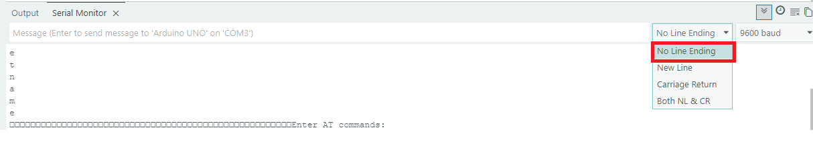

### Wi-Fi
Wi-Fi is a wireless communication technology that allows devices to connect over a network instead of directly to each other. Unlike Bluetooth, which is mainly used for short-range point-to-point communication, Wi-Fi enables an Arduino to communicate over longer distances and even connect to the internet. This makes it ideal for IoT (Internet of Things) applications such as remote monitoring, smart home systems, and web-based control.  
At its core, a basic Arduino Wi-Fi module acts as a "wireless network bridge." It uses radio frequencies in the 2.4 GHz band to transmit and receive data over a network using standard network protocols like TCP/IP. When a command is sent from a web browser or an app over the Wi-Fi network, it travels to the router and then to the module. The module translates these complex network packets (TCP/IP) back into standard UART serial signals (RX and TX), which the Arduino can read exactly as if it were plugged in via a USB cable.

Since the Arduino UNO does not have built-in Wi-Fi, we need an external module such as the ESP8266. This module  communicates with the Arduino using serial (UART), similar to the Bluetooth modules, but it adds full Wi-Fi networking capabilities, It can operate in Station (STA) mode to connect to an existing Wi-Fi router, Access Point (AP) mode to broadcast its own standalone Wi-Fi network, or both simultaneously.

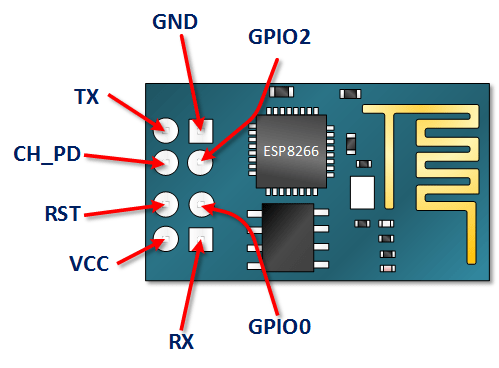


Let’s create a simple project where we display weather data on an LCD using an API through Wi-Fi with the ESP-01 module. In this system, the ESP-01 connects to the internet, requests weather data from an API, sends the raw response to the Arduino through serial communication, and the Arduino extracts useful information (like temperature) and displays it on the LCD.

First, Lets create the circuit we start by connecting the ESP-01 Wi-Fi module to the Arduino. The ESP-01 operates strictly on 3.3V logic, so its VCC must be connected to 3.3V, not 5V:
- VCC to 3.3V
- CH_PD (or EN) to 3.3V
- GND to GND
- TX to Arduino RX (Pin 0)
- RX to Arduino TX (Pin 1)

Next, we connect the  I2C LCD display (16x2 with I2C module) to reduce the number of pins:
- VCC to 5V
- GND to GND
- SDA to A4 (Arduino Uno)
- SCL to A5 (Arduino Uno)

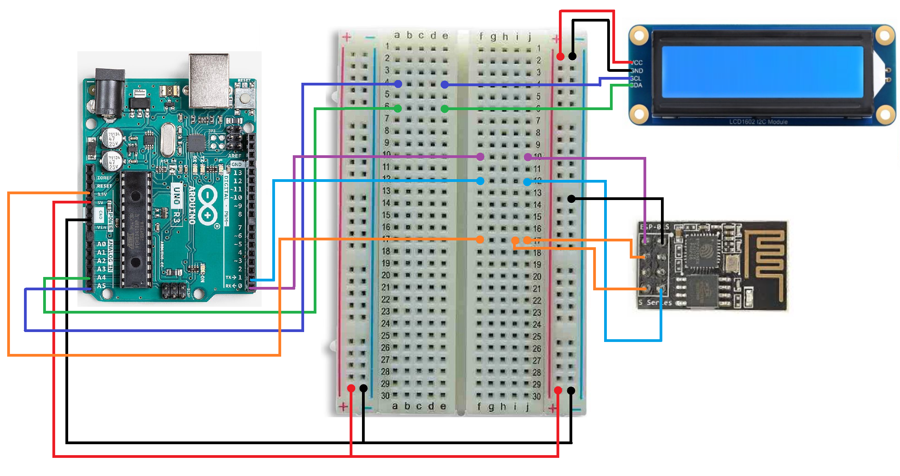

Now let’s create our program. The ESP-01 uses the UART protocol to communicate via AT commands, we start by initializing serial communication in the `setup()` function. We will send AT commands to connect to the Wi-Fi network, after that we initialize the I2C LCD.  
Inside the `loop()` function, the Arduino requests weather data periodically. When the ESP-01 receives the response, it sends the raw JSON data back. We read this data, extract useful values , and display them on the LCD.

```cpp
#include <Wire.h>
#include <LiquidCrystal_I2C.h>

LiquidCrystal_I2C lcd(0x27, 16, 2); 
String receivedData = "";

void setup() {
  Serial.begin(115200); 
  lcd.init();
  lcd.backlight();
  lcd.print("Connecting...");
  
  delay(1000);
  
  Serial.println("AT+CWMODE=1"); 
  delay(1000);
  Serial.println("AT+CWJAP=\"YourNetworkName\",\"YourPassword\""); // replace with your data
  delay(5000);
  lcd.clear();
  lcd.print("WiFi Connected");
}

void loop() {
  Serial.println("AT+CIPSTART=\"TCP\",\"api.openweathermap.org\",80");
  delay(2000);
  // Replace with your API key and city
  String request = "GET /data/2.5/weather?q=London&appid=YOUR_API_KEY HTTP/1.1\r\nHost: api.openweathermap.org\r\n\r\n";
  Serial.print("AT+CIPSEND=");
  Serial.println(request.length());
  delay(1000);
  Serial.print(request);
  delay(5000);

  // Read response
  if (Serial.available()) {
    receivedData = Serial.readString();
    int tempIndex = receivedData.indexOf("temp");
    if (tempIndex != -1) { 
      String tempValue = receivedData.substring(tempIndex + 6, tempIndex + 11);
      lcd.clear();
      lcd.setCursor(0, 0);
      lcd.print("Temp:");
      lcd.setCursor(0, 1);
      lcd.print(tempValue);
    }
  }
  delay(10000); // Update every 10 seconds
}
```
The ESP8266 is configured using AT commands same as the hC-05. In our Program First, we use `AT+CWMODE=1` to choose the connection mode, where 1 means Station mode, allowing the module to connect to an existing Wi-Fi network.

After that, we use `AT+CWJAP` to establish the connection. We send the network name followed by a comma and then the password, so the ESP-01 can join the Wi-Fi.  
Next, we use `AT+CIPSTART` to start a TCP connection with the weather server (`api.openweathermap.org`) on port 80. Then we use `AT+CIPSEND` to send the HTTP request that asks for the weather data.

The module then sends back the response (in JSON format) through serial communication. To extract the temperature, we search for the keyword `"temp"` inside the received string. Once found, we shift 6 characters forward because the response format is like `"temp":23.45`, so the actual value starts right after `"temp":`. The `indexOf` function returns the index of the letter t, and with that shift, we can get the temperature value and display it on the I2C LCD.

#### Debug and Configure The Wifi module
The ESP-01 module is very advanced and supports a wide range of networking commands. It can operate in Station mode (STA) or Access Point mode (AP), which means it can either connect to our home router or create its own Wi-Fi network for other devices to connect to directly.

Some useful commands include checking if the module is responding with `AT`, setting the Wi-Fi mode using `AT+CWMODE`, joining a network using `AT+CWJAP`, checking the assigned IP address using `AT+CIFSR`, enabling multiple connections with `AT+CIPMUX`, starting a server with `AT+CIPSERVER`, and resetting the module using `AT+RST`.

We can test and explore these commands using the Serial Monitor. First, we change the wiring and use pins 2 and 3 for UART communication:
- VCC with 3.3V
- CH_PD with 3.3V
- GND with GND
- TX with Pin 2
- RX with Pin 3

After that, we create a simple sketch that allows us to send commands from the Serial Monitor and display the responses from the module:
```cpp
#include <SoftwareSerial.h>

SoftwareSerial wifi(2, 3); 

void setup() {
  Serial.begin(9600);
  wifi.begin(115200);   

  Serial.println("Enter AT commands:");
}

void loop() {
  // Send command from Serial Monitor to Wi-Fi module
  if (Serial.available()) {
    wifi.write(Serial.read());
  }

  // Show response from Wi-Fi module
  if (wifi.available()) {
    Serial.write(wifi.read());
  }
}
```
If random or garbled characters appear in the Serial Monitor, it usually means the baud rate of the ESP-01 is mismatched. While 115200 is standard, older firmware versions sometimes use 9600. We can change `wifi.begin(115200)` to `wifi.begin(9600)` to test this.